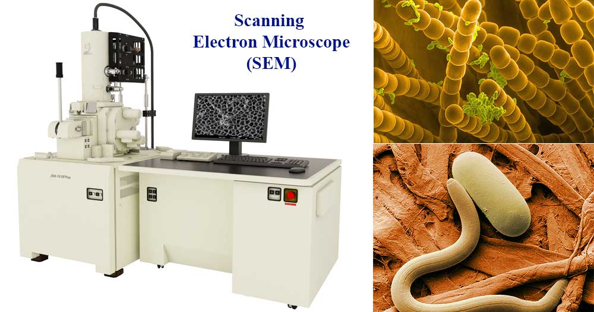

## Appendix:  Scanning Electron Microscope (SEM) and TEM

**Source:** Microbe Notes — [microbenotes.com/scanning-electron-microscope-sem](https://microbenotes.com/scanning-electron-microscope-sem/)
 
<figure style="text-align: center; margin: 20px 0;">

</figure>

The scanning electron microscope (SEM) was first developed by Manfred von Ardenne in 1937 and refined into the modern commercial instrument by Cambridge Scientific Instrument Company in 1965. Unlike a transmission electron microscope, which passes electrons through a specimen, the SEM scans a focused beam of low-energy electrons across the surface of a sample and collects the signals emitted in response.
 
**Operating principle.** The SEM directs a beam of electrons, produced by thermal emission from a tungsten filament and accelerated through a potential of 1 to 40 kV, onto the specimen surface. Two categories of emitted signal are exploited. Secondary electrons, emitted at low energy from near the specimen surface, carry information about the topography and morphology of the surface: raised features appear brighter because they emit more secondary electrons toward the detector, while depressed features appear darker. Backscattered electrons, which are primary beam electrons reflected from deeper within the specimen, carry compositional information: heavier elements with higher atomic number produce stronger backscattering and appear brighter, providing material contrast across the image.
 
The emitted electrons are collected by a scintillator-photomultiplier detector system, converted to an electrical signal, and displayed as a greyscale image where brightness maps directly to electron yield at each scan position.

**Source:** Microbe Notes — [microbenotes.com/transmission-electron-microscope-tem](https://microbenotes.com/transmission-electron-microscope-tem/)

<figure style="text-align: center; margin: 20px 0;">

</figure>
The transmission electron microscope (TEM) was developed by Ernst Ruska and Max Knoll in 1931 and achieves the highest spatial resolution of any laboratory microscope. Where the SEM images surface topography by collecting emitted electrons, the TEM forms an image by passing a high-energy electron beam through an ultrathin specimen and detecting the transmitted intensity on the far side.
 
**Operating principle.** Electrons are accelerated through a potential of 100 to 300 kV, producing a beam with a wavelength of approximately 0.005 nm — around 100,000 times shorter than visible light, enabling atomic-scale resolution. The beam passes through the specimen and the interaction of transmitted electrons with the atomic structure produces a two-dimensional projection image encoding information about crystal structure, composition, and internal morphology. The high-angle annular dark field (HAADF) mode in scanning TEM (STEM) provides atomic-resolution compositional contrast and is the standard method for imaging metal-semiconductor interfaces in cross-section.

[← Prev: Appendix B](B.md) | [Next: Appendix D →](D.md)