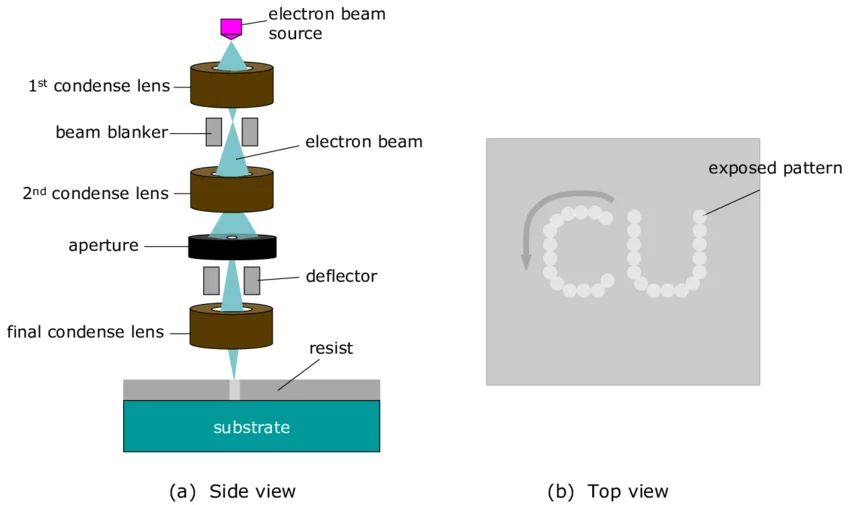

## Appendix: EBL schematic

<figure style="text-align: center; margin: 20px 0;">
  
  <figcaption style="font-style: italic; color: #666; margin-top: 8px; font-size: 14px;">
    <strong>Figure 3.5:</strong> Beam line optics.
  </figcaption>
</figure>

#### Reference 
Pimpin, Alongkorn & Srituravanich, Werayut. (2012). Review on Micro- and Nanolithography Techniques and Their Applications. Engineering Journal. 16. 37-56. 10.4186/ej.2012.16.1.37. 

[← Prev: Appendix B](B.md) | [Next: Appendix D →](D.md)