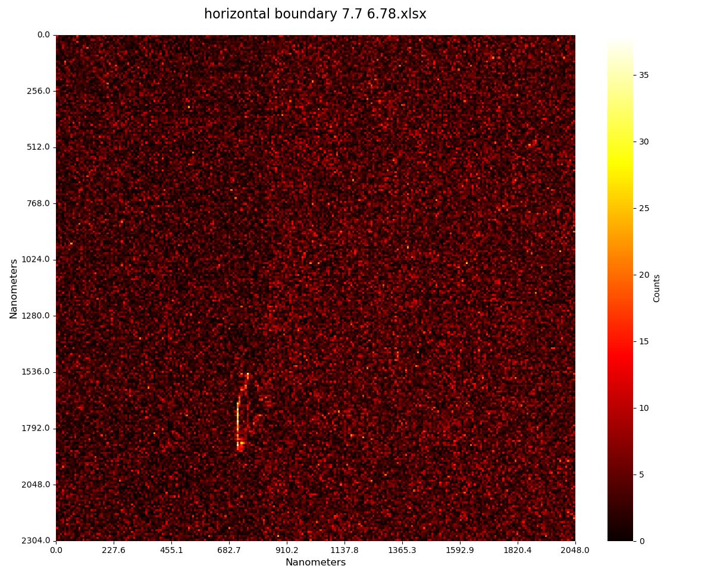
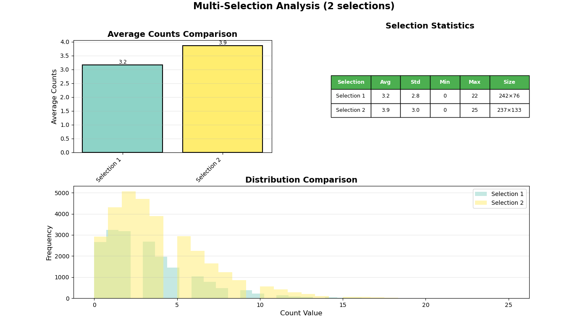

## Appendix : Electron contrast dlc vs Au

The backscatter contrast ratio between the metal grid features and the silicon substrate was assessed from the electron detector intensity profiles. A higher contrast ratio indicates greater separation between the metal signal and the background, which is the primary functional requirement of the resolution standard for SEM calibration use.

<figure style="text-align: center; margin: 20px 0;">
  
  <figcaption style="font-style: italic; color: #666; margin-top: 8px; font-size: 14px;">
    <strong>Figure E.1:</strong> Electron count heatmaps for the Au (left) and DLC(right) samples.
  </figcaption>
</figure>

Electron contrast was assessed from 256 x 256 pixel electron count maps acquired for the Au and DLC samples. Each pixel value represents the number of backscattered or secondary electrons detected at that position during the scan. A higher mean count indicates greater electron yield from the surface, which translates to a brighter signal and better contrast against the silicon substrate in the final calibration image.

<figure style="text-align: center; margin: 20px 0;">
  
  <figcaption style="font-style: italic; color: #666; margin-top: 8px; font-size: 14px;">
    <strong>Figure E.1:</strong> Electron count heatmaps for the Au (left) and DLC(right) samples.
  </figcaption>
</figure>

Au produces a mean electron count of 3.9 e/px compared to 3.2 e/px for DLC, giving a contrast ratio of 1.22. Gold (Z = 79) has a substantially higher backscatter coefficient than carbon (Z = 6) and should in principle yield significantly more signal per unit area. The modest ratio of 1.22, rather than the order-of-magnitude difference expected from Z alone, is due to the thin DLC film thickness used: at 5 to 10 nm, the DLC layer is thin enough to allow partial electron transmission into the underlying substrate, diluting the contrast difference.

[← Prev: Appendix E](E.md) | [Next: Appendix F →](F.md)