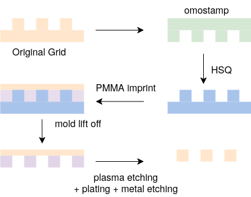
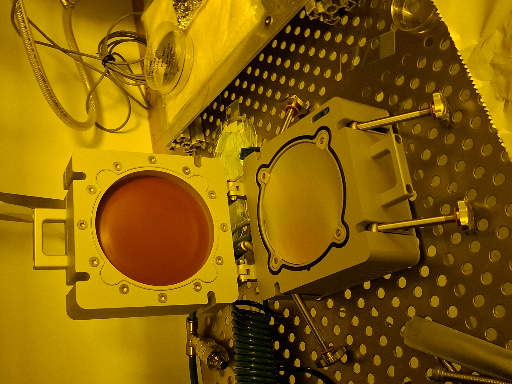

## Future works
### 5.1 Future testing using SEM and TEM
Due to time constraints and equipment downtime during the project period, the sidewall angle measurements obtained from electron detector analysis could not be independently verified against a direct cross-sectional technique. The Erf–Gaussian edge fitting method
used in this project provides an indirect estimate of θ inferred from the top-down intensity profile, it assumes that the feature geometry is the dominant contributor to the edge transition width f. 

Cross-sectional verification would either confirm or correct
this assumption, and is strongly recommended for any future iteration of this work.

#### SEM cross-sectional verification

A tilted SEM approach can provide a direct line-of-sight measurement of the sidewall profile without requiring sample destruction. The sample is mounted on a tilted stub, so that the sidewall of the grid feature is brought into a near-parallel view relative to the incident electron beam. The apparent width of the edge band in the tilted image can then be compared to the top-down measurement; the geometric relationship between the two gives an independent estimate
of the sidewall angle.

A more direct method is to cleave or FIB-mill the sample through a grid line and image the exposed cross-section. This gives a true side-on view of the feature profile, and the sidewall angle can be measured directly from the image by fitting a line to the
sidewall edge. 

#### TEM cross-sectional verification

Transmission electron microscopy offers the highest spatial resolution for sidewall angle measurement and is the reference technique used by NIST for the SCCDRM single-crystal standards. The procedure involves thinning the sample down to electron transparency using FIB milling to progressively reducing the lamella to a thickness of a few tens of nanometres until the cross-section of the grid feature is exposed. At this thickness, the high-angle annular dark field (HAADF-STEM) mode provides direct imaging of the metal–resist and metal–silicon interfaces with sub-nanometre resolution, and the sidewall angle can be measured directly from the atomic-scale image of the metal column edge.

The primary limitation of TEM is that sample preparation is destructive and time-consuming. Each FIB-prepared lamella represents one measurement site on one sample, and the preparation process itself introduces artefacts at the cut surface. For this project, TEM verification would be most valuable on the best-performing sample identified from the electron detector and AFM results, to establish a ground-truth measurement of θ against which the indirect Erf–Gaussian estimates can be calibrated for future use.

### 5.2 scalability
Nanoimprint lithography (NIL) offers a path to high-throughput replication of the grid resolution standard without requiring repeated PBW exposures. In this approach a PBW-fabricated PMMA master is used as a stamp to imprint the grid pattern into a  fresh polymer substrate, transferring the geometry in a single press cycle.

Initial trials were conducted using an Omostamp silicon stamp on a NILT CNI nanoimprinter (software v1.0.0.42). The hot embossing recipe used is summarised in Table 5.1.

<figure style="text-align: center; margin: 20px 0;">
  

  <figcaption style="font-style: italic; color: #666; margin-top: 8px; font-size: 14px;">
    <strong>Figure 5.1:</strong> nano imprinting overview
  </figcaption>
</figure>

**Table 5.1 — Nanoimprint recipe parameters (NILT CNI, hot embossing)**

| Step | Parameter | Value |
|---|---|---|
| 1 — Vacuum | Threshold | 90.0 |
| | ForceVac | 0 |
| | VacTime | 0.2 min |
| 2 — Temperature ramp | Target temperature | 130 °C |
| | Ramp time | 0.0 min |
| | Pressure | 1.0 bar |
| | Wait for temp | Yes |
| 3 — Hold | Hold time | 10.0 min |
| | Imprint pressure | 9.0 bar |
| 4 — Cooldown ramp | Target temperature | 60 °C |
| | Pressure | 9.0 bar |
| | Wait for temp | Yes |

<figure style="text-align: center; margin: 20px 0;">
  

  <figcaption style="font-style: italic; color: #666; margin-top: 8px; font-size: 14px;">
    <strong>Figure 5.2:</strong> nano imprinting mahcine
  </figcaption>
</figure>

Two problems were identified in the initial trials. First, the PMMA resist layer  delaminated from the silicon wafer during demolding — the grid features were pulled off the substrate rather than transferring cleanly into the imprint polymer. This is likely caused by insufficient adhesion between the PMMA and the silicon surface, either due to inadequate surface preparation or wafer contamination prior 
to spin coating. Depositing a thin adhesion layer (e.g. HMDS or Cr) between the silicon and PMMA prior to PBW is a recommended corrective step.

Second, the PMMA film thickness exceeded the Omostamp feature height, causing overflow of resist material beyond the patterned region during the imprint step. Future trials should match the PMMA spin thickness more closely to the stamp feature height, either by reducing the spin-coated thickness or by selecting a lower-concentration PMMA grade.

Resolving these two issues would make NIL a viable route for producing multiple copies of the grid standard from a single PBW master, significantly reducing the cost and time per calibration artefact.

[<--Prev: Results and analysis ](fna.md) | 
[Next: Appendix →](fna.md)

