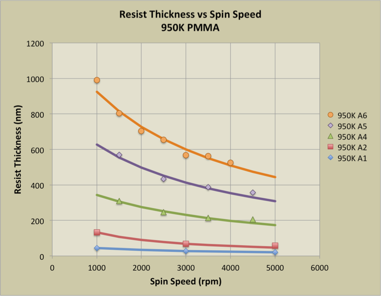
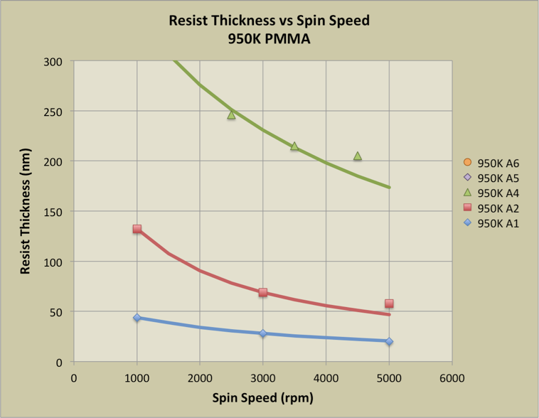

## Fabrication
### 3.1 overview of fabrication steps 

<figure style="text-align: center; margin: 20px 0;">
  
  
  <figcaption style="font-style: italic; color: #666; margin-top: 8px; font-size: 14px;">
    <strong>Figure 3.1:</strong> Fabrication process for resolution standard overview
  </figcaption>
</figure>
 
The fabrication process consists of five sequential steps, as illustrated in Figure 3.1:
 
1. **Silicon wafer** — the base substrate on which all subsequent layers are built.
1. (b) **Metal deposition** - buffer metal layer to aid in adhesion, contrast in conductivity and reduce internal stress when the thin flim is coated
2. **Spin-coated resist** — PMMA is spin-coated onto the wafer surface to the required thickness (Section 3.3).
3. **Lithography and development** — the grid pattern is written by PBW (Section 3.4) and the exposed resist is removed by DI:IPA development, leaving a patterned resist stencil.
4. **Metal deposition** — metal is deposited by PVD into the open trench regions (Section 3.5).
5. **Resist removal (lift-off)** — the remaining PMMA is dissolved in acetone, removing the metal on top of the resist and leaving only the metal features on the substrate.
 
An optional adhesion layer may be deposited directly onto the silicon wafer prior to spin coating. This intermediate layer serves to improve resist adhesion to the substrate, reduce internal film stress where lattice mismatch between the deposited metal and silicon is large, and improve electrical conductivity or imaging contrast of the final standard

### 3.2 simulations of P-beam in PMMA 

<figure style="text-align: center; margin: 20px 0;">
  
  <figcaption style="font-style: italic; color: #666; margin-top: 8px; font-size: 14px;">
    <strong>Figure 3.2:</strong> SRIM Monte Carlo simulation of 2 MeV proton trajectories 
    in 1 µm PMMA. Left: side-view (X–Y) showing 20 sample ion paths,protons travel 
    near-straight with minimal lateral deviation. Right: exit spread (Y–Z) showing the 
    radial distribution at the resist base;.
  </figcaption>
</figure>

<figure style="text-align: center; margin: 20px 0;">
  
  <figcaption style="font-style: italic; color: #666; margin-top: 8px; font-size: 14px;">
    <strong>Figure 3.3:</strong> Lateral straggle σr as a function of depth 
    for 2 MeV protons in PMMA. The grey dashed curve shows the raw SRIM data 
  </figcaption>
</figure>
spikes are caused by rare large-angle nuclear scattering events. The teal curve shows the cleaned data after IQR ×3 outlier removal, revealing a true straggle of 0.81 nm at the 1 µm exit depth — well below the 3 nm target (red dotted line).
 
SRIM Monte Carlo simulations were used to characterize the behavior of 2 MeV protons in PMMA and to predict the theoretical sidewall angle of the fabricated features. Two outputs are of interest: the depth distribution (Bragg peak), which confirms the feature height achievable at a given beam energy, and the lateral straggle σ(z), which governs edge sharpness as a function of depth.
 
#### Theoretical Sidewall Angle
 
The lateral straggle σ(z) from SRIM gives the standard deviation of the beam's lateral spread at depth z. The edge transition width at that depth is related to σ by:
 
$$ f(z) = 2\sqrt{2\ln 2} \cdot \sigma(z) \approx 2.355\,\sigma(z) $$
 
where f is the FWHM of the dose profile across the feature edge — the same parameter extracted from SEM measurements in Section 2.5.1. The theoretical sidewall angle at the full feature depth h is then:
 
$$ \theta = 90° - \arctan\!\left(\frac{f(h)}{h}\right) = 90° - \arctan\!\left(\frac{2.355\,\sigma(h)}{h}\right) $$

[Insert graph of side wall vs the penetration depth]

### 3.3 spin coating the waver and development
#### spin coating
ref for images and others: 
https://apps.mnc.umn.edu/archive/ebpgwiki/rsrc/EBPG/Datasheets/PMMA_Datasheet.PDF
https://ebeam.mff.uw.edu/ebeamweb/process/process/pmma.html
https://cse.umn.edu/mnc/pmma-spin-curves

<figure style="text-align: center; margin: 20px 0;">
  
  
  <figcaption style="font-style: italic; color: #666; margin-top: 8px; font-size: 14px;">
    <strong>Figure 3.X:</strong> Spin curves for PMMA 495K at medium (left) 
    and low (right) concentrations in anisole. Higher spin speed produces thinner films.
  </figcaption>
</figure>

<figure style="text-align: center; margin: 20px 0;">
  
  
  <figcaption style="font-style: italic; color: #666; margin-top: 8px; font-size: 14px;">
    <strong>Figure 3.Y:</strong> Spin curves for PMMA 950K at standard (left) 
    and dilute (right) concentrations. The higher molecular weight produces 
    thicker films at equivalent spin speed compared to 495K.
  </figcaption>
</figure>

Film thickness is governed by two parameters: the concentration (viscosity) of the resist solution and the spin speed [1]. Higher spin speeds and lower concentrations produce thinner films, following an approximate inverse power-law relationship.
 
PMMA is available in two standard molecular weights — 495K and 950K, each supplied at multiple concentrations in anisole (e.g. A2, A4, A6 for 2%, 4%, 6% solids by weight) [1 ][2]. Higher molecular weight resist is more viscous at the same concentration and produces a slightly thicker film at a given spin speed. The choice of molecular weight and concentration together determine the accessible thickness range:

#### Pre-back , Post-bake

After spin coating, the wafer is placed on a hotplate for a soft bake, typically at 180 °C for 60–90 seconds [1] [3]. The pre-bake serves two purposes: it drives off residual solvent (anisole) from the film, which would otherwise cause the resist to remain tacky and deform during handling; and it densifies and hardens the film, improving adhesion to the substrate and reducing unwanted swelling during development. Baking above ~125 °C is avoided as PMMA begins to flow and reflow at elevated temperatures, rounding the resist edges [1].

#### Development and lift off

<video width="100%" controls>
  <source src="images/development_1.mp4" type="video/mp4">
</video>

Development is performed after PBW exposure and is included here for process continuity. The wafer is immersed in DI water:IPA (7:3) developer, which selectively dissolves the chain-scissioned PMMA in the exposed regions while leaving the unexposed resist intact [1][2]. The sample is then rinsed in fresh IPA and dried with a nitrogen gun to stop development. Following metal deposition, the remaining PMMA is removed by immersion in acetone, lifting off the metal on top of the resist and leaving only the metal deposited directly onto the silicon substrate.

### 3.4 P-beam structure

<figure style="text-align: center; margin: 20px 0;">
  
  
  <figcaption style="font-style: italic; color: #666; margin-top: 8px; font-size: 14px;">
    <strong>Figure 3.4:</strong> Beam line optics
  </figcaption>
</figure>

The PBW facility at CIBA is built around a 3.5 MV Singletron accelerator (HVEE) which generates a focused MeV proton beam for lithography [4] [5]. Protons are produced from hydrogen gas, accelerated to the required energy, and filtered by a 90° analysing magnet before being directed to the PBW end station via a switching magnet. Blanking plates deflect the beam off-axis to control dose delivery during patterning [4].
 
Before focusing, the beam passes through two apertures. The objective aperture (8 × 4 µm²) defines the virtual source size, while the collimator aperture (30 × 30 µm²) reduces angular divergence entering the lenses, giving a beam half-divergence of approximately 3 µrad [4].

Focusing is achieved by a spaced Oxford triplet of magnetic quadrupole lenses in a converging-diverging-converging (CDC) configuration. A single quadrupole focuses in one plane and defocuses in the other; the triplet arrangement produces a symmetric spot focus. With an object-to-lens distance of 7.5 m and image distance of 30 mm, the system achieves a demagnification of 857 × 130, yielding a minimum spot size of 9.3 × 32 nm² [4]. Chromatic aberration — from the finite energy spread of the accelerator — is the dominant limit on spot size, requiring ~10 ppm accelerator stability for sub-10 nm resolution [4]. Before writing, the beam is focused by scanning across a free-standing resolution standard. The transmitted or secondary electron signal produces a complementary error function profile, which is fitted to extract the beam FWHM (Section 2.5). Once focused, a writing file is loaded and the beam is rastered over the resist using electrostatic scanners combined with stage movement for
larger fields [5].

<iframe 
  src="notes/report/scripts/beam_geo.html" 
  width="100%" 
  height="580px" 
  style="border:none; border-radius:6px;">
</iframe>
  
| Parameter | Value |
|---|---|
| Accelerator | 3.5 MV Singletron (HVEE) |
| Beam energy | 2 MeV protons |
| Objective aperture | 8 × 4 µm² |
| Collimator aperture | 30 × 30 µm² |
| Beam half-divergence | ~3 µrad |
| Lens configuration | Spaced Oxford triplet (CDC) |
| Object-to-lens distance | 7.5 m |
| Image distance | 30 mm |
| Demagnification (X) | 857 |
| Demagnification (Y) | 130 |
| Minimum spot size | 9.3 × 32 nm² |
| Quadrupole power supply resolution | 2 ppm (Bruker) |

### 3.5 Metal deposition characteristics

| Material | Deposition technique | Melting point (°C) | Conductivity (S/m) | Reasoning |
|---|---|---|---|------|
| Au | Magnetron sputtering | 1064 | 4.52 × 10⁷ |  High Z (79) gives excellent SEM/TEM contrast; chemically inert; well-established PVD process; lift-off compatible |
| Pd | E-beam evaporation | 1554.9 | 9.5 × 10⁶ |  High Z (46), good contrast; chemically stable; used for X-ray zone plates and resolution standards; higher melting point limits substrate heating risk |
| Cr | Magnetron sputtering |  1907| 7.9 × 10⁶ |  Deposited as adhesion buffer layer beneath Au/Pd; strong bonding to Si oxide|
| DLC | FCVA | N/A (amorphous) | ~10⁻³–10² (sp²/sp³ dependent)  | Excluded: Z = 6 gives near-zero contrast vs Si (Z = 14)|

### 3.6 Fabricated samples parameters and prep 

| Samples | Composition | Height(nm) | Theoretical sidewall angle | 
| 1 | Au on Cr| | |

sample 1 : Au on Cr on Si 
sample 2 : DLC on Si 
sample 3: DLC on Pd on Si - to imporve conductivity
sample 4: Au on Pd on Si
sample 5: Pd on Cr on Si

[ to do is get the height of each layer of the sample]

[<--Prev: Methodology ](Methology.md) | 
[Next: Results and analysis →](fna.md)

### Reference

[4] S. Raman, Y. Yao, and J. A. van Kan, "Automatic beam focusing in
    the 2nd generation PBW line at sub-10 nm line resolution," Nuclear
    Instruments and Methods in Physics Research Section B, vol. 348,
    pp. 22–26, 2015. DOI: 10.1016/j.nimb.2014.12.066
 
[5] J. A. van Kan, P. Malar et al., "Proton beam writing nanoprobe
    facility design and first test results," Nuclear Instruments and
    Methods in Physics Research Section A, 2011.
    DOI: 10.1016/j.nima.2010.12.011

<ol class="ref-list">
  <li>Microchem / Kayaku Advanced Materials, "PMMA Data Sheet," 2019. Available: <a href="https://kayakuam.com/wp-content/uploads/2019/09/PMMA_Data_Sheet.pdf">kayakuam.com</a></li>
  <li>J. A. van Kan et al., "Resist materials for proton beam writing: a review," <em>Applied Surface Science</em>, 2014. DOI: <a href="https://doi.org/10.1016/j.apsusc.2014.04.147">10.1016/j.apsusc.2014.04.147</a></li>
  <li>University of Chicago Pritzker Nanofab, "NANO 495 PMMA process," 2024. Available: <a href="https://pnf.uchicago.edu/process/detail/950pmma-a4/">pnf.uchicago.edu</a></li>
</ol>

