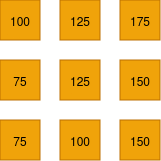
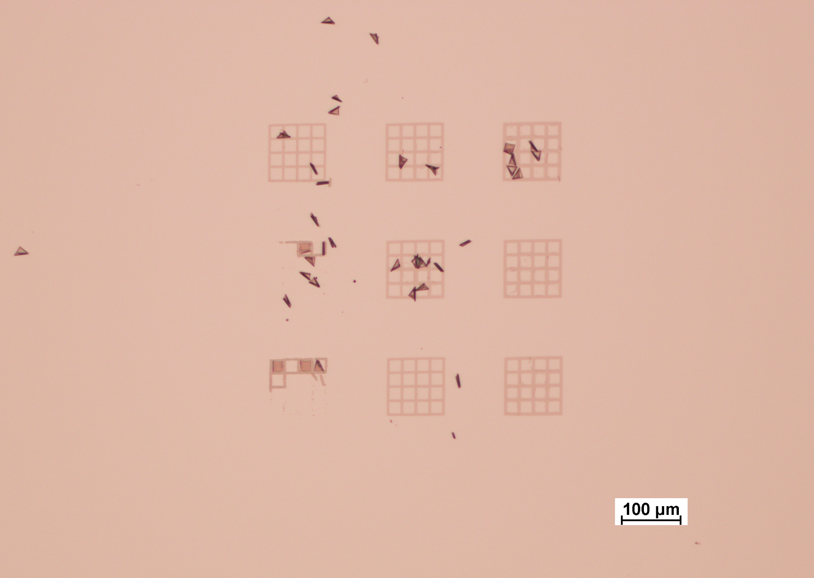

## Fabrication
### 3.1 overview of fabrication steps 

<figure style="text-align: center; margin: 20px 0;">
  
  
  <figcaption style="font-style: italic; color: #666; margin-top: 8px; font-size: 14px;">
    <strong>Figure 3.1:</strong> Fabrication process for resolution standard overview
  </figcaption>
</figure>
 

### 3.2 simulations of P-beam in PMMA 

<figure style="text-align: center; margin: 20px 0;">
  
  <figcaption style="font-style: italic; color: #666; margin-top: 8px; font-size: 14px;">
    <strong>Figure 3.2:</strong> SRIM Monte Carlo simulation of 2 MeV proton trajectories 
    in 1 µm PMMA. Left: side-view (X–Y) showing 20 sample ion paths,protons travel 
    near-straight with minimal lateral deviation. Right: exit spread (Y–Z) showing the 
    radial distribution at the resist base;.
  </figcaption>
</figure>

<figure style="text-align: center; margin: 20px 0;">
  
  <figcaption style="font-style: italic; color: #666; margin-top: 8px; font-size: 14px;">
    <strong>Figure 3.3:</strong> Lateral straggle σr as a function of depth 
    for 2 MeV protons in PMMA. The grey dashed curve shows the raw SRIM data 
  </figcaption>
</figure>

Spikes are caused by rare large-angle nuclear scattering events. The teal curve shows the cleaned data after IQR ×3 outlier removal, revealing a true straggle of 0.81 nm at the 1 µm exit depth, well below the 3 nm target (red dotted line).
 
SRIM Monte Carlo simulations were used to characterise the behaviour of 2 MeV protons in PMMA and to predict the theoretical sidewall angle of the fabricated features. Two outputs are of interest: the depth distribution (Bragg peak), which confirms the feature height
achievable at a given beam energy; and the lateral straggle σ(z), which governs edge sharpness as a function of depth.
 
#### Theoretical Sidewall Angle
 
The lateral straggle σ(z) from SRIM gives the standard deviation of the beam's lateral spread at depth z. The edge transition width at that depth is related to σ by:
 
$$ f(z) = 2\sqrt{2\ln 2} \cdot \sigma(z) \approx 2.355\,\sigma(z) $$
 
where f is the FWHM of the dose profile across the feature edge ,the same parameter extracted from SEM measurements in Section 2.5.1. The theoretical sidewall angle at the full feature depth h is then:
 
$$ \theta = 90° - \arctan\!\left(\frac{f(h)}{h}\right) = 90° - \arctan\!\left(\frac{2.355\,\sigma(h)}{h}\right) $$

### 3.3 spin coating the waver and development
#### spin coating

<figure style="text-align: center; margin: 20px 0;">
  
  
  <figcaption style="font-style: italic; color: #666; margin-top: 8px; font-size: 14px;">
    <strong>Figure 3.X:</strong> Spin curves for PMMA 495K at medium (left) 
    and low (right) concentrations in anisole. Higher spin speed produces thinner films.
  </figcaption>
</figure>

<figure style="text-align: center; margin: 20px 0;">
  
  
  <figcaption style="font-style: italic; color: #666; margin-top: 8px; font-size: 14px;">
    <strong>Figure 3.Y:</strong> Spin curves for PMMA 950K at standard (left) 
    and dilute (right) concentrations. The higher molecular weight produces 
    thicker films at equivalent spin speed compared to 495K.
  </figcaption>
</figure>

Film thickness is governed by two parameters: the concentration (viscosity) of the resist solution and the spin speed [1]. Higher spin speeds and lower concentrations produce thinner films, following an approximate inverse power-law relationship.
 
PMMA is available in two standard molecular weights 495K and 950K, each supplied at multiple concentrations in anisole (e.g. A2, A4, A6 for 2%, 4%, 6% solids by weight) [1][2]. Higher molecular weight resist is more viscous at the same concentration and produces a slightly thicker film at a given spin speed. The choice of molecular weight and concentration together determine the accessible thickness

A key design constraint is that the PMMA thickness must be at least five times greater than the intended metal deposition thickness. This ratio is required for two reasons: first, it ensures sufficient structural integrity of the resist walls during development and metal
deposition; and second, it prevents metal overflowing the resist sidewalls, a phenomenon known as mushrooming, where excess metal forms a cap-like layer over the resist that prevents clean lift-off. However, if the PMMA is made excessively thick, the increased aspect ratio of the trench can cause resist wall collapse, and as shown by the SRIM simulations in Section 3.2, deeper features allow more lateral beam straggle to accumulate, degrading the
sidewall angle. The optimal PMMA thickness is therefore determined by balancing these competing constraints against the spin curves shown above.

#### Pre-back , Post-bake

After spin coating, the wafer is placed on a hotplate for a soft bake, typically at 180 °C for 60–90 seconds [1] [3]. The pre-bake serves two purposes: it drives off residual solvent (anisole) from the film, which would otherwise cause the resist to remain tacky and deform during handling; and it densifies and hardens the film, improving adhesion to the substrate and reducing unwanted swelling during development. Baking above ~125 °C is avoided as PMMA begins to flow and reflow at elevated temperatures, rounding the resist edges [1].

#### Development and lift off

<video width="300px" controls>
  <source src="images/development_1.mp4" type="video/mp4">
</video>

Development is performed after PBW exposure and is included here for process continuity. The wafer is immersed in DI water:IPA (7:3) developer, which selectively dissolves the chain-scissioned PMMA in the exposed regions while leaving the unexposed resist intact [1][2]. The sample is then rinsed in fresh IPA and dried with a nitrogen gun to stop development. Following metal deposition, the remaining PMMA is removed by immersion in acetone, lifting off the metal on top of the resist and leaving only the metal deposited directly onto the silicon substrate.

### 3.4 P-beam structure

<figure style="text-align: center; margin: 20px 0;">
  
  
  <figcaption style="font-style: italic; color: #666; margin-top: 8px; font-size: 14px;">
    <strong>Figure 3.4:</strong> Beam line optics
  </figcaption>
</figure>

The PBW facility at CIBA is built around a 3.5 MV Singletron accelerator (HVEE) which generates a focused MeV proton beam for lithography [4] [5]. Protons are produced from hydrogen gas, accelerated to the required energy, and filtered by a 90° analysing magnet before being directed to the PBW end station via a switching magnet. Blanking plates deflect the beam off-axis to control dose delivery during patterning [4].
 
Before focusing, the beam passes through two apertures. The objective aperture (8 × 4 µm²) defines the virtual source size, while the collimator aperture (30 × 30 µm²) reduces angular divergence entering the lenses, giving a beam half-divergence of approximately 3 µrad [4].

Focusing is achieved by a spaced Oxford triplet of magnetic quadrupole lenses in a converging-diverging-converging (CDC) configuration. A single quadrupole focuses in one plane and defocuses in the other; the triplet arrangement produces a symmetric spot focus. With an object-to-lens distance of 7.5 m and image distance of 30 mm, the system achieves a demagnification of 857 × 130, yielding a minimum spot size of 9.3 × 32 nm² [4]. Chromatic aberration, is the dominant limit on spot size, requiring ~10 ppm accelerator stability for sub-10 nm resolution [4]. Before writing, the beam is focused by scanning across a free-standing resolution standard. The transmitted or secondary electron signal produces a complementary error function profile, which is fitted to extract the beam FWHM (Section 2.5). Once focused, a writing file is loaded and the beam is rastered over the resist using electrostatic scanners combined with stage movement for
larger fields [5].

<!-- <iframe 
  src="https://github.com/Ribena-dev/CDE4301_IS434/blob/main/notes/report/scripts/beam_geo.html" 
  width="100%" 
  height="580px" 
  style="border:none; border-radius:6px;"
  sandbox="allow-scripts" >
</iframe> -->

<!DOCTYPE html>
<html lang="en">
<head>
<meta charset="UTF-8">
<meta name="viewport" content="width=device-width, initial-scale=1.0">
<title>PBW Beam Geometry Explorer</title>

</head>
<body>

<h2>PBW beam geometry ,drag sliders to explore slit opening and focal position</h2>

  <!-- Side view canvas -->
  

    
Side view ,cone geometry

    <canvas id="cvSide" width="700" height="260"></canvas>
  

  <!-- Math box -->
  

  <!-- Front view canvas -->
  

    
Beam cross-section at sample

    <canvas id="cvFront" width="260" height="260"></canvas>
  

<!-- Sliders -->

  

    <label style="color:#BA7517">&#9632; Sample Δz (µm)</label>
    <input type="range" id="slDz" min="-20" max="20" step="0.1" value="-8">
    -8.0
  

  

    <label style="color:#185FA5">&#9632; X slit (µm)</label>
    <input type="range" id="slSx" min="10" max="300" step="1" value="100">
    100
  

  

    <label style="color:#0F6E56">&#9632; Y slit (µm)</label>
    <input type="range" id="slSy" min="10" max="300" step="1" value="100">
    100
  

</body>
</html>
  
| Parameter | Value |
|---|---|
| Accelerator | 3.5 MV Singletron (HVEE) |
| Beam energy | 2 MeV protons |
| Objective aperture | 8 × 4 µm² |
| Beam half-divergence | ~3 µrad |
| Lens configuration | Spaced Oxford triplet (CDC) |
| Object-to-lens distance | 7.5 m |
| Image distance | 30 mm |
| Demagnification (X) | 857 |
| Demagnification (Y) | 130 |
| Quadrupole power supply resolution | 2 ppm (Bruker) |

The beam spot size plays a critical role in controlling patterning precision. A larger spot effectively broadens the dose profile at the feature edge, increasing the measured FWHM f and reducing the achievable sidewall angle. The relationship is non-linear: when the beam is already well focused, small changes in spot size have little effect on θ, but when the beam is defocused or the focal plane is misplaced, the degradation in θ becomes significant. For this reason, beam focus is verified before each writing session by scanning across the free-standing resolution standard and fitting the transmitted or secondary electron signal to an error function to extract the beam FWHM [4].

The focal plane position can be physically adjusted by moving the sample stage along the beam axis with an accuracy of approximately 1 µm. Since the beam converges to a minimum spot at the focal point and diverges either side, placing the sample above or below focus increases
the effective spot size at the resist surface according to the cone half-angle α and the defocus distance Δz. Systematic variation of the focal plane position during writing is therefore a potential strategy for compensating residual beam divergence at depth, keeping the beam optimally focused throughout the resist thickness rather than only at the surface.

### 3.5 P-beam energy dosage 
In proton-beam writing, dose refers to the total charge delivered per unit area of resist, expressed in nC/mm². It is the product of the beam current, the dwell time per pixel, and the inverse of the pixel area. Physically, it represents the number of protons that have passed through each unit area of the resist surface, a higher dose means more protons, more secondary electron generation, and therefore more chain scission events per unit volume of PMMA.

Dose is distinct from energy. Energy determines *where* in the resist the protons stop and how deeply they penetrate. Dose determines *how much* chemical damage is accumulated at each depth along that path.

<figure style="text-align: center; margin: 20px 0;">
  
  
  <figcaption style="font-style: italic; color: #666; margin-top: 8px; font-size: 14px;">
    <strong>Figure 3.5:</strong> dosage and development testing
  </figcaption>
</figure>
 
Proton beam writing doses ranged from 75–175 nC/mm².

The minimum dose required to fully develop the exposed PMMA is called the threshold dose or clearing dose. Below this value, the chain scission density is insufficient for the developer (DI:IPA 7:3) to dissolve the exposed material, and the feature will either partially develop or not develop at all as seen below.

#### Effects of dosage

**Underdose (below ~50–75 nC/mm²):** Insufficient chain scission. The exposed PMMA
does not reach its gel point , the minimum molecular weight reduction required for the developer to dissolve it. The feature either does not develop, or develops incompletely, leaving a residual PMMA layer at the bottom of the trench. This prevents metal from reaching the substrate and produces no grid feature after lift-off.

**Correct dose (> 75nC/mm²):** The exposed volume is cleanly dissolved by the developer from top to bottom, producing a well-defined trench with vertical sidewalls whose quality is limited by the lateral straggle of the beam, as characterised in
Section 3.2.

**Overdose (above > 280 nC/mm²):** Excess secondary electron generation begins to expose resist beyond the intended beam boundary. The trench widens beyond the written pattern, reducing the effective CD and degrading sidewall verticality. At very high doses the PMMA surface can blister or form bubbles due to rapid outgassing of volatile chain scission products, permanently damaging the resist structure.

**Extreme overdose (above ~3.5 × 10¹⁴ ions/cm²):** PMMA undergoes a positive-to-negative resist transition, and the exposed regions become
insoluble rather than soluble.  This regime is not relevant to the present project but would fundamentally change the development polarity if accidentally reached.

### 3.6 Metal deposition characteristics

| Material | Deposition technique | Melting point (°C) | Conductivity (S/m) | Reasoning |
|---|---|---|---|------|
| Au | Magnetron sputtering | 1064 | 4.52 × 10⁷ |   gives excellent SEM/TEM contrast; chemically inert; well-established PVD process; lift-off compatible |
| Pd | E-beam evaporation | 1554.9 | 9.5 × 10⁶ |  good contrast; chemically stable; used for X-ray zone plates and resolution standards; higher melting point limits substrate heating risk |
| Cr | Magnetron sputtering |  1907| 7.9 × 10⁶ |  Deposited as adhesion buffer layer beneath Au/Pd; strong bonding to Si oxide|
| DLC | FCVA | N/A (amorphous) | ~10⁻³–10² (sp²/sp³ dependent)  | smoother surface|

The metals selected for this project were chosen on the basis of the criteria established
in Section 2.4 , lift-off compatibility, electron scattering contrast, chemical stability, and lattice mismatch, alongside the practical constraint of cleanroom availability at CIBA.

Gold (Au) was selected as the primary structural metal due to its well-established compatibility with magnetron sputtering workflows at CIBA, hasa potentially high electron detector backscatter contrast, and its chemical inertness. Chromium (Cr) was included as an adhesion buffer layer beneath Au, exploiting its strong bonding to native silicon oxide and its ability to reduce internal stress arising from the Au–Si lattice mismatch. Palladium (Pd) was evaluated as an alternative primary metal good chemical stability, and a higher melting point than Au, reducing the risk of substrate heating during e-beam evaporation. Diamond-like carbon (DLC) was investigated as a candidate surface coating to improve roughness performance after surface concerns with sputtered Au were observed. Titanium (Ti) was later introduced as an alternative adhesion layer to Cr, offering improved interfacial bonding without the additional conductivity and optical contrast change associated with Cr.

### 3.7 Fabricated samples composition

| Sample | Cr | Pd | Au | DLC | Ti |
|---|:---:|:---:|:---:|:---:|:---:|
| 1 ,Au/Cr/Si | 2nm | |  40nm | | |
| 2 ,DLC/Si |  | | | 10nm  |
| 3 ,DLC/Pd/Si |  |2nm  | |10nm |
| 4 ,Au/Pd/Si |  | 2nm |  | |
| 5 - DLC/Pd/Ti/Si| | | | |2nm|
| 6 - Pd/Ti/Si| | 40nm | | | 2nm |

[<--Prev: Methodology ](Methology.md) | [Next: Results and analysis →](fna.md)

### References

<ol>
  <li>Microchem / Kayaku Advanced Materials, "PMMA Data Sheet," 2019. Available:
      <a href="https://kayakuam.com/wp-content/uploads/2019/09/PMMA_Data_Sheet.pdf">kayakuam.com</a></li>

  <li>J. A. van Kan, P. Malar, and A. B. H. Tay, "Resist materials for proton beam writing:
      a review," <em>Applied Surface Science</em>, 2014.
      DOI: <a href="https://doi.org/10.1016/j.apsusc.2014.04.147">10.1016/j.apsusc.2014.04.147</a></li>

  <li>University of Chicago Pritzker Nanofab, "NANO 495 PMMA process," 2024. Available:
      <a href="https://pnf.uchicago.edu/process/detail/950pmma-a4/">pnf.uchicago.edu</a></li>

  <li>S. Raman, Y. Yao, and J. A. van Kan, "Automatic beam focusing in the 2nd generation
      PBW line at sub-10 nm line resolution," <em>Nuclear Instruments and Methods in Physics
      Research Section B</em>, vol. 348, pp. 22–26, 2015.
      DOI: <a href="https://doi.org/10.1016/j.nimb.2014.12.066">10.1016/j.nimb.2014.12.066</a></li>

  <li>J. A. van Kan, P. Malar et al., "Proton beam writing nanoprobe facility design and
      first test results," <em>Nuclear Instruments and Methods in Physics Research
      Section A</em>, 2011.
      DOI: <a href="https://doi.org/10.1016/j.nima.2010.12.011">10.1016/j.nima.2010.12.011</a></li>
</ol>

