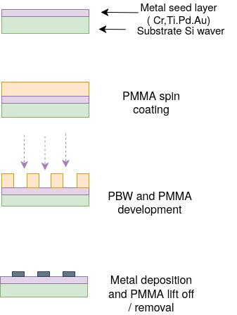
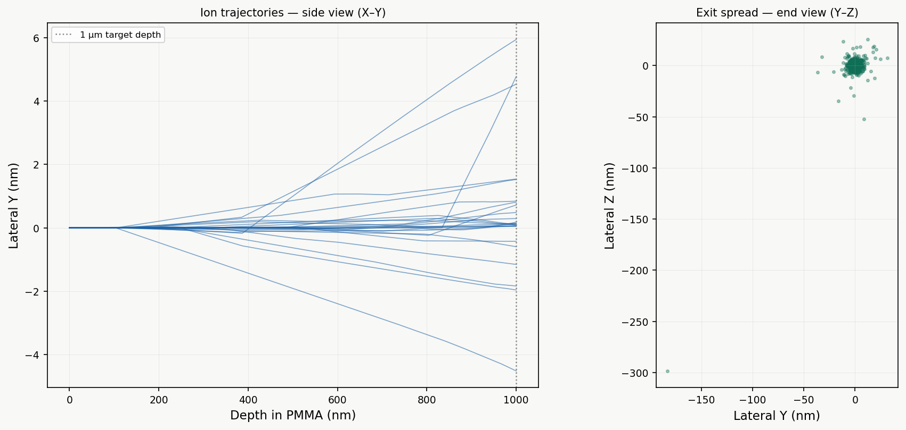
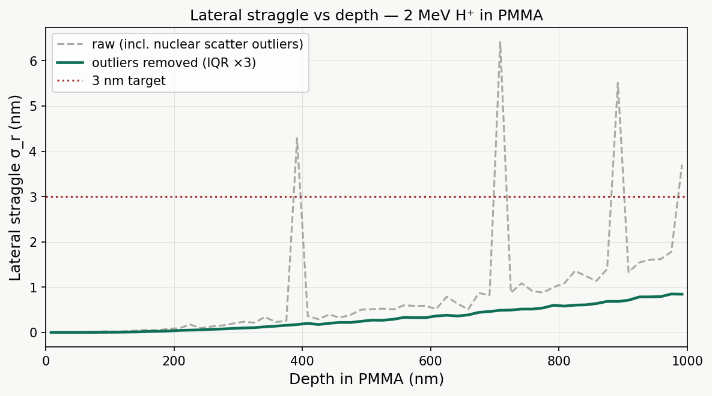
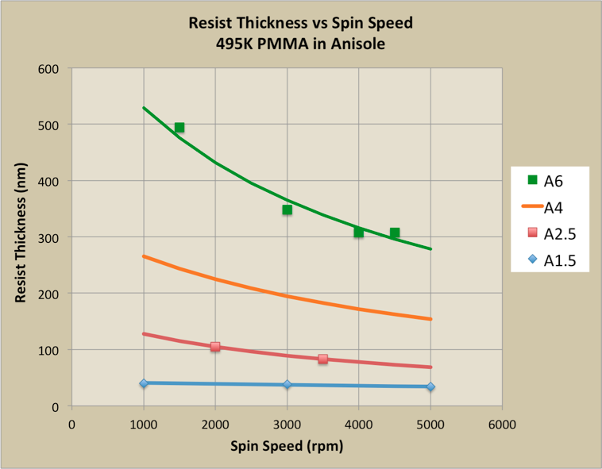
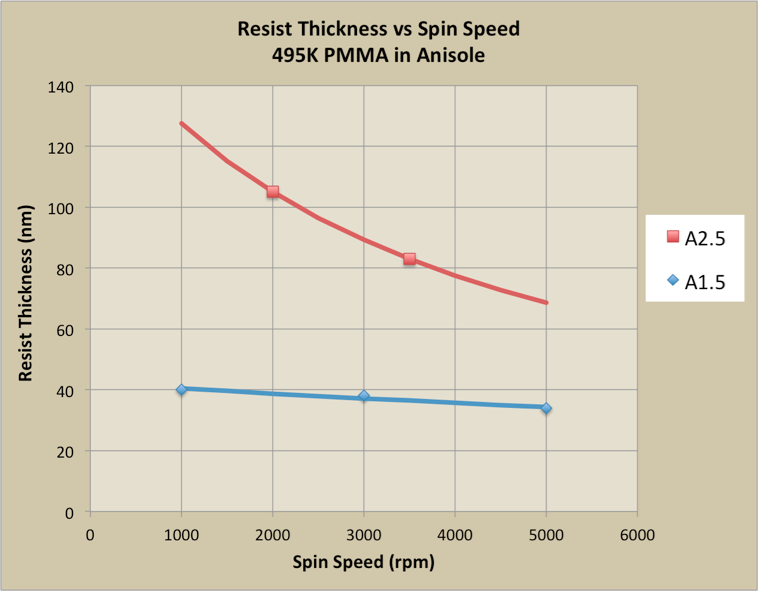
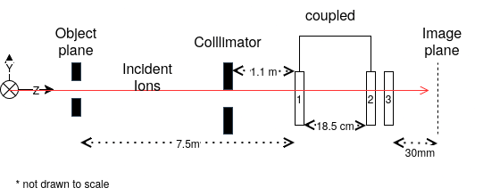
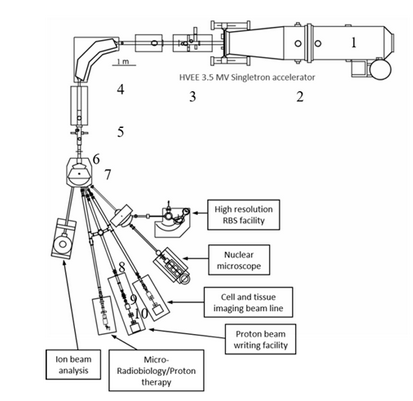
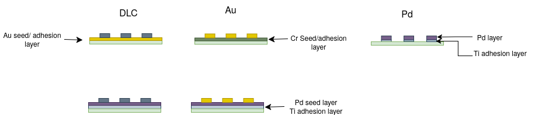

## Fabrication
### 3.1 overview of fabrication steps 

<figure style="text-align: center; margin: 20px 0;">
  
  
  <figcaption style="font-style: italic; color: #666; margin-top: 8px; font-size: 14px;">
    <strong>Figure 3.1:</strong> Fabrication process for resolution standard overview
  </figcaption>
</figure>

A slightly updated version of our fabrication overview

### 3.2 Simulations of P-beam in PMMA 

<figure style="text-align: center; margin: 20px 0;">
  
  <figcaption style="font-style: italic; color: #666; margin-top: 8px; font-size: 14px;">
    <strong>Figure 3.2:</strong> SRIM Monte Carlo simulation of 2 MeV proton trajectories 
    in 1 µm PMMA. Left: side-view (X–Y) showing 20 sample ion paths,protons travel 
    near-straight with minimal lateral deviation. Right: exit spread (Y–Z) showing the 
    radial distribution at the resist base;.
  </figcaption>
</figure>

<figure style="text-align: center; margin: 20px 0;">
  
  <figcaption style="font-style: italic; color: #666; margin-top: 8px; font-size: 14px;">
    <strong>Figure 3.3:</strong> Lateral straggle σr as a function of depth 
    for 2 MeV protons in PMMA. The grey dashed curve shows the raw SRIM data 
  </figcaption>
</figure>

To better understand how the proton beam behaves inside the PMMA, I ran SRIM Monte Carlo simulations. These simulations can help  predict exactly the verticality of the  fabricated edges will be .

Energy (2 MeV): Chosen to balance the software's capabilities with the physical requirements of our beam.

Depth (1 µm): We modeled a 1 µm thick layer of PMMA, as this is the maximum height used in our specific fabrication process.

Key Findings

The simulation focused on two main factors that determine the quality of our microstructures:

Penetration & The Bragg Peak: The simulation confirms that at 2 MeV, the protons pass through the PMMA with ease. This ensures we can achieve the full 1 µm feature height required for our design

Lateral Precision : As shown in the graph, the "lateral straggle" (how much the beam spreads sideways) is only 0.81 nm at the exit depth. This is demonstrates that proton beams can maintain much tighter precision than traditional [EBL](Introduction.md#12-problem-statement)

Note on "Spikes": You may notice occasional spikes in the trajectory data; these are simply rare instances where a proton bounces off a nucleus at a wide angle. They are outliers and do not impact the overall sharpness of the final feature.

 
#### Theoretical Sidewall Angle
 
The lateral straggle σ(z) from SRIM gives the standard deviation of the beam's lateral spread at depth z. The edge transition width at that depth is related to σ by:
 
$$ f(z) = 2\sqrt{2\ln 2} \cdot \sigma(z) \approx 2.355\,\sigma(z) $$
 
where f is the FWHM of the dose profile across the feature edge ,the same parameter extracted from electron detectors measurements in [Section 2.5.1](Methology.md#25-method-of-analysis). The theoretical sidewall angle at the full feature depth h is then:
 
$$ \theta = 90° - \arctan\!\left(\frac{f(h)}{h}\right) = 90° - \arctan\!\left(\frac{2.355\,\sigma(h)}{h}\right) $$

### 3.3 spin coating the waver and development
#### spin coating

<figure style="text-align: center; margin: 20px 0;">
  
  
  <figcaption style="font-style: italic; color: #666; margin-top: 8px; font-size: 14px;">
    <strong>Figure 3.X:</strong> Spin curves for PMMA 495K at medium (left) 
    and low (right) concentrations in anisole. Higher spin speed produces thinner films.
  </figcaption>
</figure>

</figure>

Film thickness is governed by two parameters: the concentration (viscosity) of the resist solution and the spin speed [1]. Higher spin speeds and lower concentrations produce thinner films, following an approximate inverse power-law relationship.
 

A key design constraint is that the PMMA thickness must be at least five times greater than the intended metal deposition thickness. 
This ratio is required for two reasons: 
- first, it ensures sufficient structural integrity of the resist walls during development and metal
deposition
- second, it prevents metal overflowing the resist sidewalls, a phenomenon known as mushrooming, where excess metal forms a cap-like layer over the resist that prevents clean lift-off. 

Since, the metal deposition height varies per sample, the graph above is to show the range of possible PMMA thickness used.

#### Pre-back , Post-bake

After spin coating, the wafer is placed on a hotplate for a soft bake, typically at 180 °C for 60–90 seconds [1] [3]. The pre-bake serves two purposes: it drives off residual solvent (anisole) from the film, which would otherwise cause the resist to remain tacky and deform during handling; and it densifies and hardens the film, improving adhesion to the substrate and reducing unwanted swelling during development. Baking above ~125 °C is avoided as PMMA begins to flow and reflow at elevated temperatures, rounding the resist edges [1].

#### Development and lift off

<video width="300px" controls style="text-align: center; margin: 20px 0;">
  <source src="images/development_1.mp4" type="video/mp4">
</video>

The above is a video on the lift off process

Development is performed after PBW exposure and is included here for process continuity. The wafer is immersed in DI water:IPA (7:3) developer, which selectively dissolves the chain-scissioned PMMA in the exposed regions while leaving the unexposed resist intact [1] [2]. The sample is then rinsed in fresh IPA and dried with a nitrogen gun to stop development. Following metal deposition, the remaining PMMA is removed by immersion in acetone, lifting off the metal on top of the resist and leaving only the metal deposited directly onto the silicon substrate.

### 3.4 P-beam structure

This section will cover the general P-beam structures that need to be manipulated or calibrated before and during P-Beam writing, to control the  spot size

<figure style="text-align: center; margin: 20px 0;">
  
  
  <figcaption style="font-style: italic; color: #666; margin-top: 8px; font-size: 14px;">
    <strong>Figure 3.4:</strong> Beam line optics
  </figcaption>
</figure>

<figure style="text-align: center; margin: 20px 0;">
  
  
  <figcaption style="font-style: italic; color: #666; margin-top: 8px; font-size: 14px;">
    <strong>Figure 3.5:</strong> Beam line schematics ( labeled proton beam writing)
  </figcaption>
</figure>

Before we begin patterning, we verify the focus by scanning the beam across a resolution standard. By fitting the resulting signal to an error function, we extract the beam’s FWHM (Full Width at Half Maximum) to confirm it is at its sharpest. 

The Proton Beam Writing (PBW) facility at CIBA is built around a **3.5 MV Singletron accelerator (HVEE)**, which generates the focused MeV proton beam required for high-resolution lithography **[4][5]**. To achieve sub-10 nm precision, the system refines the beam through several critical stages.

#### **1. Beam Generation and Refinement**
Protons are produced from hydrogen gas, accelerated to **2 MeV**, and filtered by a **90° analysing magnet**. This ensures a "clean" beam before it is directed to the end station via a switching magnet. Two apertures then define the beam's geometry **[4]**:
* **Objective Aperture ($8 \times 4$ µm²):** Defines the virtual source size.
* **Collimator Aperture ($30 \times 30$ µm²):** Limits angular divergence to approximately **3 µrad**.

#### **2. The Oxford Triplet (Demagnification)**
Focusing is achieved using a spaced **Oxford triplet** of magnetic quadrupole lenses in a **converging-diverging-converging (CDC)** configuration. Since a single quadrupole focuses in one plane while defocusing the other, this triplet is essential for a symmetric spot focus **[4]**. 

With an object-to-lens distance of 7.5 m and an image distance of 30 mm, the system achieves a massive demagnification (**857× in X, 130× in Y**), resulting in a minimum spot size of **$9.3 \times 32$ nm²**. 

#### **3. Stability and Calibration**
At these scales, **chromatic aberration** is the primary limit on spot size. To maintain sub-10 nm resolution, the accelerator requires a stability of approximately **10 ppm** **[4]**. 

Before writing, the beam focus is verified by scanning across a resolution standard. The transmitted or secondary electron signal produces a **complementary error function profile**, which is fitted to extract the beam **FWHM** (as discussed in Section 2.5). Once focused, electrostatic scanners and stage movement are used to raster the beam over the resist **[5]**.

<iframe 
  src="scripts/beam_geo.html" 
  width="100%" 
  height="580px" 
  style="border:none; border-radius:6px;"
  sandbox="allow-scripts" >
</iframe>

This simulates the different parameters available to vary the beam spot size 

#### **4. Strategic Focal Plane Positioning**
The sample stage can be adjusted along the beam axis with **1 µm accuracy**. Because the beam converges to a minimum "waist" at the focal point and diverges on either side, the effective spot size depends on the defocus distance ($\Delta z$) and the cone half-angle ($\alpha$). 

By varying the focal plane, we can compensate for beam divergence at depth. This can counter act beam lateral spread adn greater depths.

#### System Specifications Summary

| Parameter | Value |
| :--- | :--- |
| **Accelerator** | 3.5 MV Singletron (HVEE) |
| **Beam Energy** | 2 MeV protons |
| **Beam Half-Divergence** | ~3 µrad |
| **Lens Configuration** | Spaced Oxford triplet (CDC) |
| **Demagnification (X / Y)** | 857 / 130 |
| **Stage Accuracy (Z-axis)**| ~1 µm |
| **Power Supply Resolution**| 2 ppm (Bruker) |

### 3.6 Metal deposition characteristics

| Material | Deposition technique | Melting point (°C) | Conductivity (S/m) | Reasoning |
|---|---|---|---|------|
| Au | Magnetron sputtering | 1064 | 4.52 × 10⁷ |   gives excellent SEM/TEM contrast; chemically inert; well-established PVD process; lift-off compatible |
| Pd | E-beam evaporation | 1554.9 | 9.5 × 10⁶ |  good contrast; chemically stable; used for X-ray zone plates and resolution standards; higher melting point limits substrate heating risk |
| Cr | Magnetron sputtering |  1907| 7.9 × 10⁶ |  Deposited as adhesion buffer layer beneath Au/Pd; strong bonding to Si oxide|
| DLC | FCVA | N/A (amorphous) | ~10⁻³–10² (sp²/sp³ dependent)  | smoother surface|

The metals selected for this project were chosen on the basis of the criteria established
in Section 2.X , lift-off compatibility, electron scattering contrast, chemical stability, and lattice mismatch, alongside the practical constraint of cleanroom availability at CIBA.

Gold (Au) was selected as the primary structural metal due to its well-established compatibility with magnetron sputtering workflows at CIBA, hasa potentially high electron detector backscatter contrast, making it easier to compute the analyses later ( higher electron range and intensity ) and its chemical inertness. Chromium (Cr) was included as an adhesion buffer layer beneath Au, exploiting its strong bonding to native silicon oxide and its ability to reduce internal stress arising from the Au–Si lattice mismatch. Palladium (Pd) was evaluated as an alternative primary metal good chemical stability, and a higher melting point than Au, reducing the risk of substrate heating during e-beam evaporation. Diamond-like carbon (DLC) was investigated as a candidate surface coating to improve roughness performance after surface concerns with sputtered Au were observed. Titanium (Ti) was later introduced as an alternative adhesion layer to Cr and Ti, offering improved interfacial bonding without the additional conductivity.

#### Fabricated samples composition

| Sample | Cr | Pd | Au | DLC | Ti |
|---|:---:|:---:|:---:|:---:|:---:|
| 1 - Au/Cr/Si | 2nm | |  30nm | | |
| 2 - Au/Pd/Ti/Si |  | 2nm | 20nm | |
| 3 - DLC/Si |  | ||10nm |
| 4 - DLC/Au/Si |  | |2nm|10nm |
| 5 - DLC/Pd/Ti/Si| | | | 10nm |2nm|
| 6 - Pd/Ti/Si| | 40nm | | | 2nm |

<figure style="text-align: center; margin: 20px 0;">
  
  
  <figcaption style="font-style: italic; color: #666; margin-top: 8px; font-size: 14px;">
    <strong>Figure 3.6:</strong> Tested samples
  </figcaption>
</figure>

The samples created that are tested later are 3 DLC samples, with seed layer Pd or Au and one without, and 2 Au samples with seed layers Cr and Pd. The Pd sample was the last made and unfortunately faced difficulties testing the Pd as the vacuum chamber and P-beam was down for repairs

[<--Prev: Methodology ](Methology.md) | [Next: Results and analysis →](fna.md)

### References

<ol>
  <li>Microchem / Kayaku Advanced Materials, "PMMA Data Sheet," 2019. Available:
      <a href="https://kayakuam.com/wp-content/uploads/2019/09/PMMA_Data_Sheet.pdf">kayakuam.com</a></li>

  <li>J. A. van Kan, P. Malar, and A. B. H. Tay, "Resist materials for proton beam writing:
      a review," <em>Applied Surface Science</em>, 2014.
      DOI: <a href="https://doi.org/10.1016/j.apsusc.2014.04.147">10.1016/j.apsusc.2014.04.147</a></li>

  <li>University of Chicago Pritzker Nanofab, "NANO 495 PMMA process," 2024. Available:
      <a href="https://pnf.uchicago.edu/process/detail/950pmma-a4/">pnf.uchicago.edu</a></li>

  <li>S. Raman, Y. Yao, and J. A. van Kan, "Automatic beam focusing in the 2nd generation
      PBW line at sub-10 nm line resolution," <em>Nuclear Instruments and Methods in Physics
      Research Section B</em>, vol. 348, pp. 22–26, 2015.
      DOI: <a href="https://doi.org/10.1016/j.nimb.2014.12.066">10.1016/j.nimb.2014.12.066</a></li>

  <li>J. A. van Kan, P. Malar et al., "Proton beam writing nanoprobe facility design and
      first test results," <em>Nuclear Instruments and Methods in Physics Research
      Section A</em>, 2011.
      DOI: <a href="https://doi.org/10.1016/j.nima.2010.12.011">10.1016/j.nima.2010.12.011</a></li>
</ol>

