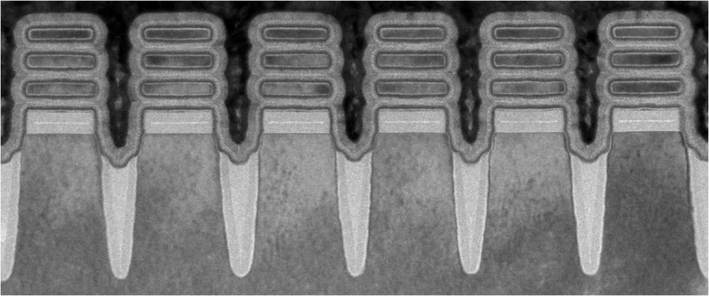
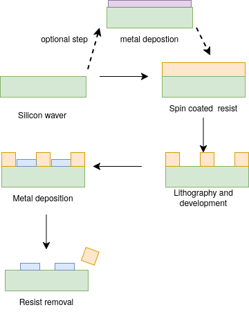
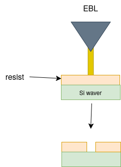
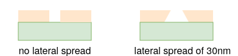
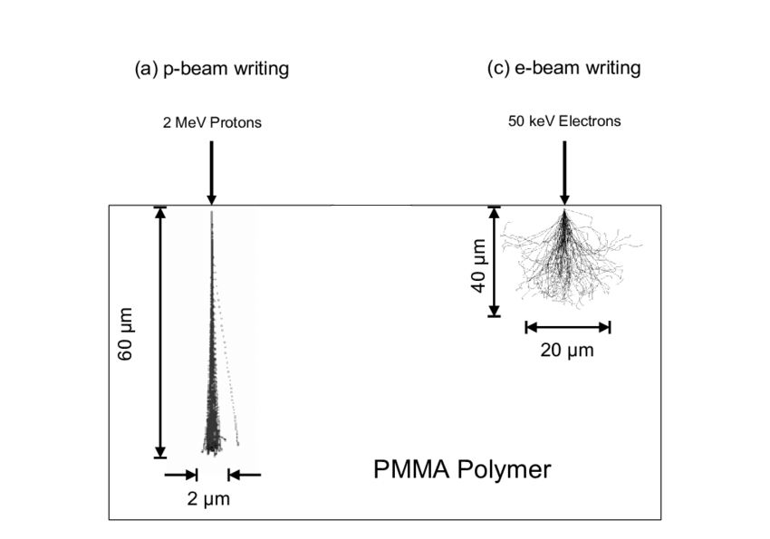
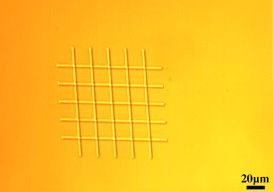

# Fabricating resolution standards using Proton beam lithography

## Acknowledgements

## Abstract 

## Introduction

<figure style="text-align: center; margin: 20px 0;">
  
  
  <figcaption style="font-style: italic; color: #666; margin-top: 8px; font-size: 14px;">
    <strong>Figure 1.1:</strong> Scaling of transistor size physical-gate length to-sustain Moore's Law
  </figcaption>
</figure>

Moore's Law, which predicts the doubling of transistor density approximately every two years which has driven semiconductor feature sizes  from the micrometre range in the 1970s to sub-2 nm nodes  (thinner that a human DNA) in commercial production today [1]. These features are often fabricated through complex proprietary steps , that are outside the scope of this report. However they can be brutishly summarized to the the following steps  of deposition, patterning (ex. lithography), and etching on a polished silicon wafer.

<figure style="text-align: center; margin: 20px 0;">
  
  
  <figcaption style="font-style: italic; color: #666; margin-top: 8px; font-size: 14px;">
    <strong>Figure 1.2:</strong> scanning electron microscope image of individual transistors, each measuring 2 nanometers wide
  </figcaption>
</figure>
ref: https://newatlas.com/computers/ibm-2-nm-chips-transistors/

This relentless miniaturisation has rendered conventional optical microscopy impractical for surface characterisation ,the wavelength of visible light (380–700 nm) is far greater than the dimensions of current transistor features [2]. This raises a fundamental question: how can such structures be characterised with the precision required for manufacturing?

As shown above, characterizing instruments such as [scanning electron microscopes (SEM)](https://microbenotes.com/scanning-electron-microscope-sem/), [critical dimension atomic force microscopes (CD-AFM)](https://www.nist.gov/programs-projects/atomic-force-microscopy), [transmission electron microscopes (TEM)](https://microbenotes.com/transmission-electron-microscope-tem/), and [extreme ultraviolet (EUV) scatterometry systems](https://www.nist.gov/programs-projects/euv-scatterometry), are being pushed to the limits of accuracy to validate such structures. 

However, the accuracy of measurements from any such instrument depends entirely on the quality of its calibration [3] ,which is where resolution and calibration standards become essential.

### 1.1 Overview of Resolution Standards

There are many kinds of resolution standards/calibration standards, below are the examples of tin spheres and a fine nano copper mesh 

<figure style="text-align: center; margin: 20px 0;">
  
  
  <figcaption style="font-style: italic; color: #666; margin-top: 8px; font-size: 14px;">
    <strong>Figure 1.2:</strong> Common resolution standards: tin spheres (left) and nano-grids (right)
  </figcaption>
</figure>

As expected calibrating such complex machines would require a complex degree of steps with various kinds of standards, for instance tin spheres are more commonly used for used for exposure and coverage testing, but are not applicable to CD-AFM calibration. Unlike the resolution grids, these can be used in calibration of all the above mentioned machines.

### 1.2 Problem statement

<figure style="text-align: center; margin: 20px 0;">
  
  
  <figcaption style="font-style: italic; color: #666; margin-top: 8px; font-size: 14px;">
    <strong>Figure 1.3:</strong> Fabrication process for resolution standard overview side view
  </figcaption>
</figure>

The above is a rather simplified, overview of the fabrication process. (More details will be given later)
Heres the issue, most commercial grids are made using electron beam lithography (EBL)(step 2)

<figure style="text-align: center; margin: 20px 0;">
  
  
  <figcaption style="font-style: italic; color: #666; margin-top: 8px; font-size: 14px;">
    <strong>Figure 1.4:</strong> simplified EBL on positive resist 
  </figcaption>
</figure>

When we zoom into the E-Beam penetrating the resist material we get this: 

<iframe src ="scripts/ebeam_vs_pbeam_lateral_spread.html"
        allowfullscreen="true" 
        width="500px" 
        height="500px">

</iframe>

A lateral spread of roughly 30nm over 1 miro depth of PMMA (estimated not simulated), can vary the the side wall vertical angle as demonstrated below (not to scale)

<figure style="text-align: center; margin: 20px 0;">
  
  
  <figcaption style="font-style: italic; color: #666; margin-top: 8px; font-size: 14px;">
    <strong>Figure 1.5:</strong> exaggerated example of vertical angle spread caused by E-beam 
  </figcaption>
</figure>

Heres where it starts to matter, For instruments such as CD-AFM, 3D-AFM and electron microscopy systems (SEM, EUV), the perpendicularity of the sidewall angle of patterned features is of critical importance to measurement accuracy.
In CD-AFM or 3D-AFM, a vertical parallel structure (VPS), is required as the primary tip characteriser because it allows measurement of the CD tip width independently of the specific flare geometry of the probe. 

The calibration relies on the sidewalls being vertical: the finer details of the tip-sample interaction, including feature sidewall angle and corner radius, introduce higher-order tip effects that cause systematic biases in measured linewidth.Any deviation of the reference sidewall from 90° introduces an uncharacterised geometric bias into every subsequent measurement the instrument makes. [5] [3] [6] [7]

The simplified iterative model below, demonstrates the correlation between sidewall angle and the SE intensity characteristics, which you can see by varying the slider.

<iframe src ="scripts/sidewall_angle_cd_error.html"
        allowfullscreen="true" 
        width="500px" 
        height="500px">
</iframe>

In EUV and SEM metrology, the consequences are equally significant. A deviation of just 5° from the ideal 90° sidewall angle has been shown to produce a critical dimension error of up to 20% in a 16 nm line-space pattern [8]. This is because the interaction of the incident beam with a non-vertical sidewall produces asymmetric scattering that systematically shifts the apparent edge position.

### 1.3 Proposed solution (Novelty)

#### Proton Beam Writing  

<figure style="text-align: center; margin: 20px 0;">
  
  <figcaption style="font-style: italic; color: #666; margin-top: 8px; font-size: 14px;">
    <strong>Figure 1.6:</strong> Depth penetration comparison
  </figcaption>
</figure>

Proton-beam writing (PBW) is a direct-write lithographic technique developed at the Centre for Ion Beam Applications (CIBA), Physics Department, National University of Singapore [3] [4]. In PBW, a focused MeV-energy proton beam is scanned in a predetermined pattern over a suitable resist material, which is subsequently chemically developed [4] [5].

The key physical distinction from EBL lies in the mass of the incident particle. Protons are approximately 1,800 times more massive than electrons, which has two critical consequences [4] [5]. First, due to their greater momentum, protons travel in near-linear trajectories through the resist with minimal lateral deflection, even at significant depths [4] [5]. 

Second, the secondary electrons generated by proton-resist interactions have considerably lower energies ,typically below 100 eV ,compared to those generated in EBL [3][5]. These low-energy secondary electrons have a very limited range, modifying resist material only within several nanometres of the proton track, resulting in minimal proximity effects [3] [4] [5] [6].

The practical outcome of these properties is that PBW is capable of fabricating three-dimensional high-aspect-ratio structures with smooth near-vertical sidewalls and low line-edge roughness [4] [5] [6]. Aspect ratios of up to 160 have been demonstrated in SU-8, and feature widths down to 19 nm have been achieved in HSQ using a 2 MeV proton beam at CIBA [6] [7]. Sub-3 nm edge smoothness has also been reported [7].

### 1.4 Deliverables

The benchmarks for this project are based on prior work conducted at CIBA. The two primary characterisation targets are a sidewall angle of ≥89.4° and a surface roughness below 3 nm Rq, with a grid cell size of 100 µm × 100 µm [13]. 

<figure style="text-align: center; margin: 20px 0;">
  
  <figcaption style="font-style: italic; color: #666; margin-top: 8px; font-size: 14px;">
    <strong>Figure 1.7:</strong> Nickel grid from [13]shown for example 
  </figcaption>
</figure>

The importance of surface roughness adn electron contrast  will be discussed later;it is, however, not the primary novelty of this report. No specific feature height was targeted, as the appropriate height varies considerably depending on the calibration application. The fabricated standard will be characterised using AFM and electron detector measurements to verify sidewall angle, electron contrast and surface roughness.

<figure style="text-align: center; margin: 20px 0;">
  
  <figcaption style="font-style: italic; color: #666; margin-top: 8px; font-size: 14px;">
    <strong>Figure 1.8:</strong> Target grid resolution standard geometry.
  </figcaption>
</figure>

[<--Prev: Home ](index.md) | [Next: Methodology →](Methology.md)

## References

<ol>
  <li>Z. Yu, S. Tan, R. Han, H. Xiao, and J. He, "Device and technology outlook for 1 nm node and beyond," in <em>Proc. IEEE Int. Conf. Solid-State and Integrated Circuit Technology (ICSICT)</em>, 2004. DOI: 10.1109/ICSICT.2004.1434947</li>

  <li>E. Abbe, "Beiträge zur Theorie des Mikroskops und der mikroskopischen Wahrnehmung," <em>Archiv für Mikroskopische Anatomie</em>, vol. 9, pp. 413–468, 1873.</li>

  <li>National Institute of Standards and Technology, "Improving CD-AFM measurements from the tip down," NIST News, Mar. 2016. Available: <a href="https://www.nist.gov/news-events/news/2016/03/improving-cd-afm-measurements-tip-down">nist.gov</a></li>

  <li>I. Pollentier, C.-U. Kim, P. Vandervorst, and E. Hendrickx, "EUV lithography materials characterisation using angle-resolved XPS and EUV scatterometry," <em>physica status solidi (a)</em>, vol. 216, no. 17, 2019. DOI: 10.1002/phvs.201900027</li>

  <li>G. Wilkening and L. Koenders, Eds., <em>Nanoscale Calibration Standards and Methods</em>, Part IV. Weinheim: Wiley-VCH, 2005. ISBN: 3-527-40502-X</li>

  <li>N. G. Orji, R. G. Dixson, A. Garcia-Gutierrez, B. D. Bunday, and M. Bishop, "Tip characterization method using multi-feature characterizer for CD-AFM," <em>Precision Engineering</em>, 2016. Available: <a href="https://pmc.ncbi.nlm.nih.gov/articles/PMC4803071/">pmc.ncbi.nlm.nih.gov</a></li>

  <li>R. G. Dixson, N. G. Orji, J. Fu, and R. Matero, "Lateral tip control effects in CD-AFM metrology: the large tip limit," <em>Journal of Micro/Nanolithography, MEMS, and MOEMS</em>, 2016. Available: <a href="https://pmc.ncbi.nlm.nih.gov/articles/PMC4832421/">pmc.ncbi.nlm.nih.gov</a></li>

  <li>K. H. Ko, Y. Moon, C. Jeong, H. Kim, C. U. Jeon, and H. K. Oh, "Influence of a non-ideal sidewall angle of extreme ultra-violet mask absorber for 1×-nm patterning in isomorphic and anamorphic lithography," <em>Microelectronic Engineering</em>, vol. 181, pp. 1–9, 2017. DOI: 10.1016/j.mee.2017.06.007</li>
  <li>R. Winkler et al., "Roadmap for focused ion beam technologies," <em>Applied Physics Reviews</em>, vol. 10, no. 4, art. 041311, 2023. DOI: <a href="https://doi.org/10.1063/5.0162597">10.1063/5.0162597</a></li>

  <li>J. Gierak et al., "Effects of focused gallium ion-beam implantation on properties of nanochannels on silicon-on-insulator substrates," <em>Applied Physics Letters</em>, vol. 89, 2006. Available: <a href="https://www.researchgate.net/publication/249512973">researchgate.net</a></li>

  <li>J. A. van Kan, A. A. Bettiol, and F. Watt, "Proton beam writing of three-dimensional nanostructures in hydrogen silsesquioxane," <em>Nano Letters</em>, vol. 6, no. 3, pp. 579–582, 2006. DOI: 10.1021/nl052478c</li>

  <li>F. Watt, A. A. Bettiol, J. A. van Kan, E. J. Teo, and M. B. H. Breese, "Ion beam lithography and nanofabrication: a review," <em>International Journal of Nanoscience</em>, vol. 4, no. 3, pp. 269–286, 2005.</li>

  <li>F. Watt, M. B. H. Breese, A. A. Bettiol, and J. A. van Kan, "Proton beam writing," <em>Materials Today</em>, vol. 10, no. 6, pp. 20–29, 2007. DOI: 10.1016/S1369-7021(07)70129-3</li>

  <li>J. A. van Kan, P. G. Shao, Y. H. Wang, and P. Malar, "Proton beam writing: a platform technology for high quality three-dimensional metal mold fabrication for nanofluidic applications," <em>Microsystem Technologies</em>, vol. 17, pp. 1519–1527, 2011. DOI: 10.1007/s00542-011-1333-0</li>

  <li>K. Yamazaki, "Electron beam direct writing," in <em>Nanofabrication: Fundamentals and Applications</em>, A. A. Tseng, Ed. Singapore: World Scientific, 2008.</li>

  <li>A. A. Bettiol, S. Venugopal Rao, E. J. Teo, J. A. van Kan, and F. Watt, "Sidewall quality in proton beam writing," <em>Nuclear Instruments and Methods in Physics Research Section B</em>, vol. 258, no. 1, pp. 302–306, 2007. DOI: <a href="https://doi.org/10.1016/j.nimb.2007.02.065">10.1016/j.nimb.2007.02.065</a></li>
</ol>

