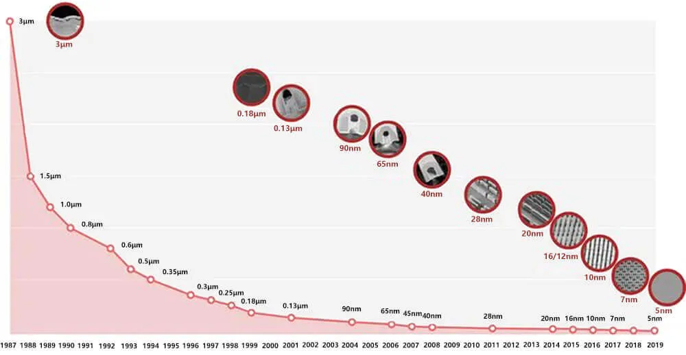
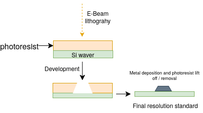
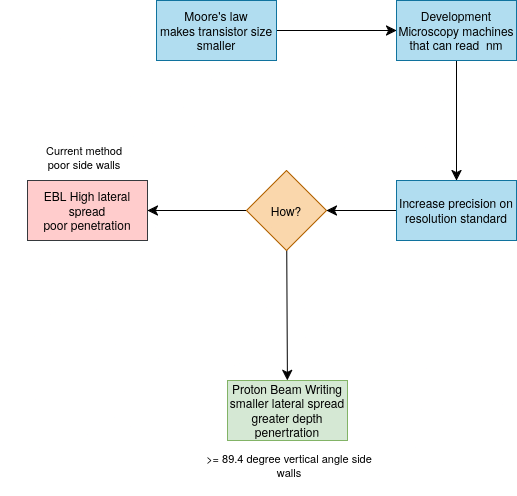

# Fabricating resolution standards using Proton beam lithography

## Introduction

<figure style="text-align: center; margin: 20px 0;">
  
  <figcaption style="font-style: italic; color: #666; margin-top: 8px; font-size: 14px;">
    <strong>Figure 1.1:</strong> Scaling of transistor size physical gate length to sustain Moore's Law.<a href="#ref-20">[20]</a>.
  </figcaption>
</figure>

Moore's Law, which predicts the doubling of transistor density approximately every two years, has driven semiconductor feature sizes from the micrometre range in the 1970s to sub-2 nm nodes, thinner than a strand of human DNA , in commercial production today <a href="#ref-1">[1]</a>. These features are fabricated through complex proprietary steps that are outside the scope of this report, but can be broadly summarised as the sequential processes of deposition, patterning (e.g. lithography), and etching on a polished silicon wafer.

<figure style="text-align: center; margin: 20px 0;">
  
  <figcaption style="font-style: italic; color: #666; margin-top: 8px; font-size: 14px;">
    <strong>Figure 1.2:</strong> Scanning electron microscope image of individual transistors, each measuring 2 nanometres wide <a href="#ref-19">[19]</a>.
  </figcaption>
</figure>

This relentless miniaturisation has rendered conventional optical microscopy impractical for surface characterisation — the wavelength of visible light (380–700 nm) is far greater than the dimensions of current transistor features <a href="#ref-2">[2]</a>. This raises a fundamental question: how can such structures be characterised with the precision required for manufacturing?

Characterising instruments such as [scanning electron microscopes (SEM)](A.md), [critical dimension atomic force microscopes (CD-AFM)](B.md), [transmission electron microscopes (TEM)](A.md), and extreme ultraviolet (EUV) scatterometry systems are being pushed to the limits of accuracy to validate such structures. However, the accuracy of measurements from any such instrument depends entirely on the quality of its calibration <a href="#ref-3">[3]</a>, which is where resolution and calibration standards become essential.

### 1.1 Overview of Resolution Standards

There are many kinds of resolution and calibration standards. Common examples include tin spheres and fine nano copper meshes, shown below.

<figure style="text-align: center; margin: 20px 0;">
  
  
  <figcaption style="font-style: italic; color: #666; margin-top: 8px; font-size: 14px;">
    <strong>Figure 1.3:</strong> Common resolution standards: tin spheres (left) and nano-grids (right).
  </figcaption>
</figure>

Calibrating such complex instruments requires different standards for different purposes. For instance, tin spheres are commonly used for exposure and coverage testing but are not applicable to CD-AFM calibration. Resolution grids, by contrast, can be applied across all of the instruments mentioned above.

### 1.2 Problem Statement

<figure style="text-align: center; margin: 20px 0;">
  
  <figcaption style="font-style: italic; color: #666; margin-top: 8px; font-size: 14px;">
    <strong>Figure 1.4:</strong> Fabrication process for a resolution standard — overview side view. (Further detail is provided in Sections 2 and 3.)
  </figcaption>
</figure>

Most commercial grids are fabricated using [electron beam lithography (EBL)](C.md) at the patterning step.

<figure style="text-align: center; margin: 20px 0;">
  
  <figcaption style="font-style: italic; color: #666; margin-top: 8px; font-size: 14px;">
    <strong>Figure 1.5:</strong> Simplified EBL process on positive resist.
  </figcaption>
</figure>

When the electron beam penetrates the resist material, significant lateral scattering occurs:

<iframe src="scripts/ebeam_vs_pbeam_lateral_spread.html"
        allowfullscreen="true"
        width="500px"
        height="500px">
</iframe>

A lateral spread of roughly 30 nm over 1 µm depth of PMMA (estimated, not simulated) introduces a taper in the patterned sidewall, as illustrated below (not to scale).

<figure style="text-align: center; margin: 20px 0;">
  
  <figcaption style="font-style: italic; color: #666; margin-top: 8px; font-size: 14px;">
    <strong>Figure 1.6:</strong> Exaggerated example of sidewall angle deviation caused by EBL lateral scattering.
  </figcaption>
</figure>

Here is where this becomes critical. For instruments such as CD-AFM, 3D-AFM, and electron microscopy systems (SEM, EUV), the perpendicularity of the sidewall angle of patterned features is of critical importance to measurement accuracy. In CD-AFM or 3D-AFM, a vertical parallel structure (VPS) is required as the primary tip characteriser because it allows measurement of the CD tip width independently of the specific flare geometry of the probe.

The calibration relies on the sidewalls being vertical: the finer details of the tip–sample interaction, including feature sidewall angle and corner radius, introduce higher-order tip effects that cause systematic biases in measured linewidth. Any deviation of the reference sidewall from 90° introduces an uncharacterised geometric bias into every subsequent measurement the instrument makes. <a href="#ref-3">[3]</a> <a href="#ref-5">[5]</a> <a href="#ref-6">[6]</a> <a href="#ref-7">[7]</a>

The [simplified iterative model](D.md) below demonstrates the correlation between sidewall angle and the secondary electron (SE) intensity profile, which can be explored using the slider.

<iframe src="scripts/sidewall_angle_cd_error.html"
        allowfullscreen="true"
        width="500px"
        height="500px">
</iframe>

In EUV and SEM metrology the consequences are equally significant. A deviation of just 5° from the ideal 90° sidewall angle has been shown to produce a critical dimension error of up to 20% in a 16 nm line-space pattern <a href="#ref-8">[8]</a>. This is because the interaction of the incident beam with a non-vertical sidewall produces asymmetric scattering that systematically shifts the apparent edge position.

### 1.3 Proposed Solution

#### Proton Beam Writing

<figure style="text-align: center; margin: 20px 0;">
  
  <figcaption style="font-style: italic; color: #666; margin-top: 8px; font-size: 14px;">
    <strong>Figure 1.7:</strong> Depth penetration comparison between proton beam writing, FIB, and electron beam writing.
  </figcaption>
</figure>

Proton beam writing (PBW) is a direct-write lithographic technique developed at the Centre for Ion Beam Applications (CIBA), Physics Department, National University of Singapore <a href="#ref-12">[12]</a> <a href="#ref-13">[13]</a>. In PBW, a focused MeV-energy proton beam is scanned in a predetermined pattern over a suitable resist material, which is subsequently chemically developed <a href="#ref-13">[13]</a> <a href="#ref-14">[14]</a>.

The key physical distinction from EBL lies in the mass of the incident particle. Protons are approximately 1,800 times more massive than electrons, which has two critical consequences <a href="#ref-12">[12]</a> <a href="#ref-13">[13]</a>. First, due to their greater momentum, protons travel in near-linear trajectories through the resist with minimal lateral deflection, even at significant depths. Second, the secondary electrons generated by proton–resist interactions have considerably lower energies — typically below 100 eV — compared to those generated in EBL <a href="#ref-12">[12]</a> <a href="#ref-13">[13]</a> <a href="#ref-16">[16]</a>. These low-energy secondary electrons have a very limited range, modifying resist material only within several nanometres of the proton track, resulting in minimal proximity effects.

The practical outcome of these properties is that PBW is capable of fabricating three-dimensional high-aspect-ratio structures with smooth near-vertical sidewalls and low line-edge roughness <a href="#ref-12">[12]</a> <a href="#ref-13">[13]</a> <a href="#ref-14">[14]</a>. Aspect ratios of up to 160 have been demonstrated in SU-8, and feature widths down to 19 nm have been achieved in HSQ using a 2 MeV proton beam at CIBA <a href="#ref-11">[11]</a> <a href="#ref-13">[13]</a>. Sub-3 nm edge smoothness has also been reported <a href="#ref-16">[16]</a>.

#### Existing Approaches

While several fabrication methods have been explored for producing resolution standards with near-vertical sidewalls, achieving the sidewall verticality required for traceable CD-AFM and SEM calibration has remained a challenge. Table 1.1 summarises sidewall angle results reported across representative approaches in the literature. The three references were selected to represent distinct points of comparison: a metrology-focused study characterising sidewall angles on commercially relevant calibration grids <a href="#ref-17">[17]</a>, a dedicated silicon microfabrication study using conventional dry etching <a href="#ref-18">[18]</a>, and the CIBA benchmark result using PBW <a href="#ref-16">[16]</a>.

| Reference | Material | Fabrication Method | Sidewall Angle |
|---|---|---|---|
| Lee et al., SPIE 2023 <a href="#ref-17">[17]</a> | Chrome (photomask) | Conventional lithography; characterised via TEM cross-section | ~85° |
| He et al., JVST B 2011 <a href="#ref-18">[18]</a> | Silicon | Reactive Ion Etching (RIE) with dual-layer mask | 82° |
| F.Zhang et al. (CIBA, NUS), NIMB 2007 <a href="#ref-16">[16]</a> | Nickel | **Proton Beam Writing + DUV + Ni electroplating** | **89.4°** |

**Table 1.1:** Sidewall angles reported in representative resolution standard fabrication studies.

The RIE-fabricated silicon template <a href="#ref-18">[18]</a> and the chrome photomask grid <a href="#ref-17">[17]</a> both fall short of the 90° target, with deviations arising from the lateral scattering effects inherent to their respective patterning processes, precisely the same mechanisms described in Section 1.2 for EBL. The benchmark for this project is the result previously achieved within CIBA . <a href="#ref-16">[16]</a>, who demonstrated a sidewall verticality of 89.4° in a nickel grid fabricated using PBW. This project therefore builds directly on that prior work, targeting the same ≥89.4° specification.

### 1.4 Objective and Deliverables

The objective of this project is to fabricate a metallic grid resolution standard using proton beam writing at CIBA, NUS, and to demonstrate that the fabricated features meet the sidewall angle and surface roughness targets required for traceable SEM and CD-AFM calibration. Specifically, the standard must achieve a sidewall angle of ≥89.4°, a surface roughness below 1 nm Rq, and a grid cell size of 100 µm × 100 µm <a href="#ref-13">[13]</a>.

<figure style="text-align: center; margin: 20px 0;">
  
  <figcaption style="font-style: italic; color: #666; margin-top: 8px; font-size: 14px;">
    <strong>Figure 1.8:</strong> Nickel grid from <a href="#ref-16">[16]</a>, shown as the fabrication benchmark for this project.
  </figcaption>
</figure>

No specific feature height was targeted, as the appropriate height varies considerably depending on the calibration application. Characterisation is performed using AFM tapping mode and SEM edge analysis, with results validated against SRIM Monte Carlo predictions.

<figure style="text-align: center; margin: 20px 0;">
  
  <figcaption style="font-style: italic; color: #666; margin-top: 8px; font-size: 14px;">
    <strong>Figure 1.9:</strong> Target grid resolution standard geometry.
  </figcaption>
</figure>

### 1.5 Summary Logic Flow

<figure style="text-align: center; margin: 20px 0;">
  
  <figcaption style="font-style: italic; color: #666; margin-top: 8px; font-size: 14px;">
    <strong>Figure 1.10:</strong> Logic flow chart summary of the introduction.
  </figcaption>
</figure>

[← Prev: Home](index.html) | [Next: Methodology →](Methology.md)

---

## References

<ol>

<li id="ref-1">Z. Yu, S. Tan, R. Han, H. Xiao, and J. He, "Device and technology outlook for 1 nm node and beyond," in <em>Proc. IEEE Int. Conf. Solid-State and Integrated Circuit Technology (ICSICT)</em>, 2004. DOI: <a href="https://doi.org/10.1109/ICSICT.2004.1434947">10.1109/ICSICT.2004.1434947</a></li>

<li id="ref-2">Hao, X., Kuang, C., Gu, Z. et al. From microscopy to nanoscopy via visible light. <em>Light Sci Appl</em> 2, e108 (2013). <a href="https://doi.org/10.1038/lsa.2013.64">https://doi.org/10.1038/lsa.2013.64</a></li>

<li id="ref-3">National Institute of Standards and Technology, "Improving CD-AFM measurements from the tip down," NIST News, Mar. 2016. [Online]. Available: <a href="https://www.nist.gov/news-events/news/2016/03/improving-cd-afm-measurements-tip-down">nist.gov</a></li>

<li id="ref-4">I. Pollentier, C.-U. Kim, P. Vandervorst, and E. Hendrickx, "EUV lithography materials characterisation using angle-resolved XPS and EUV scatterometry," <em>Physica Status Solidi (a)</em>, vol. 216, no. 17, 2019. DOI: <a href="https://doi.org/10.1002/phvs.201900027">10.1002/phvs.201900027</a></li>

<li id="ref-5">G. Wilkening and L. Koenders, Eds., <em>Nanoscale Calibration Standards and Methods</em>, Part IV. Weinheim: Wiley-VCH, 2005. ISBN: 3-527-40502-X</li>

<li id="ref-6">N. G. Orji, R. G. Dixson, A. Garcia-Gutierrez, B. D. Bunday, and M. Bishop, "Tip characterization method using multi-feature characterizer for CD-AFM," <em>Precision Engineering</em>, 2016. [Online]. Available: <a href="https://pmc.ncbi.nlm.nih.gov/articles/PMC4803071/">pmc.ncbi.nlm.nih.gov</a></li>

<li id="ref-7">R. G. Dixson, N. G. Orji, J. Fu, and R. Matero, "Lateral tip control effects in CD-AFM metrology: the large tip limit," <em>J. Micro/Nanolithogr. MEMS MOEMS</em>, 2016. [Online]. Available: <a href="https://pmc.ncbi.nlm.nih.gov/articles/PMC4832421/">pmc.ncbi.nlm.nih.gov</a></li>

<li id="ref-8">K. H. Ko, Y. Moon, C. Jeong, H. Kim, C. U. Jeon, and H. K. Oh, "Influence of a non-ideal sidewall angle of extreme ultraviolet mask absorber for 1×-nm patterning in isomorphic and anamorphic lithography," <em>Microelectron. Eng.</em>, vol. 181, pp. 1–9, 2017. DOI: <a href="https://doi.org/10.1016/j.mee.2017.06.007">10.1016/j.mee.2017.06.007</a></li>

<li id="ref-9">R. Winkler et al., "Roadmap for focused ion beam technologies," <em>Appl. Phys. Rev.</em>, vol. 10, no. 4, art. 041311, 2023. DOI: <a href="https://doi.org/10.1063/5.0162597">10.1063/5.0162597</a></li>

<li id="ref-10">J. Gierak et al., "Effects of focused gallium ion-beam implantation on properties of nanochannels on silicon-on-insulator substrates," <em>Appl. Phys. Lett.</em>, vol. 89, 2006. [Online]. Available: <a href="https://www.researchgate.net/publication/249512973">researchgate.net</a></li>

<li id="ref-11">J. A. van Kan, A. A. Bettiol, and F. Watt, "Proton beam writing of three-dimensional nanostructures in hydrogen silsesquioxane," <em>Nano Lett.</em>, vol. 6, no. 3, pp. 579–582, 2006. DOI: <a href="https://doi.org/10.1021/nl052478c">10.1021/nl052478c</a></li>

<li id="ref-12">F. Watt, A. A. Bettiol, J. A. van Kan, E. J. Teo, and M. B. H. Breese, "Ion beam lithography and nanofabrication: a review," <em>Int. J. Nanosci.</em>, vol. 4, no. 3, pp. 269–286, 2005.</li>

<li id="ref-13">F. Watt, M. B. H. Breese, A. A. Bettiol, and J. A. van Kan, "Proton beam writing," <em>Mater. Today</em>, vol. 10, no. 6, pp. 20–29, 2007. DOI: <a href="https://doi.org/10.1016/S1369-7021(07)70129-3">10.1016/S1369-7021(07)70129-3</a></li>

<li id="ref-14">J. A. van Kan, P. G. Shao, Y. H. Wang, and P. Malar, "Proton beam writing: a platform technology for high quality three-dimensional metal mold fabrication for nanofluidic applications," <em>Microsyst. Technol.</em>, vol. 17, pp. 1519–1527, 2011. DOI: <a href="https://doi.org/10.1007/s00542-011-1333-0">10.1007/s00542-011-1333-0</a></li>

<li id="ref-15">K. Yamazaki, "Electron beam direct writing," in <em>Nanofabrication: Fundamentals and Applications</em>, A. A. Tseng, Ed. Singapore: World Scientific, 2008.</li>

<li id="ref-16"> F. Zhang, J. A. van Kan, S. Y. Chiam, and F. Watt.<em>Nuclear Instruments and Methods in Physics Research Section B: Beam Interactions with Materials and Atoms</em>, vol. 260, no. 1, pp. 474–478, Jul. 2007. DOI: <a href="https://doi.org/10.1016/j.nimb.2007.02.065">10.1016/j.nimb.2007.02.065</a></li>

<li id="ref-17">W. Lee, H. Yang, and P. Wang, "Sidewall angle calculation on CD-SEM metrology," in <em>Proc. SPIE 12915, Photomask Japan 2023: XXIX Symposium on Photomask and Next-Generation Lithography Mask Technology</em>, 129150O, Sep. 2023. DOI: <a href="https://doi.org/10.1117/12.2685008">10.1117/12.2685008</a></li>

<li id="ref-18">J. He, K. Richter, J. W. Bartha, and S. Howitz, "Fabrication of silicon template with smooth tapered sidewall for nanoimprint lithography," <em>J. Vac. Sci. Technol. B</em>, vol. 29, no. 6, p. 06FC16, Nov. 2011. DOI: <a href="https://doi.org/10.1116/1.3653266">10.1116/1.3653266</a></li>

<li id="ref-19">IBM Research, "IBM unveils world's first 2 nm chip technology," <em>New Atlas</em>, May 2021. [Online]. Available: <a href="https://newatlas.com/computers/ibm-2-nm-chips-transistors/">newatlas.com</a></li>

<li id="ref-20">IBM Research, "Is Smaller Always Better for Transistor Size? - TechSparks," <em>Techsparks</em>, Jan. 16, 2024 [Online]. Available: <a href="https://www.tech-sparks.com/size-of-transistors/">newatlas.com</a></li>

</ol>

