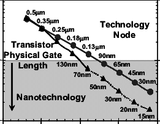
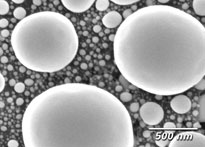
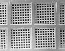
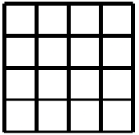

## Introduction 

### 1.1 Overview of Resolution Standards
Driven by Moore's Law, which predicts the doubling of transistor density approximately every two years, semiconductor feature sizes have scaled from the micrometre range in the 1970s to sub-2 nm nodes in commercial production today [1] . This relentless miniaturisation has rendered conventional optical microscopy impractical for surface characterisation; the wavelength of visible light (380–700 nm) fundamentally limits optical resolution to length scales far exceeding those of modern device features [2]. Consequently, there is a pressing need for higher-precision characterisation instruments.

<figure style="text-align: center; margin: 20px 0;">
  
  
  <figcaption style="font-style: italic; color: #666; margin-top: 8px; font-size: 14px;">
    <strong>Figure 1.1:</strong> Scaling of transistor size physical-gate length to-sustain Moore's Law
  </figcaption>
</figure>

To meet this need, researchers and manufacturers rely on a suite of advanced metrology instruments capable of characterising nanometre and sub-nanometre scale features. These include scanning electron microscopes (SEM), critical dimension atomic force microscopes (CD-AFM), transmission electron microscopes (TEM), and extreme ultraviolet (EUV) scatterometry systems. CD-AFM measures surface features by dragging a calibrated flared tip across a surface, like a record player needle tracing a groove, with potential width uncertainties as low as 1 nm  [3]. EUV scatterometry illuminates a patterned surface with extreme ultraviolet light (wavelength ~13.5 nm) and reconstructs the three-dimensional profile of surface features by analysing the angular distribution of scattered intensity, enabling non-destructive characterisation of line width, sidewall angle, and surface roughness at the sub-10 nm scale [4]. However, the accuracy of measurements from any such instrument depends entirely on the quality of its calibration [3] — which is where resolution and calibration standards become essential.

<figure style="text-align: center; margin: 20px 0;">
  
  
  <figcaption style="font-style: italic; color: #666; margin-top: 8px; font-size: 14px;">
    <strong>Figure 1.2:</strong> Common resolution standards: tin spheres (left) and nano-grids (right)
  </figcaption>
</figure>

### 1.2 The Importance of Sidewall Angles in Grid Resolution Standards

For instruments such as CD-AFM, 3D-AFM and electron microscopy systems (SEM, EUV), the perpendicularity of the sidewall angle of patterned features is of critical importance to measurement accuracy.
In CD-AFM, a vertical parallel structure (VPS), is required as the primary tip characteriser because it allows measurement of the CD tip width independently of the specific flare geometry of the probe. The calibration relies on the sidewalls being vertical: the finer details of the tip-sample interaction, including feature sidewall angle and corner radius, introduce higher-order tip effects that cause systematic biases in measured linewidth.Any deviation of the reference sidewall from 90° introduces an uncharacterised geometric bias into every subsequent measurement the instrument makes. [5] [3] [6] [7]

<!-- <iframe
  src="scripts/sidewall_angle_cd_error.html" 
  width="100%" 
  height="580px" 
  style="border:none; border-radius:6px;"
  sandbox="allow-scripts" >
</iframe> -->

<!DOCTYPE html>
<html lang="en">
<head>
<meta charset="UTF-8">
<title>Sidewall angle — SEM scan model</title>

</head>
<body>

  

    
Feature cross-section

    <canvas id="cvX" width="360" height="260"></canvas>
  

  

    
Simulated SEM intensity profile

    <canvas id="cvS" width="360" height="260"></canvas>
  

  

    <label style="color:#a32d2d">&#9632; Sidewall angle (°)</label>
    <input type="range" id="sA" min="60" max="90" step="0.5" value="85">
    85.0°
  

  

deviation from 90°

5.0°

  

CD error (nm)

—

  

CD error (%) at 20 nm CD

—

</body>
</html>

In EUV and SEM metrology, the consequences are equally significant. A deviation of just 5° from the ideal 90° sidewall angle has been shown to produce a critical dimension error of up to 20% in a 16 nm line-space pattern [10]. This is because the interaction of the incident beam with a non-vertical sidewall produces asymmetric scattering that systematically shifts the apparent edge position.

### 1.3 Deliverables
This project aims to fabricate a grid resolution standard with a smooth surface finish and a sidewall perpendicularity of 89.9 using proton-beam writing lithography. The use of proton-beam writing, rather than conventional electron-beam lithography, is motivated by the fundamental reduction in lateral beam scattering and will explained later in the report. The fabricated standard will be characterised using CD-AFM and SEM to verify sidewall angle, pitch uniformity, and surface roughness against the defined specifications.

<figure style="text-align: center; margin: 20px 0;">
  
  
  <figcaption style="font-style: italic; color: #666; margin-top: 8px; font-size: 14px;">
    <strong>Figure 1.3:</strong> Diagram of grid
  </figcaption>
</figure>

[Next: Methodology →](Methology.md)

### References

 

 
<ol>
  <li>Z. Yu, S. Tan, R. Han, H. Xiao, and J. He, "Device and technology outlook for 1 nm node and beyond," in <em>Proc. IEEE Int. Conf. Solid-State and Integrated Circuit Technology (ICSICT)</em>, 2004. DOI: 10.1109/ICSICT.2004.1434947</li>
 
  <li>E. Abbe, "Beiträge zur Theorie des Mikroskops und der mikroskopischen Wahrnehmung," <em>Archiv für Mikroskopische Anatomie</em>, vol. 9, pp. 413–468, 1873.</li>
 
  <li>National Institute of Standards and Technology, "Improving CD-AFM measurements from the tip down," NIST News, Mar. 2016. [Online]. Available: <a href="https://www.nist.gov/news-events/news/2016/03/improving-cd-afm-measurements-tip-down">nist.gov</a></li>
 
  <li>I. Pollentier, C.-U. Kim, P. Vandervorst, and E. Hendrickx, "EUV lithography materials characterisation using angle-resolved XPS and EUV scatterometry," <em>physica status solidi (a)</em>, vol. 216, no. 17, 2019. DOI: 10.1002/phvs.201900027</li>
 
  <li>G. Wilkening and L. Koenders, Eds., <em>Nanoscale Calibration Standards and Methods</em>, Part IV. Weinheim: Wiley-VCH, 2005. ISBN: 3-527-40502-X</li>
 
  <li>N. G. Orji, R. G. Dixson, A. Garcia-Gutierrez, B. D. Bunday, and M. Bishop, "Tip characterization method using multi-feature characterizer for CD-AFM," <em>Precision Engineering</em>, 2016. Available: <a href="https://pmc.ncbi.nlm.nih.gov/articles/PMC4803071/">pmc.ncbi.nlm.nih.gov</a></li>
 
  <li>R. G. Dixson, N. G. Orji, J. Fu, and R. Matero, "Lateral tip control effects in CD-AFM metrology: the large tip limit," <em>Journal of Micro/Nanolithography, MEMS, and MOEMS</em>, 2016. Available: <a href="https://pmc.ncbi.nlm.nih.gov/articles/PMC4832421/">pmc.ncbi.nlm.nih.gov</a></li>
 
  <li>K. H. Ko, Y. Moon, C. Jeong, H. Kim, C. U. Jeon, and H. K. Oh, "Influence of a non-ideal sidewall angle of extreme ultra-violet mask absorber for 1×-nm patterning in isomorphic and anamorphic lithography," <em>Microelectronic Engineering</em>, vol. 181, pp. 1–9, 2017. DOI: 10.1016/j.mee.2017.06.007</li>
</ol>
 

 

