## Methodology

<figure style="text-align: center; margin: 20px 0;">
  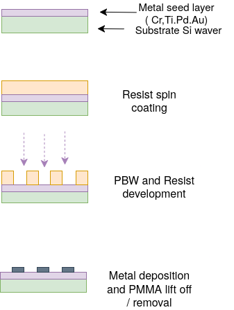
  <figcaption style="font-style: italic; color: #666; margin-top: 8px; font-size: 14px;">
    <strong>Figure 2.1:</strong> Fabrication process for the resolution standard, overview side view.
  </figcaption>
</figure>

This section outlines the materials, techniques, and analytical methods selected to fabricate and characterise the grid resolution standard. The fabrication process follows a standard sequence, which is the most widely adopted approach for producing patterned metal structures in nanofabrication and is the established procedure at CIBA. The process proceeds in four stages:

1. **Spin coating:** a photoresist is spin-coated onto the substrate to form a uniform film of controlled thickness.
2. **Lithography:** the resist is exposed using the proton beam.
3. **Metal deposition:** a metal layer is deposited over the entire surface, filling the developed trenches.
4. **Lift-off:** the remaining resist is dissolved in solvent, removing the metal deposited on top of it and leaving only the patterned grid structures.

Previously, general lithography overview, as the novelty of the proton beam approach was covered in Section 1.3,as such this section will focus instead on understanding the proton beam system and the analytical techniques used to evaluate the fabricated standard.

Further note: this section and the next include a process chart that will highlight which fabrication step each subsection corresponds to.

### 2.1 Resist

Resists are radiation-sensitive materials that can be coated onto substrates and locally modified to yield desired patterns. Based on their response to exposure, they are broadly classified as positive or negative resists. Positive resists show an increased dissolution rate in the exposed regions when developed, while negative resists show a decreased dissolution rate; the exposed regions become insoluble and are retained after development <a href="#ref-1">[1]</a>.

Two of the most common and highest-resolution resists used for nanofabrication are PMMA and HSQ. Both have been demonstrated to be compatible with proton beam writing (PBW) at sub-100 nm dimensions, and represent the state of the art for direct-write lithography at CIBA <a href="#ref-2">[2]</a>.

#### PMMA: Poly(methyl methacrylate)

<figure style="text-align: center; margin: 20px 0;">
  
  <figcaption style="font-style: italic; color: #666; margin-top: 8px; font-size: 14px;">
    <strong>Figure 2.2:</strong> PMMA repeating unit.
  </figcaption>
</figure>

PMMA is a long-chain synthetic polymer and one of the most widely used positive resists in nanofabrication. Its primary advantages include a simple formulation (PMMA dissolved in anisole, a low-toxicity solvent), insensitivity to white light (wavelength above 250 nm), a wide range of available film thicknesses through dilution, no processing delay effects after spin-coating, and straightforward removal after metal deposition via lift-off using acetone to dissolve the PMMA <a href="#ref-2">[2]</a> <a href="#ref-3">[3]</a>.

<figure style="text-align: center; margin: 20px 0;">
  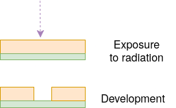
  <figcaption style="font-style: italic; color: #666; margin-top: 8px; font-size: 14px;">
    <strong>Figure 2.3:</strong> PMMA simplified development process.
  </figcaption>
</figure>

PMMA is a positive resist. When exposed to a proton or electron beam, the incident radiation generates secondary electrons that initiate chain scission: the breaking of the polymer backbone at the carbon-carbonyl bond. This reduces the molecular weight of the polymer in the exposed regions, increasing their solubility in an organic developer such as MIBK:IPA. The exposed material is dissolved away during development, leaving the unexposed PMMA as the remaining resist pattern <a href="#ref-3">[3]</a> <a href="#ref-4">[4]</a>.

PMMA is available in two standard molecular weights, 495K and 950K, each supplied at multiple concentrations in anisole (e.g. A2, A4, A6 for 2%, 4%, 6% solids by weight) <a href="#ref-3">[3]</a> <a href="#ref-5">[5]</a>. Higher molecular weight resist is more viscous at the same concentration and produces a slightly thicker film at a given spin speed. The choice of molecular weight and concentration together determine the accessible thickness range.

#### HSQ: Hydrogen Silsesquioxane

<figure style="text-align: center; margin: 20px 0;">
  
  <figcaption style="font-style: italic; color: #666; margin-top: 8px; font-size: 14px;">
    <strong>Figure 2.4:</strong> HSQ repeating unit.
  </figcaption>
</figure>

HSQ is an inorganic silicon-based resist with the empirical formula [HSiO3/2]n. In its as-deposited state it exists as a polyhedral cage of silicon and oxygen atoms, each silicon bearing a single hydrogen substituent. HSQ is a negative resist and has been shown to function as a high-resolution negative-tone e-beam resist, with resolutions below 20 nm reported and single lines as narrow as 7 nm demonstrated <a href="#ref-2">[2]</a>.

<figure style="text-align: center; margin: 20px 0;">
  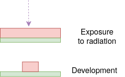
  <figcaption style="font-style: italic; color: #666; margin-top: 8px; font-size: 14px;">
    <strong>Figure 2.5:</strong> HSQ simplified development process.
  </figcaption>
</figure>

When exposed to radiation, secondary electrons cleave the Si-H bonds within the cage structure, generating silanol groups that rapidly condense to form new Si-O-Si crosslinks. This converts the soluble cage structure into a dense, crosslinked network that is insoluble in developer solutions such as TMAH. The unexposed, uncrosslinked regions are dissolved during development and removed, leaving the crosslinked network as the patterned feature. This is the negative-tone response <a href="#ref-2">[2]</a> <a href="#ref-6">[6]</a>.

#### Resist Choice

<figure style="text-align: center; margin: 20px 0;">
  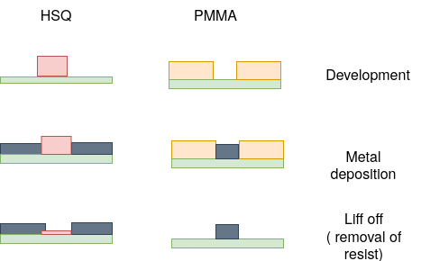
  <figcaption style="font-style: italic; color: #666; margin-top: 8px; font-size: 14px;">
    <strong>Figure 2.6:</strong> Simplified diagram of resist lift-off comparison.
  </figcaption>
</figure>

PMMA is selected over HSQ for this project on the basis of lift-off compatibility. The fabrication process requires metal deposition followed by resist lift-off to define the metallic grid features. As a positive resist, PMMA produces an undercut profile during development that allows clean separation of the deposited metal film <a href="#ref-3">[3]</a> <a href="#ref-4">[4]</a>. HSQ, as a negative resist, produces an overcut profile that prevents clean lift-off and is therefore incompatible with this process flow <a href="#ref-6">[6]</a>.

### 2.2 Proton Beam Writing

#### Dosage

In proton beam writing, dose refers to the total charge delivered per unit area of resist, expressed in nC/mm². It is the product of the beam current, the dwell time per pixel, and the inverse of the pixel area. Physically, it represents the number of protons that have passed through each unit area of the resist surface. A higher dose means more protons, more secondary electron generation, and therefore more chain scission events per unit volume of photoresist.

> Dose is distinct from energy. Energy determines where in the resist the protons stop and how deeply they penetrate. Dose determines how much chemical damage is accumulated at each depth along that path.

<figure style="text-align: center; margin: 20px 0;">
  
  <figcaption style="font-style: italic; color: #666; margin-top: 8px; font-size: 14px;">
    <strong>Figure 2.7:</strong> Dosage and development testing diagram.
  </figcaption>
</figure>

There is a minimum dose required, called the threshold dose, to fully develop a given volume of PMMA. For 1 µm of PMMA this is approximately 100 nC/mm². Below this value, the chain scission density is insufficient for the developer (DI:IPA 7:3) to dissolve the exposed material, and the feature will either partially develop or not develop at all. To test this and choose a suitable dose range, various grids were fabricated on the same piece of silicon wafer with the same seed metal layer of 2 nm Cr.

<figure style="text-align: center; margin: 20px 0;">
  
  <figcaption style="font-style: italic; color: #666; margin-top: 8px; font-size: 14px;">
    <strong>Figure 2.8:</strong> Dosage and development testing results, during lift off process
  </figcaption>
</figure>

The visible flakes are PMMA being removed during the lift off
#### Effects of Dosage

<figure style="text-align: center; margin: 20px 0;">
  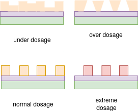
  <figcaption style="font-style: italic; color: #666; margin-top: 8px; font-size: 14px;">
    <strong>Figure 2.9:</strong> Dosage effect diagram.
  </figcaption>
</figure>

**Underdose (below approximately 50 to 75 nC/mm²):** Insufficient chain scission. The exposed PMMA does not reach its threshold dose. The feature either does not develop, or develops incompletely, leaving a residual PMMA layer at the bottom. This prevents the metal seed layer from being exposed and produces no visible grid feature after lift-off.

**Correct dose (above 100 nC/mm²):** The exposed volume is cleanly dissolved by the developer from top to bottom, producing a well-defined trench with vertical sidewalls whose quality is limited by the lateral straggle of the beam, as characterised in Section 3.2.

**Overdose (above 280 nC/mm²):** Excess secondary electron generation begins to expose resist beyond the intended beam boundary. The trench widens beyond the written pattern, reducing the effective critical dimension and degrading sidewall verticality.

**Extreme overdose (above approximately 3.5 x 10¹⁴ ions/cm²):** PMMA undergoes a positive-to-negative resist transition, and the exposed regions become insoluble rather than soluble. This regime is not relevant to the present project but would fundamentally change the development polarity if accidentally reached. <a href="#ref-6">[6]</a>

### 2.3 Material Deposition

Following lithographic patterning and development of the resist, metal is deposited onto the substrate to form the functional grid features. For this project, metal deposition is carried out using physical vapour deposition (PVD), a broad class of processes in which a solid source material is vaporised and the resulting vapour is transported and condensed onto the substrate as a thin film <a href="#ref-7">[7]</a> <a href="#ref-8">[8]</a>.

<figure style="text-align: center; margin: 20px 0;">
  
  <figcaption style="font-style: italic; color: #666; margin-top: 8px; font-size: 14px;">
    <strong>Figure 2.10:</strong> PVD schematic.
  </figcaption>
</figure>

The general PVD process proceeds in four stages: energy is applied to the source material to vaporise it; the vaporised material is transported through a high-vacuum environment; the vapour impinges on the substrate surface; and the material condenses to form a thin film.

PVD is well-suited to this project for several reasons. High vacuum conditions minimise contamination from residual gases. The deposition rate can be controlled, providing influence over the film morphology, texture, and surface roughness, all of which affect the calibration utility of the finished standard <a href="#ref-7">[7]</a> .

The primary disadvantage of PVD is that it is a line-of-sight process: atoms travel in straight paths from the source to the substrate and cannot coat surfaces that are geometrically hidden from the source. For this project, this is not a limitation, as the grid structure is a relatively simple planar geometry with no hidden or re-entrant surfaces requiring coating.

Additionally, given that pure PMMA has a glass transition temperature (Tg) of approximately 105 to 107 °C (commercial grades can range from 85 to 165 °C) <a href="#ref-8">[8]</a> , the deposition method must not subject the substrate to temperatures that would damage the PMMA before lift-off.

Three PVD techniques are considered: magnetron sputtering, electron beam evaporation, and filtered cathodic vacuum arc (FCVA).

#### Magnetron Sputtering

<figure style="text-align: center; margin: 20px 0;">
  
  <figcaption style="font-style: italic; color: #666; margin-top: 8px; font-size: 14px;">
    <strong>Figure 2.11:</strong> RF sputtering schematic.
  </figcaption>
</figure>

For this project, magnetron sputtering is the most readily accessible deposition technique available in the laboratory. Its key advantage in the context of PMMA-patterned substrates is that it is a non-thermal process: energy is delivered to the target by ion bombardment rather than by heat, so the substrate temperature remains comparatively low during deposition. This reduces the risk of the PMMA resist warping or deforming before lift-off. Magnetron sputtering is also highly versatile in terms of target material, provided the material is compatible with the vacuum level achievable in the available system.

The primary disadvantage for lift-off applications is the diffuse angular transport of sputtered atoms, which can deposit material on the sides of resist walls and prevent clean lift-off <a href="#ref-7">[7]</a> .

#### E-beam Evaporation

In electron beam (e-beam) evaporation, a high-voltage (6 to 40 kV) electron beam is focused onto a target material held in a water-cooled crucible. The kinetic energy of the electrons is converted to thermal energy on impact, causing the target to melt or sublimate and produce a vapour flux that condenses onto the substrate as a thin film. The beam is deflected through 180° or 270° by a magnetic field, keeping the filament away from the deposition path to preserve film purity, and can be scanned across the target in X and Y to distribute heating uniformly. The process must be carried out under high vacuum (below 10⁻² mbar) to prevent energy loss from electron collisions with residual gas molecules. E-beam evaporation can vaporise materials with melting points up to approximately 2,800 °C, making it suitable for refractory metals that cannot be processed by resistive thermal evaporation.

#### DLC Deposition via FCVA

<figure style="text-align: center; margin: 20px 0;">
  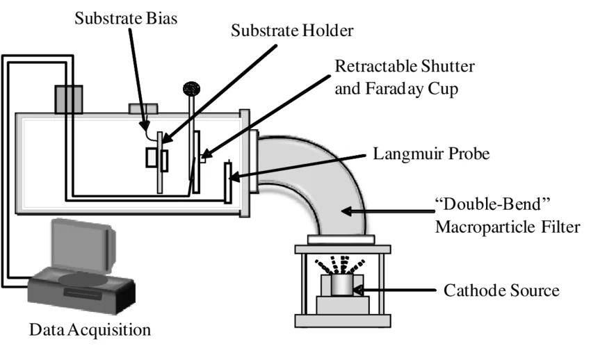
  <figcaption style="font-style: italic; color: #666; margin-top: 8px; font-size: 14px;">
    <strong>Figure 2.12:</strong> FCVA schematic.
  </figcaption>
</figure>

Filtered cathodic vacuum arc (FCVA) is a PVD technique in which a high-current arc is struck on a graphite cathode, generating a carbon plasma that is directed onto the substrate through a magnetic filter. The filter removes macroparticles from the plasma stream, producing a dense, smooth diamond-like carbon (DLC) film with a tunable sp²/sp³ ratio depending on the arc parameters. Unlike sputtering or thermal evaporation, FCVA can deposit hard, wear-resistant carbon films at room temperature without requiring a precursor gas.

### 2.4 Material Choice

For this fabrication project, a metal is required that satisfies five criteria:

1. It must be compatible with PMMA lift-off, i.e. depositable at substrate-compatible temperatures.
2. It must be a good electron scatterer for SEM and TEM characterisation. Materials with a high atomic number (high Z) produce strong contrast in electron microscopy.
3. It must be chemically stable. The grid standard must resist oxidation or corrosion during storage and repeated use.
4. It must have low lattice mismatch with the silicon substrate to minimise stress-induced deformation of the thin film. The silicon substrate has a lattice parameter of a = 5.431 Å (diamond cubic structure) <a href="#ref-9">[9]</a> . Lattice mismatch f is defined as f = (a_film - a_Si) / a_Si.
5. It must have good surface smoothness to limit diffuse electron scattering.

The Névot-Croce factor provides a quantitative measure of how surface roughness degrades specular signal retention. A perfectly smooth surface reflects all of the incident beam in the specular direction. As the surface gets rougher, signal scatters diffusely in random directions and the coherent reflection is reduced.

<figure style="text-align: center; margin: 20px 0;">
  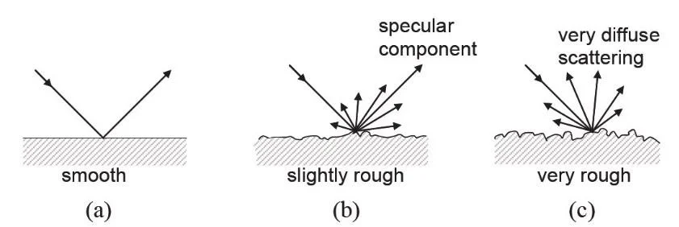
  <figcaption style="font-style: italic; color: #666; margin-top: 8px; font-size: 14px;">
    <strong>Figure 2.13:</strong> Diffuse surface scattering as a function of roughness.
  </figcaption>
</figure>

<iframe src="scripts/nevot_croce_roughness.html"
        allowfullscreen="true"
        width="500px"
        height="500px">
</iframe>

The plot shows signal retention as a function of roughness across representative scattering conditions. At q_z = 0.5 nm⁻¹ (grazing incidence, where CD-AFM and SEM calibration measurements typically operate), a surface roughness below 1 nm yields an NC factor above 0.94, meaning less than 6% of the coherent specular signal is lost to diffuse scatter. This places the standard firmly within the near-ideal regime where roughness-induced measurement bias is negligible.

### 2.5 Method of Analysis

Three complementary characterisation techniques are used to evaluate the fabricated grid resolution standard: SEM analysis for edge straightness and sidewall angle, and atomic force microscopy (AFM) for surface roughness.

#### SEM: Edge Straightness and Sidewall Angle

The SEM is the primary tool used in this project to assess edge quality and estimate sidewall angle. The method selected is based off F.Zhang et al. (CIBA, NUS), NIMB 2007 <a href="#ref-10">[10]</a> . When the electron beam scans across the edge of a grid feature, the secondary electron yield increases sharply at the sidewall, producing a bright edge peak in the greyscale line profile. The width of this bright band, known as the edge width (EW) or white-band width (WBW), is directly related to the sidewall angle: a steeper, more vertical sidewall produces a narrower edge band, while a sloped or tapered sidewall broadens it.

<figure style="text-align: center; margin: 20px 0;">
  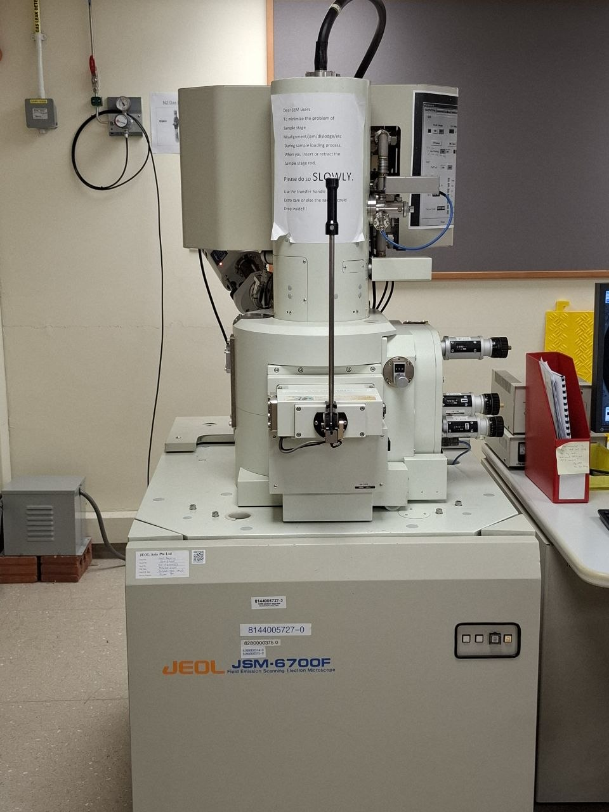
  <figcaption style="font-style: italic; color: #666; margin-top: 8px; font-size: 14px;">
    <strong>Figure 2.14:</strong> SEM machine used to image the sample
  </figcaption>
</figure>

The edge intensity profile is fitted using a combined error function and Gaussian model:

$$ F(x) = A\left[1 + \text{Erf}\!\left(\frac{2\sqrt{\ln 2}}{f}(d - x)\right)\right] + B\exp\!\left(-\frac{\ln 16}{f^2}(d - x)^2\right) + C $$

where *A* is the error function amplitude, *B* is the Gaussian amplitude, *C* is the baseline offset, *d* is the fitted edge position in pixels, and *f* is the FWHM of the edge transition <a href="#ref-10">[10]</a> .

<figure style="text-align: center; margin: 20px 0;">
  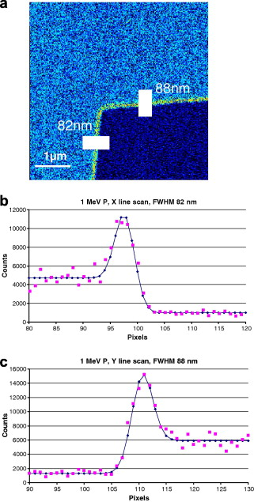
  <figcaption style="font-style: italic; color: #666; margin-top: 8px; font-size: 14px;">
    <strong>Figure 2.15:</strong> Analysis method applied to the previously fabricated nickel reference grid: F.Zhang et al. (CIBA, NUS), NIMB 2007 <a href="#ref-10">[10]</a> 
  </figcaption>
</figure>

The error function term models the underlying step transition in secondary electron intensity as the beam crosses the edge, which is the fundamental shape of an ideal edge profile convolved with the finite beam diameter. The Gaussian term accounts for the bright secondary electron emission peak at the sidewall. Together they give a physically complete description of the measured profile.

The key output is *f*, the FWHM of the fitted edge transition. A smaller *f* corresponds to a sharper, more abrupt edge, which in turn indicates a more vertical sidewall. The sidewall angle θ is estimated geometrically from the fitted FWHM and the known feature height *h*:

$$ \theta = 90° - \arctan\!\left(\frac{f}{h}\right)$$

where *h* is the feature height determined from the PBW process parameters and verified by AFM step-height measurement.

<figure style="text-align: center; margin: 20px 0;">
  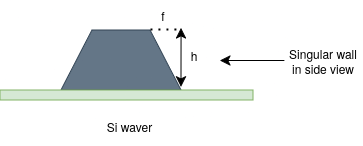
  <figcaption style="font-style: italic; color: #666; margin-top: 8px; font-size: 14px;">
    <strong>Figure 2.16:</strong> Geometric relationship between FWHM and sidewall angle.
  </figcaption>
</figure>

The resolution limit for this type of measurement is approximately 10 nm, below which the finite beam diameter and beam-sample interaction volume prevent reliable edge discrimination. The method is also limited to top-down  and cannot directly image the sidewall profile without cross-sectioning, which is destructive or by tilting the stage, which will be discussed later in [Future works](!FW.md) 

##### Processing data
To process and analyze the SEM data, a Python script was developed. The software workflow is illustrated below.

<figure style="text-align: center; margin: 20px 0;">
  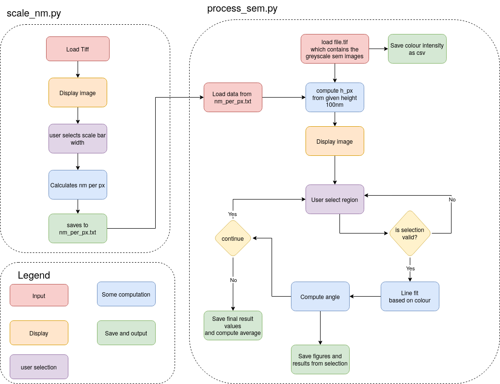
  <figcaption style="font-style: italic; color: #666; margin-top: 8px; font-size: 14px;">
    <strong>Figure 2.17:</strong> Software flowchart for the SEM analysis pipeline.
  </figcaption>
</figure>

The JEOL JSM-6700F SEM produces a greyscale image where each pixel's intensity value is directly proportional to the number of secondary electrons detected at that position on the sample surface. While the raw electron counts are not directly accessible, the 8-bit greyscale encoding (0–255) provides a linearly scaled representation of the local electron yield, and can therefore be treated as a quantitative proxy for electron intensity.

By fitting the combined error function and Gaussian model to this intensity profile, the FWHM of the edge transition can be extracted. Since the greyscale intensity is proportional to electron count, the fitted FWHM corresponds directly to the spatial width of the electron intensity transition, and by extension, to the projected width of the sidewall slope at the sample surface. Combined with the known feature height, this allows the sidewall angle to be estimated from a standard top-down SEM image.

<figure style="text-align: center; margin: 20px 0;">
  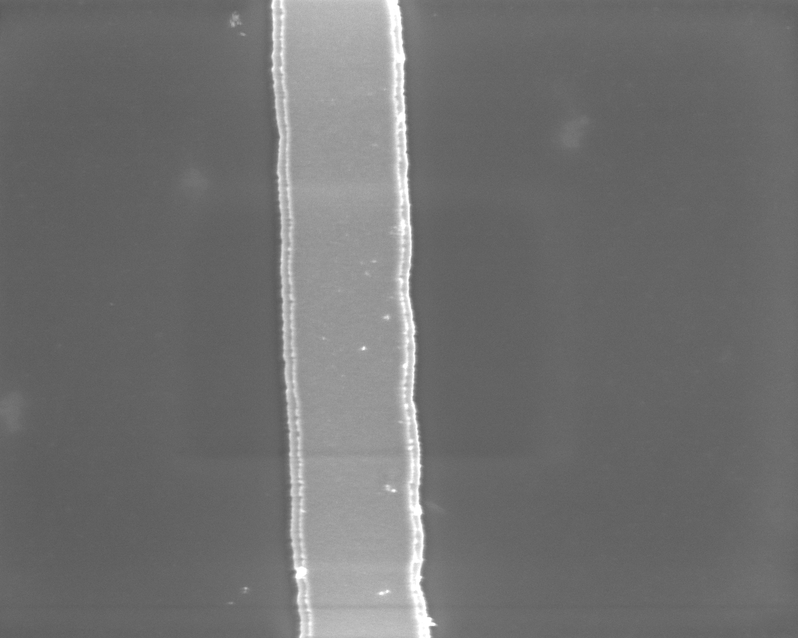
  <figcaption style="font-style: italic; color: #666; margin-top: 8px; font-size: 14px;">
    <strong>Figure 2.18:</strong> Example image from SEM imaging.
  </figcaption>
</figure>

#### AFM: Surface Roughness

AFM is used to characterize the surface roughness of the top face of the deposited metal grid features and of the exposed silicon substrate between features. The AFM tip scans in tapping mode across the sample surface, recording sub-nanometre height variations. From the resulting height map, the root mean square roughness Rq (also written Rrms) is extracted, which is the standard deviation of height across the measured area. An example surface profile as visualised in Gwyddion is shown below.

<figure style="text-align: center; margin: 20px 0;">
  
  <figcaption style="font-style: italic; color: #666; margin-top: 8px; font-size: 14px;">
    <strong>Figure 2.17:</strong> Example AFM surface scan of a Pd-seeded silicon sample.
  </figcaption>
</figure>

<figure style="text-align: center; margin: 20px 0;">
  
  <figcaption style="font-style: italic; color: #666; margin-top: 8px; font-size: 14px;">
    <strong>Figure 2.18:</strong> Line profiles extracted at the centre lines in both the vertical and horizontal directions.
  </figcaption>
</figure>

For a resolution standard, surface roughness is significant for two reasons. First, it affects the accuracy of AFM-based calibration measurements made using the standard: a rough reference surface introduces uncertainty into tip characterisation. Second, roughness provides indirect information about the quality of the deposition process and the uniformity of the metal film grain structure. The target surface roughness for a usable resolution standard is below 1 nm Rq.

#### Surface Roughness Metrics

Surface roughness is quantified from the AFM height profiles using three standard parameters. For a profile of N height points y_i, with the mean height subtracted to remove any scan tilt or baseline offset, the three metrics are defined as follows.

The root mean square roughness Rq is the standard deviation of the height values:

$$ R_q = \sqrt{\frac{1}{N} \sum_{i=1}^{N} y_i^2} $$

The arithmetic mean roughness Ra is the average of the absolute height deviations:

$$ R_a = \frac{1}{N} \sum_{i=1}^{N} |y_i| $$

Ra treats all deviations equally regardless of their size and is less sensitive to outliers than Rq. It is reported here as a secondary reference, as it is the most widely cited roughness parameter in industrial standards.

The total height Rz is the peak-to-valley span across the full profile:

$$ R_z = y_{max} - y_{min} $$

Rz gives the worst-case surface excursion and is most sensitive to isolated spikes or scratches. A large Rz relative to Rq indicates the presence of a small number of extreme features on an otherwise smooth surface.

All three parameters are computed from 1D line profiles extracted from the AFM height map by the Python analysis script. Values are reported in nanometres after converting from the raw SI metre output of Gwyddion.

[← Prev: Introduction](Introduction.md) | [Next: Fabrication →](Fabrication.md)

### References

<ol>
  <li id="ref-1">K. Yamazaki, "Electron beam direct writing," in <em>Nanofabrication:
  Fundamentals and Applications</em>, A. A. Tseng, Ed. Singapore: World
  Scientific, 2008, ch. 10.</li>

  <li id="ref-2">J. A. van Kan, P. Malar, and A. B. H. Tay, "Resist materials for proton
  beam writing: a review," <em>Appl. Surf. Sci.</em>, 2014.
  DOI: 10.1016/j.apsusc.2014.04.147</li>

  <li id="ref-3">Microchem / Kayaku Advanced Materials, "PMMA Data Sheet," 2019.
  Available: <a href="https://kayakuam.com/wp-content/uploads/2019/09/PMMA_Data_Sheet.pdf">kayakuam.com</a></li>

  <li id="ref-4">F. Watt, M. B. H. Breese, A. A. Bettiol, and J. A. van Kan, "Proton beam
  writing," <em>Mater. Today</em>, vol. 10, no. 6, pp. 20–29, 2007.
  DOI: 10.1016/S1369-7021(07)70129-3</li>

  <li id="ref-5">F. Watt, A. A. Bettiol, J. A. van Kan, E. J. Teo, and M. B. H. Breese,
  "Ion beam lithography and nanofabrication: a review," <em>Int. J. Nanosci.</em>,
  vol. 4, no. 3, pp. 269–286, 2005.</li>

  <li id="ref-6">N. Puttaraksa et al., "Fabrication of a negative PMMA master mold for
  soft-lithography by MeV ion beam lithography," <em>Nuclear Instruments and
  Methods in Physics Research Section B</em>, vol. 272, pp. 149–152, 2012.
  DOI: <a href="https://doi.org/10.1016/j.nimb.2011.01.053">10.1016/j.nimb.2011.01.053</a></li>

  <li id="ref-7">H. Frey and H. R. Khan, Eds., <em>Handbook of Thin-Film Technology</em>.
  Berlin: Springer, 2015.</li>

  <li id="ref-8">K. Müller, "Thermal stability of PMMA resists used in nanolithography,"
  <em>Sci. Rep.</em>, 2021. DOI: 10.1038/s41598-021-01282-7</li>

  <li id="ref-9">L. B. Freund and S. Suresh, <em>Thin Film Materials: Stress, Defect
  Formation and Surface Evolution</em>. Cambridge: Cambridge University
  Press, 2003.</li>

  <li id="ref-10">F. Zhang, J. A. van Kan, S. Y. Chiam, and F. Watt, <em>Nuclear Instruments
  and Methods in Physics Research Section B: Beam Interactions with Materials
  and Atoms</em>, vol. 260, no. 1, pp. 474–478, Jul. 2007.
  DOI: <a href="https://doi.org/10.1016/j.nimb.2007.02.065">10.1016/j.nimb.2007.02.065</a></li>
</ol>

