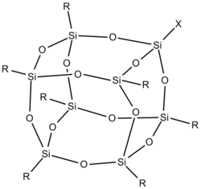
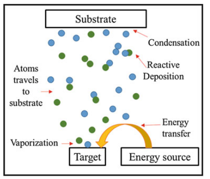
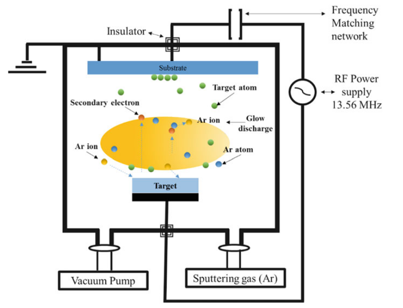
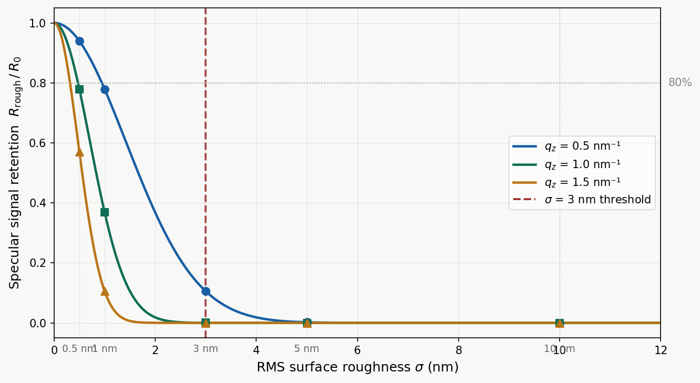
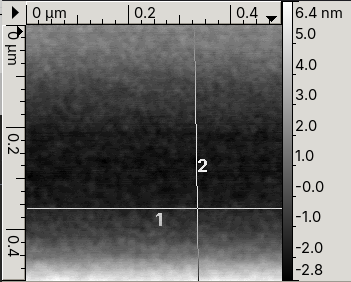
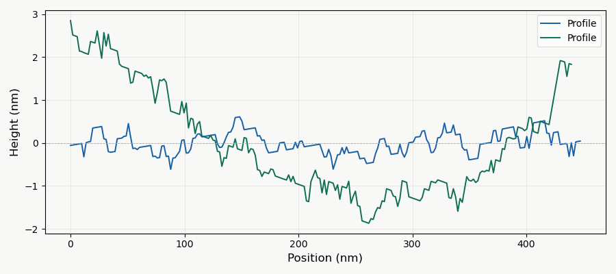

## Methodology

### 2.1 lithography methods
The choice of lithographic technique is central to the quality of the fabricated grid resolution standard, as it directly governs the achievable sidewall verticality, feature resolution, and proximity effects. Three primary techniques are considered here: electron-beam lithography (EBL), proton-beam writing (PBW), and soft UV lithography.

#### Electron beam lithography

Electron-beam lithography (EBL) is among the most widely used techniques for high-resolution nanopatterning, commonly employed for mask fabrication in the semiconductor industry [1]. Using a focused Gaussian beam, EBL can achieve feature resolutions of 10 nm or below, with common resists including PMMA, ZEP, and HSQ [1]. However, EBL suffers from a fundamental physical limitation — the proximity effect. When the beam interacts with the resist and substrate, it undergoes elastic and inelastic collisions with target atoms, generating high-energy secondary electrons that travel considerable distances from the primary beam track, exposing resist beyond the intended pattern boundaries [2]. Adjacent features therefore influence one another's exposure dose, an effect that worsens with depth and makes achieving consistently vertical sidewalls extremely challenging [1][2].

#### Proton Beam writing 

Proton-beam writing (PBW) is a direct-write lithographic technique developed at the Centre for Ion Beam Applications (CIBA), Physics Department, National University of Singapore [3][4]. In PBW, a focused MeV-energy proton beam is scanned in a predetermined pattern over a suitable resist material, which is subsequently chemically developed [4][5].

The key physical distinction from EBL lies in the mass of the incident particle. Protons are approximately 1,800 times more massive than electrons, which has two critical consequences [4] [5]. First, due to their greater momentum, protons travel in near-linear trajectories through the resist with minimal lateral deflection, even at significant depths [4] [5]. Second, the secondary electrons generated by proton-resist interactions have considerably lower energies — typically below 100 eV — compared to those generated in EBL [3][5]. These low-energy secondary electrons have a very limited range, modifying resist material only within several nanometres of the proton track, resulting in minimal proximity effects [3] [4] [5] [6].

<figure style="text-align: center; margin: 20px 0;">
  
  <figcaption style="font-style: italic; color: #666; margin-top: 8px; font-size: 14px;">
    <strong>Figure 2.3:</strong> Depth penetration comparison
  </figcaption>
</figure>

The practical outcome of these properties is that PBW is capable of fabricating three-dimensional, high-aspect-ratio structures with smooth, near-vertical sidewalls and low line-edge roughness [4] [5] [6]. Aspect ratios of up to 160 have been demonstrated in SU-8, and feature widths down to 19 nm have been achieved in HSQ using a 2 MeV proton beam at CIBA [6] [7]. Sub-3 nm edge smoothness has also been reported [7].

### Choosing P-beam

Soft UV lithography is excluded from consideration for this application as its resolution is fundamentally diffraction-limited, making it unsuitable for the sub-micron grid features required. EBL, while capable of achieving the necessary lateral resolution, produces sidewall profiles that deteriorate with increasing depth due to the proximity effect — making consistent ≥89° sidewall angles across a two-dimensional grid geometry difficult to guarantee. PBW is selected as the lithographic method for this project 

### 2.2 Resist 

Resists are radiation-sensitive materials that can be coated onto substrates and locally modified to yield desired patterns. Based on their response to exposure, they are broadly classified as positive or negative resists. Positive resists show an increased dissolution rate in the exposed regions when developed, while negative resists show a decreased dissolution rate — the exposed regions become
insoluble and are retained after development [9].

Two of the most common and highest-resolution resists used for nano-fabrication are PMMA and HSQ. Both have been demonstrated to be compatible with proton-beam writing (PBW) at sub-100 nm dimensions, and represent the state-of-the-art for
direct-write lithography at CIBA [10].

####  PMMA — Poly(methyl methacrylate)

<figure style="text-align: center; margin: 20px 0;">
  
  <figcaption style="font-style: italic; color: #666; margin-top: 8px; font-size: 14px;">
    <strong>Figure 2.4:</strong> PMMA repeating unit
  </figcaption>
</figure>

PMMA is a long-chain synthetic polymer and one of the most widely used positive resists in nano-fabrication. Its primary advantages include a simple formulation (PMMA dissolved in anisole, a low-toxicity solvent), insensitivity to white
light (λ > 250 nm), a wide range of available film thicknesses through dilution, no shelf-life limitations, no processing delay effects after spin-coating, and straightforward removal after metal deposition via lift-off [10] [11].

PMMA is a positive resist. When exposed to a proton or electron beam, the incident radiation generates secondary electrons that initiate chain scission — the breaking of the polymer backbone at the carbon–carbonyl bond. This reduces
the molecular weight of the polymer in the exposed regions, increasing their solubility in an organic developer such as MIBK:IPA. The exposed material is dissolved away during development, leaving the unexposed PMMA as the remaining resist pattern [11] [12].

#### HSQ — Hydrogen Silsesquioxane

<figure style="text-align: center; margin: 20px 0;">
  
  <figcaption style="font-style: italic; color: #666; margin-top: 8px; font-size: 14px;">
    <strong>Figure 2.4:</strong> HSQ repeating unit
  </figcaption>
</figure>

HSQ is an inorganic silicon-based resist with the empirical formula [HSiO₃/₂]ₙ.In its as-deposited state it exists as a polyhedral cage of silicon and oxygen atoms, each silicon bearing a single hydrogen substituent. HSQ is a negative resist and has been shown to function as a high-resolution negative-tone e-beam resist, with resolutions below 20 nm reported and single lines as narrow as 7 nm
demonstrated [10].

When exposed to radiation, secondary electrons cleave the Si–H bonds within the cage structure, generating silanol groups that rapidly condense to form new Si–O–Si crosslinks. This converts the soluble cage structure into a dense, crosslinked network that is insoluble in developer solutions such as TMAH. The unexposed, uncrosslinked regions are dissolved during development and removed, leaving the crosslinked network as the patterned feature — the negative-tone
response [10] [13].

HSQ has a limited shelf life of approximately 6 months (Dow Corning specification), and the coated film must be exposed and developed promptly after coating to achieve reproducible results , a constraint not shared by PMMA.

#### Resist choice

PMMA is selected over HSQ for this project for three reasons.

First, lift-off compatibility. The fabrication process in this project requires metal deposition followed by resist lift-off to define the metallic grid features. As a positive resist, PMMA produces an undercut profile during development that allows clean separation of the deposited metal film [11] [12]. HSQ, as a negative resist, produces an overcut profile that prevents clean lift-off and is therefore incompatible with this process flow [13].

Second, resolution requirements. Positive resists such as PMMA can typically resolve features down to approximately 20 nm, while negative resists such as HSQ generally resolve to around 40 nm under standard conditions [12]. As the target grid pitch for this standard does not require sub-20 nm features, the resolution advantage of HSQ is not a determining factor, and PMMA is sufficient.

Third, process reliability. PMMA has an unlimited shelf life and is stable in air after spin-coating, placing no time constraint on processing. HSQ contrast and sensitivity degrade with age and with delay between coating and exposure, introducing a source of variability that is undesirable when fabricating a
calibration standard requiring high reproducibility [10].

### 2.3 Material deposition

Following lithographic patterning and development of the resist, metal is deposited onto the substrate to form the functional grid features. For this project, metal deposition is carried out using physical vapour deposition (PVD) — a broad class of processes in which a solid source material is vaporised and the resulting vapour is transported and condensed onto the substrate as a thin film [13] [14].
 
<figure style="text-align: center; margin: 20px 0;">
  
  <figcaption style="font-style: italic; color: #666; margin-top: 8px; font-size: 14px;">
    <strong>Figure 2.5:</strong> PVD schematic
  </figcaption>
</figure>

The general PVD process proceeds in four stages:
1. Energy is applied to the source material to vaporise it
2. The vaporised material is transported through a high-vacuum environment
3. The vapour impinges on the substrate surface
4. The material condenses and forms a thin film on the substrate

PVD is well-suited to this project for several reasons. The composition of the deposited film is directly controlled by the choice of source material, enabling rapid testing of different metals without altering the rest of the fabrication process. High vacuum conditions minimise contamination from residual gases.
Critically, the deposition rate can be controlled, providing influence over the film morphology, texture, and surface roughness, all of which affect the calibration utility of the finished standard [14].

The primary disadvantage of PVD is that it is a line-of-sight process, atoms travel in straight paths from the source to the substrate and cannot coat surfaces that are geometrically hidden from the source. For this project, this is not a limitation, as the grid structure is a relatively simple planar geometry with no hidden or re-entrant surfaces requiring coating.

Additionally, given that  Pure PMMA has a glass transition temperature (Tg) of approximately 105–107 °C but commercial grades can range from 85 to 165 °C[16], the deposition method should not damage the PMMA 
 
Three PVD techniques are considered: magnetron sputtering, E-beam deposition and Filtered cathodic acuum arc (FCVA).

#### Magnetron sputtering

<figure style="text-align: center; margin: 20px 0;">
  
  <figcaption style="font-style: italic; color: #666; margin-top: 8px; font-size: 14px;">
    <strong>Figure 2.6</strong> RF sputtering schematic
  </figcaption>
</figure>
For this project, magnetron sputtering is the most readily accessible deposition
technique available in the lab. Its key advantage in the context of PMMA-patterned substrates is that it is a non-thermal process — energy is delivered to the target by ion bombardment rather than by heat, so the substrate temperature remains comparatively low during deposition. This reduces the risk of the PMMA resist warping or deforming before lift-off. Magnetron sputtering is also highly versatile in terms of target material, provided the material is compatible with
the vacuum level achievable in the available system.

The primary disadvantage for lift-off applications is the diffuse transport of
sputtered atoms: which can prevent clean lift-off [15].

    
#### E-beam deposition  
In electron beam (e-beam) deposition, a high-voltage (6–40 kV) electron beam is focused onto a target material held in a water-cooled crucible. The kinetic energy of the electrons is converted to thermal energy on impact, causing the target to melt or sublimate and produce a vapour flux that condenses onto the substrate as a thin film. The beam is deflected through 180° or 270° by a magnetic field — keeping the filament away from the deposition path to preserve film purity — and can be scanned across the target in X and Y to distribute heating uniformly. The process must be carried out under high vacuum (>10⁻² mbar) to prevent energy loss from electron collisions with residual gas molecules. E-beam deposition can vaporise materials with melting points up to ~2,800 °C, making it suitable for refractory metals that cannot be processed by resistive thermal evaporation.

#### DLC deposition via FCVA

Filtered cathodic vacuum arc (FCVA) is a PVD technique in which a high-current arc is struck on a graphite cathode, generating a carbon plasma that is directed 
onto the substrate through a magnetic filter. The filter removes macroparticles from the plasma stream, producing a dense, smooth diamondlike carbon (DLC) film 
with a tunable sp²/sp³ ratio depending on the arc parameters. Unlike sputtering or thermal evaporation, FCVA can deposit hard, wear-resistant carbon films at 
room temperature without requiring a precursor gas.

DLC was considered as a candidate absorber material for the grid resolution standard due to its chemical inertness and mechanical hardness. However, it was 
excluded on three grounds: its low atomic number (Z = 6) gives near-zero SEM contrast against the silicon substrate (Z = 14); the oxygen plasma conditions 
required for selective DLC etching are incompatible with a PMMA lift-off process; and the FCVA facility was not available for use at the time of fabrication. 
FCVA-deposited DLC samples from prior work will be referenced for comparison in the analysis section where relevant.

### 2.4 Material choice

For this fabrication project, a metal is required that satisfies four criteria:
 
1. It must be compatible with PMMA lift-off — i.e. evaporable at substrate

2. It must be a good electron scatterer for SEM and TEM characterization --   materials with high atomic number (high-Z) produce strong contrast in electron microscopy.

3. It must be chemically stable — the grid standard must resist oxidation or corrosion during storage and repeated use.

4. It must have low lattice mismatch with the silicon substrate to minimize stress-induced deformation of the thin film.
The silicon substrate has a lattice parameter of a = 5.431 Å (diamond cubic structure) [18]. Lattice mismatch f is defined as f = (a_film − a_Si) / a_Si.

5. Good surface smoothness, limiting e- scattering 
Using the Névot-Croce factor, to visualize the importance of a smooth surface under <3nm

The Névot-Croce factor is a  correction factor that tells you how much of the specular (mirror-like) reflected signal you lose from a surface due to roughness.
A perfectly smooth surface reflects 100% of the incident beam in the specular direction. As the surface gets rougher, some of that signal scatters diffusely in random directions instead, so the sharp, coherent reflection you're trying to measure gets weaker

<figure style="text-align: center; margin: 20px 0;">
  
  <figcaption style="font-style: italic; color: #666; margin-top: 8px; font-size: 14px;"> Névot-Croce factor against roughness
    <strong>Figure 2.7</strong> 
  </figcaption>
</figure>

The plot shows signal retention as a function of roughness across three representative scattering conditions (q_z = 0.5, 1.0, and 1.5 nm⁻¹). All three curves decay exponentially — at low roughness the surface behaves near-ideally, but beyond ~3 nm the higher-q curves drop sharply, indicating that diffuse scatter increasingly dominates over the coherent specular signal. At σ = 5 nm the most sensitive condition retains less than 40% of its signal; at σ = 10 nm the signal is effectively lost.
The 3 nm threshold is therefore chosen as the point at which signal retention remains above 80%

### 2.5 method of analysis
Three complementary characterization techniques are used to evaluate the fabricated grid resolution standard: scanning electron microscopy (SEM) for edge straightness and sidewall angle, atomic force microscopy (AFM) for surface roughness.

#### SEM - edge straightness  and side wall angle 

SEM is the primary tool used in this project to assess edge quality and estimate sidewall angle. When the electron beam scans across the edge of a grid feature, the secondary electron yield increases sharply at the sidewall — producing a bright edge peak in the greyscale line profile. The width of this bright band, known as the edge width (EW) or white-band width (WBW), is directly related to the sidewall angle: a steeper, more vertical sidewall produces a narrower edge band, while a sloped or tapered sidewall broadens it.

The edge intensity profile is fitted using a combined error function and Gaussian model:
 
$$ F(x) = A\left[1 + \text{Erf}\!\left(\frac{2\sqrt{\ln 2}}{f}(d - x)\right)\right] + B\exp\!\left(-\frac{\ln 16}{f^2}(d - x)^2\right) + C $$
 
where *A* is the error function amplitude, *B* is the Gaussian amplitude, *C* is the baseline offset, *d* is the fitted edge position in pixels, and *f* is the FWHM of the edge transition [3].
 
The **error function term** models the underlying step transition in secondary electron intensity as the beam crosses the edge — the fundamental shape of an ideal edge profile convolved with the finite beam diameter. The **Gaussian term** accounts for the bright secondary electron emission peak at the sidewall. Together they give a physically complete description of the measured profile.
 
The key output is *f* — the FWHM of the fitted edge transition. A smaller *f* corresponds to a sharper, more abrupt edge, which in turn indicates a more vertical sidewall. The sidewall angle θ is estimated geometrically from the fitted FWHM and the known feature height *h*:
 
$$ \theta = 90° - \arctan\!\left(\frac{f}{h}\right)$$
 
where *h* is the feature height determined from the PBW process parameters and verified by AFM step-height measurement.

The resolution limit of SEM for this type of measurement is approximately 1 nm,below which the finite beam diameter and beam-sample interaction volume prevent reliable edge discrimination. SEM is also limited to top-down or oblique imaging — it cannot directly image the sidewall profile without cross-sectioning,
which is destructive. 

#### AFM - Surface Roughness

AFM is used to characterize the surface roughness of the top face of the deposited metal grid features and of the exposed silicon substrate between features. The AFM tip scans in tapping mode across the sample surface, recording sub-nanometer height variations. From the resulting height map, the root mean square roughness R_rms (also written R_q) is extracted, the standard deviation of height across the measured area.

<figure style="text-align: center; margin: 20px 0;">
  

  <figcaption style="font-style: italic; color: #666; margin-top: 8px; font-size: 14px;"> Afm example 
    <strong>Figure 2.7</strong> 
  </figcaption>
</figure>

<figure style="text-align: center; margin: 20px 0;">
  

  <figcaption style="font-style: italic; color: #666; margin-top: 8px; font-size: 14px;"> graph of surface at center lines in both verticle and horizontal
    <strong>Figure 2.8</strong> 
  </figcaption>
</figure>

For a resolution standard, surface roughness is significant for two reasons. First, it affects the accuracy of AFM-based calibration measurements made using the standard: a rough reference surface introduces uncertainty into tip characterization. Second, roughness provides indirect information about the quality of the deposition process and the uniformity of the metal film grain structure. Target surface roughness for a usable resolution standard is typically below a few nanometers R_rms.

[<--Prev: Introduction ](Introduction.md) | [Next: Fabrication →](Fabrication.md)

### References

 
<ol>
  <li>H. Duan, D. Winston, J. K. W. Yang, B. M. Cord, V. R. Manfrinato, and K. K. Berggren, "Sub-10-nm half-pitch electron-beam lithography by using poly(methyl methacrylate) as a negative resist," <em>Microelectronic Engineering</em>, 2015. DOI: 10.1016/j.mee.2015.02.042</li>
 
  <li>K. Yamazaki, "Electron beam direct writing," in <em>Nanofabrication: Fundamentals and Applications</em>, A. A. Tseng, Ed. Singapore: World Scientific, 2008, ch. 10.</li>
 
  <li>J. A. van Kan, A. A. Bettiol, and F. Watt, "Proton beam writing of three-dimensional nanostructures in hydrogen silsesquioxane," <em>Nano Letters</em>, vol. 6, no. 3, pp. 579–582, 2006. DOI: 10.1021/nl052478c</li>
 
  <li>F. Watt, A. A. Bettiol, J. A. van Kan, E. J. Teo, and M. B. H. Breese, "Ion beam lithography and nanofabrication: a review," <em>International Journal of Nanoscience</em>, vol. 4, no. 3, pp. 269–286, 2005.</li>
 
  <li>F. Watt, M. B. H. Breese, A. A. Bettiol, and J. A. van Kan, "Proton beam writing," <em>Materials Today</em>, vol. 10, no. 6, pp. 20–29, 2007. DOI: 10.1016/S1369-7021(07)70129-3</li>
 
  <li>J. A. van Kan, P. G. Shao, Y. H. Wang, and P. Malar, "Proton beam writing: a platform technology for high quality three-dimensional metal mold fabrication for nanofluidic applications," <em>Microsystem Technologies</em>, vol. 17, pp. 1519–1527, 2011. DOI: 10.1007/s00542-011-1333-0</li>
 
  <li>A. A. Bettiol, S. Venugopal Rao, E. J. Teo, J. A. van Kan, and F. Watt, "Sidewall quality in proton beam writing," <em>Nuclear Instruments and Methods in Physics Research Section B</em>, vol. 258, no. 1, pp. 302–306, 2007. DOI: 10.1016/j.nimb.2007.01.073</li>
 
  <li>S. Rajendran, J. A. van Kan, T. Osipowicz, and F. Watt, "Design considerations for a compact proton beam writing system aiming for fast sub-10 nm direct write lithography," <em>Nuclear Instruments and Methods in Physics Research Section B</em>, 2016. DOI: 10.1016/j.nimb.2016.11.022</li>
 
  <li>C. Mack, <em>Fundamental Principles of Optical Lithography</em>. Chichester: Wiley, 2007.</li>
 
  <li>Microchem / Kayaku Advanced Materials, "PMMA Data Sheet," 2019. Available: <a href="https://kayakuam.com/wp-content/uploads/2019/09/PMMA_Data_Sheet.pdf">kayakuam.com</a></li>
 
  <li>J. A. van Kan, P. Malar, and A. B. H. Tay, "Resist materials for proton beam writing: a review," <em>Applied Surface Science</em>, 2014. DOI: 10.1016/j.apsusc.2014.04.147</li>
 
  <li>A. A. Tseng, K. Chen, C. D. Chen, and K. J. Ma, "Electron beam lithography in nanoscale fabrication: recent development," <em>IEEE Transactions on Electronics Packaging Manufacturing</em>, vol. 26, no. 2, pp. 141–149, 2003. DOI: 10.1109/TEPM.2003.817714</li>
 
  <li>L. B. Freund and S. Suresh, <em>Thin Film Materials: Stress, Defect Formation and Surface Evolution</em>. Cambridge: Cambridge University Press, 2003.</li>
 
  <li>H. Frey and H. R. Khan, Eds., <em>Handbook of Thin-Film Technology</em>. Berlin: Springer, 2015.</li>
 
  <li>K. Müller, "Thermal stability of PMMA resists used in nanolithography," <em>Scientific Reports</em>, 2021. DOI: 10.1038/s41598-021-01282-7</li>
 
  <li>National Institute of Standards and Technology, "Improving CD-AFM measurements from the tip down," NIST News, Mar. 2016. Available: <a href="https://www.nist.gov/news-events/news/2016/03/improving-cd-afm-measurements-tip-down">nist.gov</a></li>
</ol>
 

 