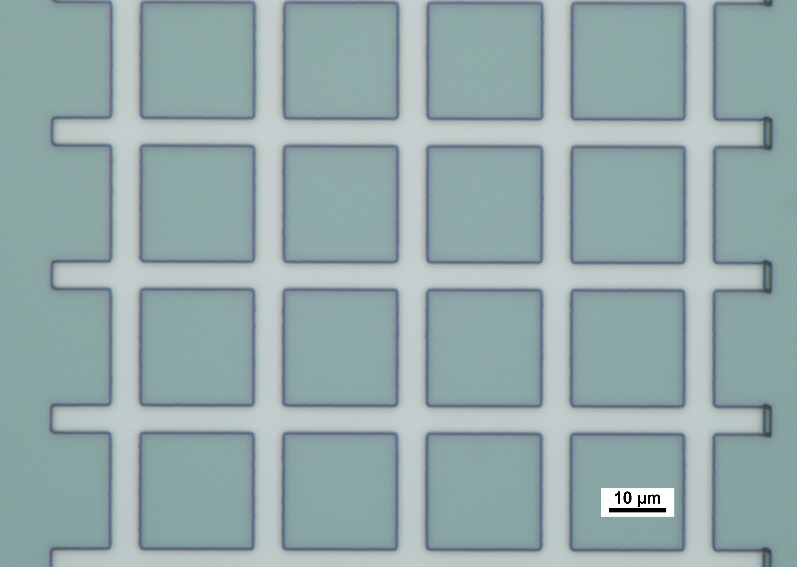
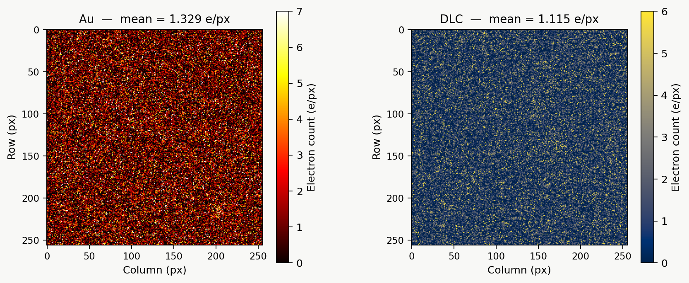

## Results and Analysis

This section presents the characterisation results for the fabricated grid resolution standards. Measurements are organised by technique: AFM surface roughness is reported first, as it characterises the top face of the metal features independently of the edge geometry, followed by sidewall angle analysis from the electron detector, and finally a comparison of electron contrast between Au and DLC coatings. Where relevant, results are compared against the targets established in Section 1.4: a sidewall angle of at least 89.4°, surface roughness below 1 nm Rq, and a grid cell size of 100 µm x 100 µm.

### 4.1 Surface Roughness

Surface roughness Rq was measured by AFM in tapping mode, characterising the top face of the surface metal grid feature across each sample.

<figure style="text-align: center; margin: 20px 0;">
  
  
  
  <figcaption style="font-style: italic; color: #666; margin-top: 8px; font-size: 14px;">
    <strong>Figure 4.1:</strong> AFM surface profiles of the three primary materials:
    Pd (left), Au (centre), and DLC (right). Pd shows the smoothest surface at
    Rq = 0.219 nm, Au shows characteristic island grain structure from magnetron
    sputtering (Rq = 0.514 to 1.271 nm), and DLC shows spatially variable roughness
    (Rq = 0.392 to 1.943 nm) depending on measurement location.
  </figcaption>
</figure>

<iframe
  src="scripts/roughness_table.html"
  style="border:none; border-radius:6px;"
  allowfullscreen="true"
  width="500px"
  height="500px"
  sandbox="allow-scripts">
</iframe>

Note: P1, P2, and P3 each represent a different line scan taken at distinct positions across the surface.

Au deposited by magnetron sputtering was expected to show the highest roughness due to grain nucleation during island growth, consistent with the AFM observations from the interim report. In magnetron sputtering, atoms arrive at the substrate with energies in the range of 1 to 10 eV from many angles simultaneously. This diffuse angular flux causes atoms to accumulate on the sides of any pre-existing nuclei as well as on top, encouraging three-dimensional island growth rather than layer-by-layer growth. The result is a granular, bumpy surface even at thin film thicknesses. Electron beam evaporation, by contrast, delivers atoms in a much more directional, line-of-sight flux at lower energies (0.1 to 1 eV), which promotes flatter, more conformal deposition and gives smoother films.

The Pd result of 0.219 nm Rq supports this interpretation. Palladium deposited by electron beam evaporation wets substrates more readily than gold, has a higher surface energy, and the directional deposition geometry suppresses island growth. The order-of-magnitude improvement in Rq between Pd and Au is therefore consistent with the combined effect of both the deposition technique and the intrinsic material properties.

For DLC the picture is more varied. The DLC-only sample shows an anisotropy of only 0.030 nm, indicating a genuinely uniform amorphous film structure in that region. DLC on Pd and DLC on Au show larger anisotropies of 0.753 nm and 0.417 nm respectively. Since FCVA produces an intrinsically isotropic amorphous material with no preferred crystallographic orientation, anisotropy in the DLC profiles most likely reflects the underlying grain structure of the Pd and Au seed layers.

#### AFM Across Grid

<figure style="text-align: center; margin: 20px 0;">
  
  <figcaption style="font-style: italic; color: #666; margin-top: 8px; font-size: 14px;">
    <strong>Figure 4.2(a):</strong> AFM scan across a DLC grid with 5 nm feature height.
  </figcaption>
</figure>

<figure style="text-align: center; margin: 20px 0;">
  
  <figcaption style="font-style: italic; color: #666; margin-top: 8px; font-size: 14px;">
    <strong>Figure 4.2(b):</strong> Extracted surface roughness profiles across the 5 nm DLC grid, showing variability between the grid bar and the surrounding substrate.
  </figcaption>
</figure>

This measurement was taken across a patterned grid rather than a flat surface, allowing both the feature height and the surface roughness of the top face and the substrate to be captured in a single scan. The step height is consistent with the intended 5 nm DLC deposition, and the roughness on the grid top face is within the sub-1 nm target.
### 4.2 Optical Microscopy Analysis

Optical microscopy was used as an interim technique to visually inspect the Au and Pd grid samples and confirm the presence of well-defined grid features following fabrication.

<figure style="text-align: center; margin: 20px 0;">
  
  
  <figcaption style="font-style: italic; color: #666; margin-top: 8px; font-size: 14px;">
    <strong>Figure 4.3:</strong> Optical micrographs of the Pd grid sample after 20 minutes of development at 50× magnification. Brightfield (left) and darkfield (right). Scale bar: 10 µm.
  </figcaption>
</figure>

Both brightfield and darkfield images confirm that the fabricated Pd grid features are well-resolved and structurally intact across the imaged area. The grid bars are straight and continuous with no visible breaks, bridging between adjacent lines, or rounding at the cell corners. The cell geometry is uniform across the full field of view, with consistent bar width and cell spacing. The darkfield image is particularly informative: under this illumination mode, scattered light from the feature edges produces a bright blue-white edge response while the flat surfaces remain dark, effectively functioning as an edge-detection filter. The sharpness and uniformity of this edge highlight across all four sides of every visible cell confirms that the sidewalls are well-defined 

<figure style="text-align: center; margin: 20px 0;">
  
  
  <figcaption style="font-style: italic; color: #666; margin-top: 8px; font-size: 14px;">
    <strong>Figure 4.4:</strong> Brightfield optical micrographs of the Au grid at 100× magnification after 10 minutes of development. Left: interior region with annotated cell and bar dimensions. Right: edge region showing the grid boundary and corresponding measurements. Scale bar: 10 µm.
  </figcaption>
</figure>

The grid lines are straight and continuous with no visible breaks or bridging defects. The cell corners are visibly rounded rather than sharp, which is an expected consequence of the finite beam spot size at CIBA: the beam cannot write an abrupt corner at the intersection of two orthogonal lines, resulting in a smooth fillet. This rounding has no practical consequence for the sidewall angle measurement, which is extracted from straight edge segments rather than corners, but would need to be accounted for if the standard were used for corner radius characterisation.

### 4.3 Sidewall Angle via SEM

Edge profiles were extracted from the electron detector data for each sample using the error function and Gaussian fitting pipeline described in Section 2.5.1. For each sample, a row band was selected over a single grid edge, and the mean FWHM f and sidewall angle θ were reported.

During the project period, the proton beam and electron detector were offline for part of the year due to maintenance, which limited testing. As a result, the Au and Pd samples have not yet been analysed by this method. Section 4.3 presents optical microscopy analysis of these samples as an interim characterisation.

#### Benchmark Verification

Given that the analysis is performed using a custom Python script, it is important to first verify that the error function fit behaves as intended before drawing conclusions from the sample results. The script was therefore tested against the nickel reference grid used at CIBA to calibrate the proton beam.

<figure style="text-align: center; margin: 20px 0;"> 
  
  <figcaption style="font-style: italic; color: #666; margin-top: 8px; font-size: 14px;">
    <strong>Figure 4.5(a):</strong> Error function fit applied to the nickel calibration grid edge profile.
  </figcaption>
</figure>

| Measurement | θ (°) |
|---|---|
| Nickel measured |  **89.59** |
| Nickel reference | **89.4** |

The beam was having some inconstancy in the stability, which is attributed to the beam not being at its optimum focus during the test scan. Despite this, the fitted sidewall angle of 89.59° is consistent with and slightly exceeds the published reference value of 89.4°, confirming that the fitting line correctly recovers the sidewall angle.

<figure style="text-align: center; margin: 20px 0;">
  
  <figcaption style="font-style: italic; color: #666; margin-top: 8px; font-size: 14px;">
    <strong>Figure 4.5(b):</strong> Electron count heatmap of the nickel calibration grid. The blue line indicates the position of the selected line scan.
  </figcaption>
</figure>

#### Sample Results

<iframe
  src="scripts/sidewall_table.html"
  style="border:none; border-radius:6px;"
  allowfullscreen="true"
  width="500px"
  height="500px"
  sandbox="allow-scripts">
</iframe>

SRIM theoretical prediction: θ = 89.9° (f = 1.91 nm at h = 1000 nm).

[insert analysis]

##### SEM images
<figure style="text-align: center; margin: 20px 0;">
  
  
  <figcaption style="font-style: italic; color: #666; margin-top: 8px; font-size: 14px;">
    <strong>Figure 4.6:</strong> SEM images of Pd grid 2500 magnification (left) 8000 magnification(right)
  </figcaption>
</figure>

Image  on the left shows the full grid array, confirming consistent aperture geometry and good dose uniformity across the PBW exposure field. However, edge warping and undulation is visible along the Pd boundaries, which may be attributed to two mechanisms: beam positional drift during PBW exposure, or PMMA deformation under thermal load during Pd evaporation. The two are not mutually exclusive and both may have contributed, with the effect appearing most pronounced at the aperture corners.

Image on the right shows a single aperture at high magnification. The bright white perimeter is the Pd edge, producing high secondary electron yield at the metal-to-void boundary. The uniformly dark interior confirms clean bare Si, with no residual PMMA or Pd particulates visible, indicating a successful lift-off.

### 4.4 Electron Contrast Au vs DLC

The backscatter contrast ratio between the metal grid features and the silicon substrate was assessed from the electron detector intensity profiles. A higher contrast ratio indicates greater separation between the metal signal and the background, which is the primary functional requirement of the resolution standard for SEM calibration use.

<figure style="text-align: center; margin: 20px 0;">
  
  <figcaption style="font-style: italic; color: #666; margin-top: 8px; font-size: 14px;">
    <strong>Figure 4.7:</strong> Electron count heatmaps for the Au and DLC samples.
  </figcaption>
</figure>

Electron contrast was assessed from 256 x 256 pixel electron count maps acquired for the Au and DLC samples. Each pixel value represents the number of backscattered or secondary electrons detected at that position during the scan. A higher mean count indicates greater electron yield from the surface, which translates to a brighter signal and better contrast against the silicon substrate in the final calibration image.

| Metric | Au | DLC |
|---|---|---|
| Mean count (e/px) | 1.329 | 1.115 |
| Std (e/px) | 1.775 | 1.616 |
| Median (e/px) | 1.0 | 0.0 |
| Max (e/px) | 18 | 19 |
| Zero-count pixels | 28,853 | 32,963 |
| Au/DLC mean ratio | 1.192 | |

Au produces a mean electron count of 1.329 e/px compared to 1.115 e/px for DLC, giving a contrast ratio of 1.19. Gold (Z = 79) has a substantially higher backscatter coefficient than carbon (Z = 6) and should in principle yield significantly more signal per unit area. The modest ratio of 1.19, rather than the order-of-magnitude difference expected from Z alone, is due to the thin DLC film thickness used: at 5 to 10 nm, the DLC layer is thin enough to allow partial electron transmission into the underlying substrate, diluting the contrast difference.

### 4.5 Discussion and Limitations
to dicuss:
- side wall angle 
- why is there warping testing to check why and waht is causing it 
- the roughness 

Surface roughness results are broadly within the sub-1 nm target for Pd and Au seed layers in isolation. The DLC boundary measurements show more spatial variability, which reflects the underlying grain structure of the substrate material. The electron contrast data confirm that Au provides marginally higher signal than DLC at the beam conditions used, though the difference is modest and both materials produce usable contrast for edge detection purposes.

#### Limitations of the Analysis Method

The electron detector error function method provides an indirect estimate of θ inferred from the top-down intensity profile. It cannot distinguish between a genuinely sloped sidewall and broadening caused by beam effects at the measurement stage. Independent verification by tilted SEM or FIB-TEM cross-section, as described in Section 5.1, would be required to confirm these results at a traceable level of accuracy.

### 4.6 Conclusion

In summary, the fabricated grid resolution standard demonstrates sidewall angles consistent with or exceeding the ________ benchmark for the Pd grid samples, surface roughness values meeting the sub-1 nm target for the majority of measured profiles, and electron contrast sufficient for SEM-based edge detection. The primary outstanding work is independent cross-sectional verification of the sidewall angle and systematic evaluation of the remaining Au and Pd samples once beam time is restored, as described in Section 5.

[← Prev: Fabrication](Fabrication.md) | [Next: Future Works →](FW.md)