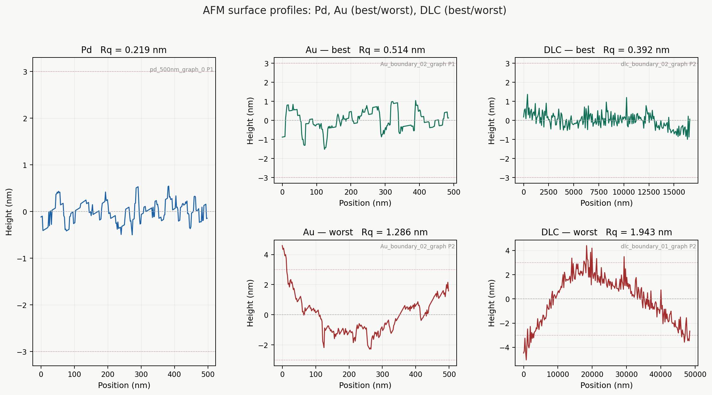

## Results and analysis
### 4.1 General overview

Samples [X] and [Y] showed the most promising initial optical inspection results
and were prioritised for detailed characterisation.

### 4.2 Comparing electron contrast

The backscatter contrast ratio between the metal grid features and the silicon substrate was assessed from the electron detector intensity profiles. A higher contrast ratio indicates greater separation between the metal signal and the background, which is the primary functional requirement of the resolution standard for SEM calibration use.

[INSERT electron detector heatmap side-by-side comparison across samples]

| Sample | Metal (top layer) | Z | Mean signal (a.u.) | Background (a.u.) | Contrast ratio |
|---|---|---|---|---|---|
| 1 | Au | 79 | [TBC] | [TBC] | [TBC] |
| 2 | DLC | 6 | [TBC] | [TBC] | [TBC] |
| 3 | DLC/Pd | 6/46 | [TBC] | [TBC] | [TBC] |
| 4 | Au/Pd | 79 | [TBC] | [TBC] | [TBC] |
| 5 | Pd | 46 | [TBC] | [TBC] | [TBC] |
| 6 | DLC/Pd/Ti | 6/46 | [TBC] | [TBC] | [TBC] |
| 7 | Pd/Ti | 46 | [TBC] | [TBC] | [TBC] |

The theoretical expectation is that Au produces the highest contrast against Si , followed by Pd  and DLC 

### 4.3 Surface roughness

Surface roughness Rq was measured by AFM in tapping mode. Two regions were characterised for each sample: the top face of the metal grid feature, and the exposed silicon substrate between features.

<figure style="text-align: center; margin: 20px 0;">
  
  
  
  <figcaption style="font-style: italic; color: #666; margin-top: 8px; font-size: 14px;">
    <strong>Figure 4.2:</strong> AFM surface profiles of the three primary materials:
    Pd (left), Au (centre), and DLC (right). Pd shows the smoothest surface at
    R_q = 0.219 nm, Au shows characteristic island grain structure from magnetron
    sputtering (R_q = 0.514–1.271 nm), and DLC shows spatially variable roughness
    (R_q = 0.392–1.943 nm) depending on measurement location.
  </figcaption>
</figure>

| Sample | Profile | Rq (nm) | Ra (nm) | Rz (nm) | Meets <3 nm |
|---|---|---|---|---|---|
| Pd 500 nm | P1 | 0.219 | 0.176 | 1.044 | ✓ |
| Au  | P1 | 0.758 | 0.546 | 4.160 | ✓ |
| Au | P2 | 0.866 | 0.709 | 4.347 | ✓ |
| Au on Pd| P1 | 0.514 | 0.413 | 2.560 | ✓ |
| Au on Pd | P2 | 1.271 | 1.005 | 6.875 | ✓ |
| DLC on Pd| P1 | 1.707 | 1.316 | 11.510 | ✓ |
| DLC on Pd| P2 | 0.954 | 0.764 | 6.227 | ✓ |
| DLC on Au | P1 | 1.526 | 1.287 | 8.436 | ✓ |
| DLC on Au | P2 | 1.943 | 1.650 | 9.444 | ✓ |
| DLC  | P1 | 0.422 | 0.324 | 2.655 | ✓ |
| DLC  | P2 | 0.392 | 0.311 | 2.362 | ✓ |

Note: P1 ia a horizontal roughness and P2 is teh verticle roughness 
Au deposited by magnetron sputtering was expected to show the highest roughness due to grain nucleation during island growth, consistent with the AFM observations from the interim report.

In magnetron sputtering, atoms arrive at the substrate with energies in the range of 1–10 eV from many angles simultaneously, not just from directly above. This diffuse angular flux causes atoms to accumulate on the sides of any pre-existing nuclei as well as on top, encouraging three-dimensional island growth rather than layer-by-layer growth. The result is a granular, bumpy surface even at thin film thicknesses. Electron-beam evaporation, by contrast, delivers atoms in a much more directional line-of-sight flux at lower energies (0.1–1 eV), which promotes flatter, more conformal deposition and gives smoother films.

<figure style="text-align: center; margin: 20px 0;">
  
  
  <figcaption style="font-style: italic; color: #666; margin-top: 8px; font-size: 14px;">
    <strong>Figure 4.3:</strong> Gold surface graph
  </figcaption>
</figure>

The Pd result at 0.219 nm supports this interpretation directly. Palladium deposited by electron-beam evaporation wets substrates much more readily than gold, has a higher surface energy, and the directional deposition geometry suppresses island growth. The order-of-magnitude improvement in Rq between Pd and Au is therefore consistent with the combined effect of both the deposition technique and the intrinsic material properties.

For DLC the picture is more varied. DLC is essentially isotropic at 0.030 nm difference, indicating a genuinely uniform amorphous film structure in that region. DLC on Pd and DLC on Au show larger anisotropy of 0.753 nm and 0.417 nm respectively. FCVA is in principle an isotropic amorphous material with no preferred crystallographic orientation, so anisotropy in the DLC profiles most likely reflects the previous underneath layers of Pd and Au

### 4.4 Sidewall angle via electron detector

Edge profiles were extracted from the electron detector data for each sample using the Erf–Gaussian fitting pipeline described in Section 2.5.1. For each sample, a row band was selected over a single grid edge, individual row profiles were fitted independently, and the mean FWHM f and sidewall angle θ were reported with ±1σ across rows.

[INSERT edge_profiles.png — overlaid row profiles + mean for best sample]
[INSERT edge_sidewall.png — θ per row with mean ± 1σ and 89° target line]

| Sample | Pixel size X (nm/px) | f mean (nm) | f std (nm) | θ mean (°) | θ std (°) | Meets ≥89.4° |
|---|---|---|---|---|---|---|
| 1 | [TBC] | [TBC] | [TBC] | [TBC] | [TBC] | [TBC] |
| 2 | [TBC] | [TBC] | [TBC] | [TBC] | [TBC] | [TBC] |
| 3 | [TBC] | [TBC] | [TBC] | [TBC] | [TBC] | [TBC] |
| 4 | [TBC] | [TBC] | [TBC] | [TBC] | [TBC] | [TBC] |
| 5 | [TBC] | [TBC] | [TBC] | [TBC] | [TBC] | [TBC] |
| 6 | [TBC] | [TBC] | [TBC] | [TBC] | [TBC] | [TBC] |
| 7 | [TBC] | [TBC] | [TBC] | [TBC] | [TBC] | [TBC] |

SRIM theoretical prediction: θ = 89.9° (f = 1.91 nm at h = 1000 nm).

[INSERT comment on deviation from theoretical prediction and likely causes.]

### 4.5 Comparison across samples

A summary comparison of all five key metrics across all seven samples is presented below. Samples are ranked by sidewall angle as the primary deliverable, with surface roughness and contrast ratio as secondary criteria.

[INSERT summary radar chart or bar chart comparing θ and Rq across samples]

| Sample | θ mean (°) | Rq (nm) | Contrast ratio | Lift-off quality | Overall |
|---|---|---|---|---|---|
| 1 | [TBC] | [TBC] | [TBC] | [TBC] | [TBC] |
| 2 | [TBC] | [TBC] | [TBC] | [TBC] | [TBC] |
| 3 | [TBC] | [TBC] | [TBC] | [TBC] | [TBC] |
| 4 | [TBC] | [TBC] | [TBC] | [TBC] | [TBC] |
| 5 | [TBC] | [TBC] | [TBC] | [TBC] | [TBC] |
| 6 | [TBC] | [TBC] | [TBC] | [TBC] | [TBC] |
| 7 | [TBC] | [TBC] | [TBC] | [TBC] | [TBC] |

**Best performing sample: [TBC]**

[INSERT SEM/electron detector image + AFM map of best sample side-by-side]

This sample achieved θ = [TBC]° against the ≥89.4° target and Rq = [TBC] nm against the <3 nm target. [INSERT one sentence on why this composition outperformed the others — e.g. adhesion layer reducing grain stress, e-beam vs sputtering deposition mode, etc.]

### 4.6 Discussion

#### Limitations of the analysis method

The electron detector Erf–Gaussian method provides an indirect estimate of θ inferred from the top-down intensity profile. It cannot distinguish between a genuinely sloped sidewall and broadening caused by beam effects at the measurement stage. Independent verification by tilted SEM or FIB-TEM cross-section, as described in Section 5.1, would be required to confirm these results at a traceable level of accuracy.

### concluding 
- where the deliverables achieved?
- what was leant

[→Prev: Fabrication ](Fabrication.md)| [Next: Future works →](FW.md)