## Results and Analysis

This section presents the characterisation results for the fabricated grid resolution standards. Measurements are organised by technique: AFM surface roughness is reported first, as it characterises the top face of the metal features independently of the edge geometry, followed by sidewall angle analysis from the SEM, . Where relevant, results are compared against the targets established in Section 1.4: a sidewall angle of at least 89.4°, surface roughness below 1 nm Rq. To note; the comparison of electron contrast between Au and DLC coatings was left to [Appendix E](E.md).

### 4.1 Surface Roughness

Surface roughness Rq was measured by AFM in tapping mode, characterising the top face of the surface metal grid feature across each sample.

<figure style="text-align: center; margin: 20px 0;">
  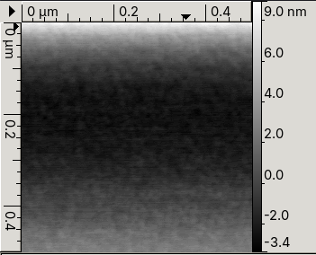
  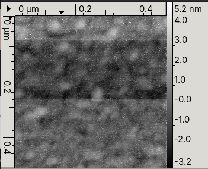
  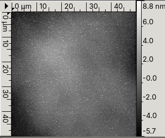
  <figcaption style="font-style: italic; color: #666; margin-top: 8px; font-size: 14px;">
    <strong>Figure 4.1:</strong> AFM surface profiles of the three primary materials:
    Pd (left), Au (centre), and DLC (right). Pd shows the smoothest surface at
    Rq = 0.219 nm, Au shows characteristic island grain structure from magnetron
    sputtering (Rq = 0.514 to 1.271 nm), and DLC shows spatially variable roughness
    (Rq = 0.392 to 1.943 nm) depending on measurement location.
  </figcaption>
</figure>

<iframe
  src="scripts/roughness_table.html"
  style="border:none; border-radius:6px;"
  allowfullscreen="true"
  width="500px"
  height="500px"
  sandbox="allow-scripts">
</iframe>

Note: P1, P2, and P3 each represent a different line scan taken at distinct positions across the surface.

Au deposited by magnetron sputtering was expected to show the highest roughness due to grain nucleation during island growth, consistent with the AFM observations from the interim report. In magnetron sputtering, atoms arrive at the substrate with energies in the range of 1 to 10 eV from many angles simultaneously. This diffuse angular flux causes atoms to accumulate on the sides of any pre-existing nuclei as well as on top, encouraging three-dimensional island growth rather than layer-by-layer growth. The result is a granular, bumpy surface even at thin film thicknesses. Electron beam evaporation, by contrast, delivers atoms in a much more directional, line-of-sight flux at lower energies (0.1 to 1 eV), which promotes flatter, more conformal deposition and gives smoother films.

The Pd result of 0.219 nm Rq supports this interpretation. Palladium deposited by electron beam evaporation wets substrates more readily than gold, has a higher surface energy, and the directional deposition geometry suppresses island growth. The order-of-magnitude improvement in Rq between Pd and Au is therefore consistent with the combined effect of both the deposition technique and the intrinsic material properties.

For DLC the picture is more varied. The DLC-only sample shows an anisotropy of only 0.030 nm, indicating a genuinely uniform amorphous film structure in that region. DLC on Pd and DLC on Au show larger anisotropies of 0.753 nm and 0.417 nm respectively. Since FCVA produces an intrinsically isotropic amorphous material with no preferred crystallographic orientation, anisotropy in the DLC profiles most likely reflects the underlying grain structure of the Pd and Au seed layers.

#### AFM Across Grid

<figure style="text-align: center; margin: 20px 0;">
  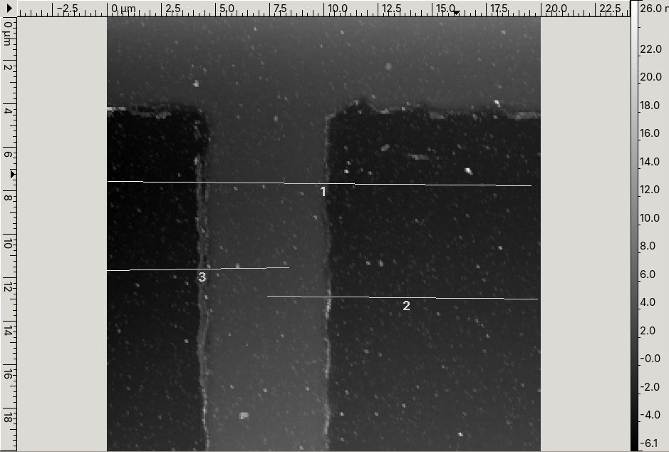
  <figcaption style="font-style: italic; color: #666; margin-top: 8px; font-size: 14px;">
    <strong>Figure 4.2(a):</strong> AFM scan across a DLC grid with 5 nm feature height.
  </figcaption>
</figure>

<figure style="text-align: center; margin: 20px 0;">
  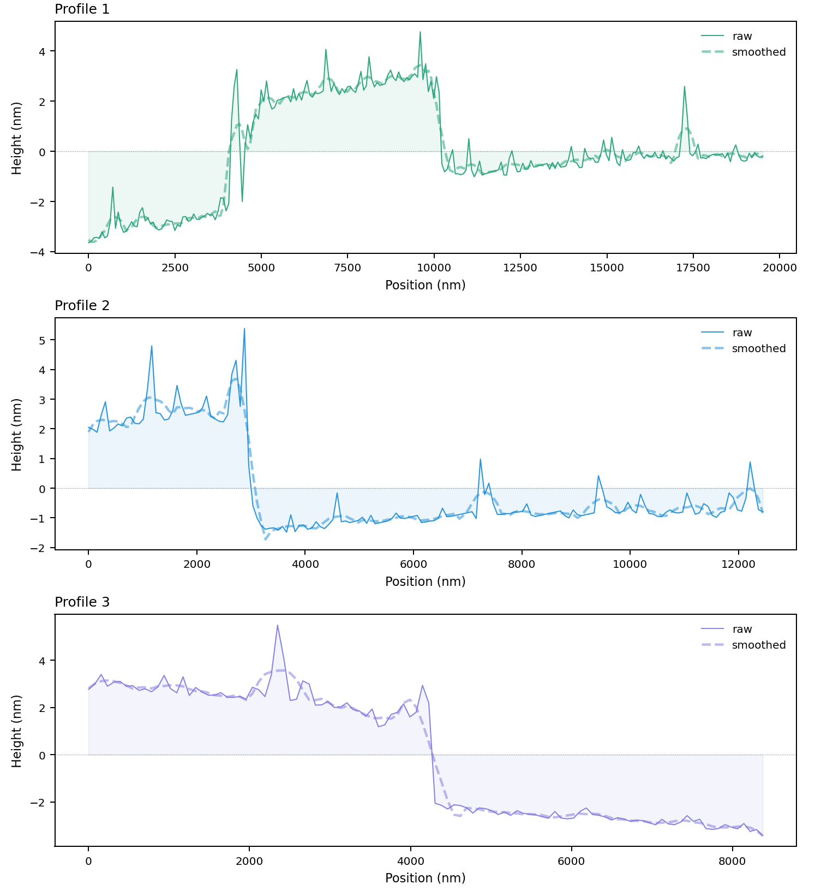
  <figcaption style="font-style: italic; color: #666; margin-top: 8px; font-size: 14px;">
    <strong>Figure 4.2(b):</strong> Extracted surface roughness profiles across the 5 nm DLC grid, showing variability between the grid bar and the surrounding substrate.
  </figcaption>
</figure>

This measurement was taken across a patterned grid rather than a flat surface, allowing both the feature height and the surface roughness of the top face and the substrate to be captured in a single scan. The step height is consistent with the intended 5 nm DLC deposition, and the roughness on the grid top face is within the sub-1 nm target.
### 4.2 Optical Microscopy Analysis

Optical microscopy was used as an interim technique to visually inspect the Au and Pd grid samples and confirm the presence of well-defined grid features following fabrication.

<figure style="text-align: center; margin: 20px 0;">
  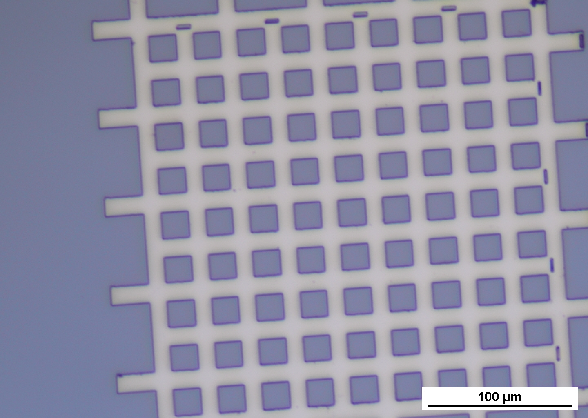
  <!-- 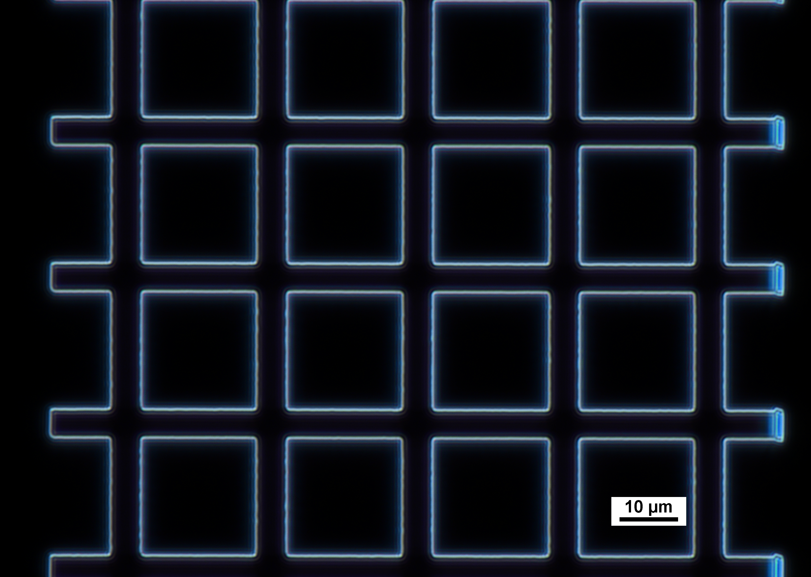 -->
  <figcaption style="font-style: italic; color: #666; margin-top: 8px; font-size: 14px;">
    <strong>Figure 4.3:</strong> Optical micrographs of the Pd grid sample after 20 minutes of development at 50× magnification. Brightfield  Scale bar: 100 µm.
  </figcaption>
</figure>

The brightfield a images confirm that the fabricated Pd grid features are well-resolved and structurally intact across the imaged area. The grid bars are straight and continuous with no visible breaks, bridging between adjacent lines, or rounding at the cell corners. The cell geometry is uniform across the full field of view, with consistent bar width and cell spacing. 

<figure style="text-align: center; margin: 20px 0;">
  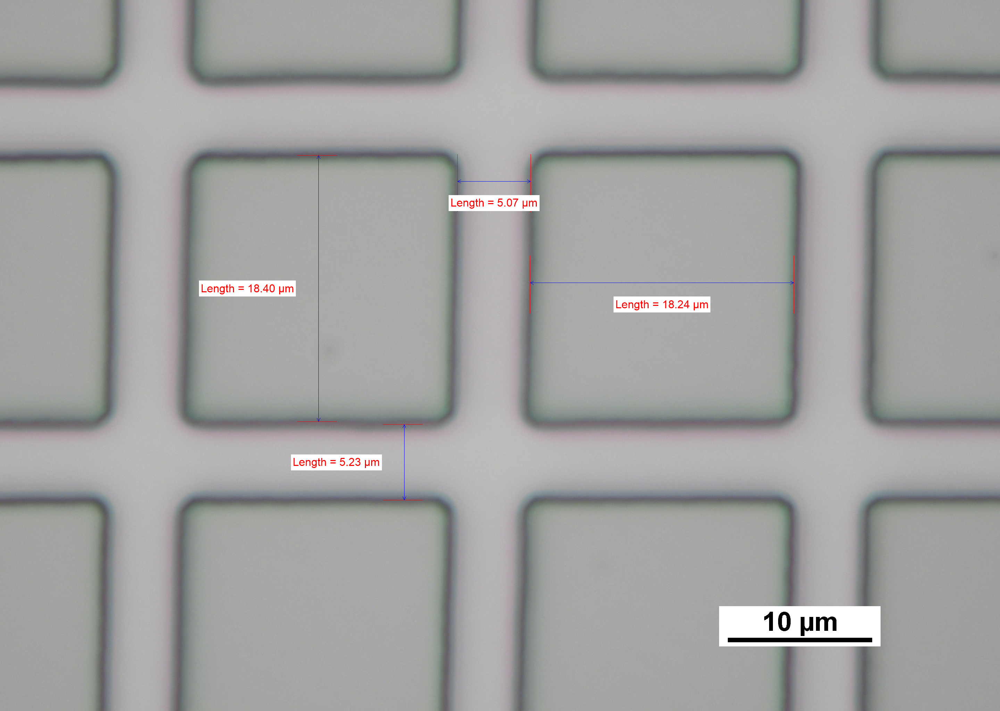
  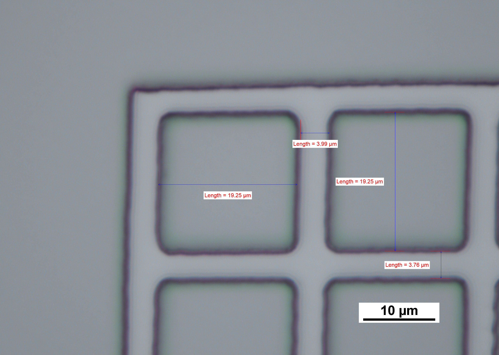
  <figcaption style="font-style: italic; color: #666; margin-top: 8px; font-size: 14px;">
    <strong>Figure 4.4:</strong> Brightfield optical micrographs of the Au grid at 100× magnification after 10 minutes of development. Left: interior region with annotated cell and bar dimensions. Right: edge region showing the grid boundary and corresponding measurements. Scale bar: 10 µm.
  </figcaption>
</figure>

The grid lines are straight and continuous with no visible breaks or bridging defects. The cell corners are visibly rounded rather than sharp, which is an expected consequence of the finite beam spot size at CIBA: the beam cannot write an abrupt corner at the intersection of two orthogonal lines, resulting in a smooth fillet. This rounding has no practical consequence for the sidewall angle measurement, which is extracted from straight edge segments rather than corners, but would need to be accounted for if the standard were used for corner radius characterisation.

### 4.3 SEM Analysis

#### SEM Images

<figure style="text-align: center; margin: 20px 0;">
  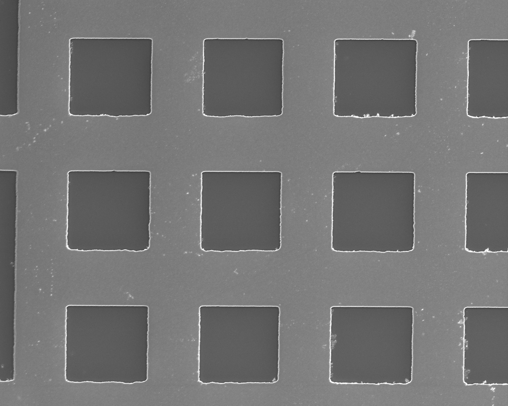
  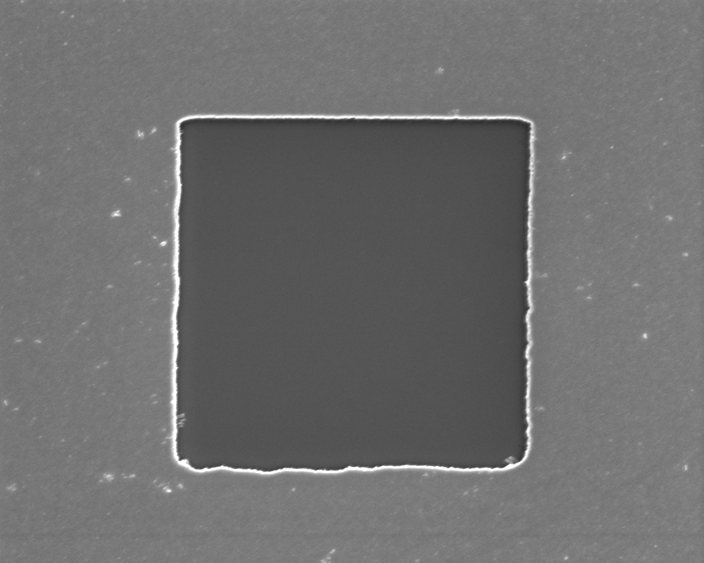
  <figcaption style="font-style: italic; color: #666; margin-top: 8px; font-size: 14px;">
    <strong>Figure 4.5:</strong> SEM images of Pd grid 2500 magnification (left) 8000 magnification(right)
  </figcaption>
</figure>

Image  on the left shows the full grid array, confirming consistent aperture geometry and good dose uniformity across the PBW exposure field. However, edge warping and undulation is visible along the Pd boundaries, which may be attributed to two mechanisms: beam positional drift during PBW exposure, or PMMA deformation under thermal load during Pd evaporation. The two are not mutually exclusive and both may have contributed, with the effect appearing most pronounced at the aperture corners.
Image on the right shows a single aperture at high magnification. The bright white perimeter is the Pd edge, producing high secondary electron yield at the metal-to-void boundary. The uniformly dark interior confirms clean bare Si, with no residual PMMA or Pd particulates visible, indicating a successful lift-off.

<figure style="text-align: center; margin: 20px 0;">
  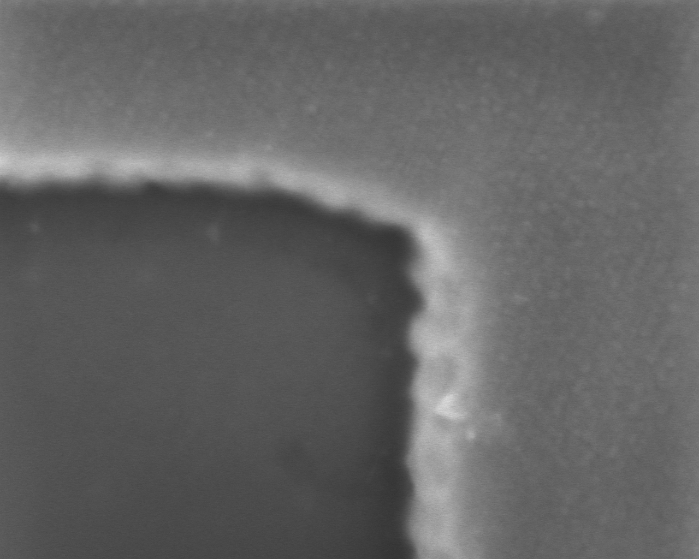
  <figcaption style="font-style: italic; color: #666; margin-top: 8px; font-size: 14px;">
    <strong>Figure 4.6:</strong> SEM images of Pd grid 100000 magnification 
  </figcaption>
</figure>

Two additional things observed in the SEM images. A prominent shadowing effect is visible across the apertures, likely attributable to the SEM detector configuration or working distance settings rather than the sample itself. This could skew the edge analysis, as such samples with this promise effect where excluded.

Additionally, a widening effect along the horizontal edges is consistent with proton beam instability during exposure. These samples were written immediately after the beam was brought back online following extended downtime, without adequate time to recommission or characterise the beam state. Residual instability under such conditions would directly manifest as lateral edge broadening, and should be considered when interpreting the FWHM results from these samples.

#### EdgeAnalysis

Edge profiles were extracted from the SEMimage data for each sample using the error function and Gaussian fitting pipeline described in Section 2.5.1. For each sample, a row band was selected over a single grid edge, and the mean FWHM f and sidewall angle θ were reported.

#### Benchmark Verification

Given that the analysis is performed using a custom Python script, it is important to first verify that the error function fit behaves as intended before drawing conclusions from the sample results. The script was therefore tested against the nickel reference grid used at CIBA to calibrate the proton beam.

<figure style="text-align: center; margin: 20px 0;"> 
  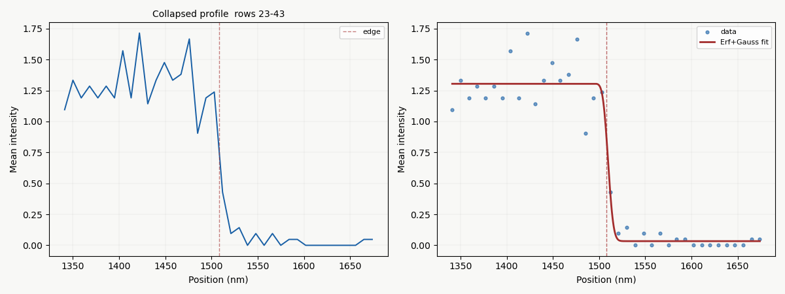
  <figcaption style="font-style: italic; color: #666; margin-top: 8px; font-size: 14px;">
    <strong>Figure 4.7(a):</strong> Error function fit applied to the nickel calibration grid edge profile.
  </figcaption>
</figure>

| Measurement | θ (°) |
|---|---|
| Nickel measured |  **89.59** |
| Nickel reference | **89.4** |

The beam was having some inconstancy in the stability, which is attributed to the beam not being at its optimum focus during the test scan. Despite this, the fitted sidewall angle of 89.59° is consistent with and slightly exceeds the published reference value of 89.4°, confirming that the fitting line correctly recovers the sidewall angle and the FWHM.

<figure style="text-align: center; margin: 20px 0;">
  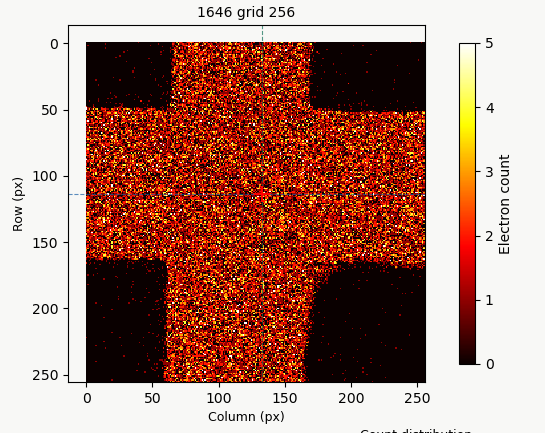
  <figcaption style="font-style: italic; color: #666; margin-top: 8px; font-size: 14px;">
    <strong>Figure 4.7(b):</strong> Electron count heatmap of the nickel calibration grid. The blue line indicates the position of the selected line scan.
  </figcaption>
</figure>

#### Sample Results

Given the shadowing effect, the below table is carefully curated to only include the ones with least least shadowing effect to reduce it's effect onto the results

<figure style="text-align: center; margin: 20px 0;">
  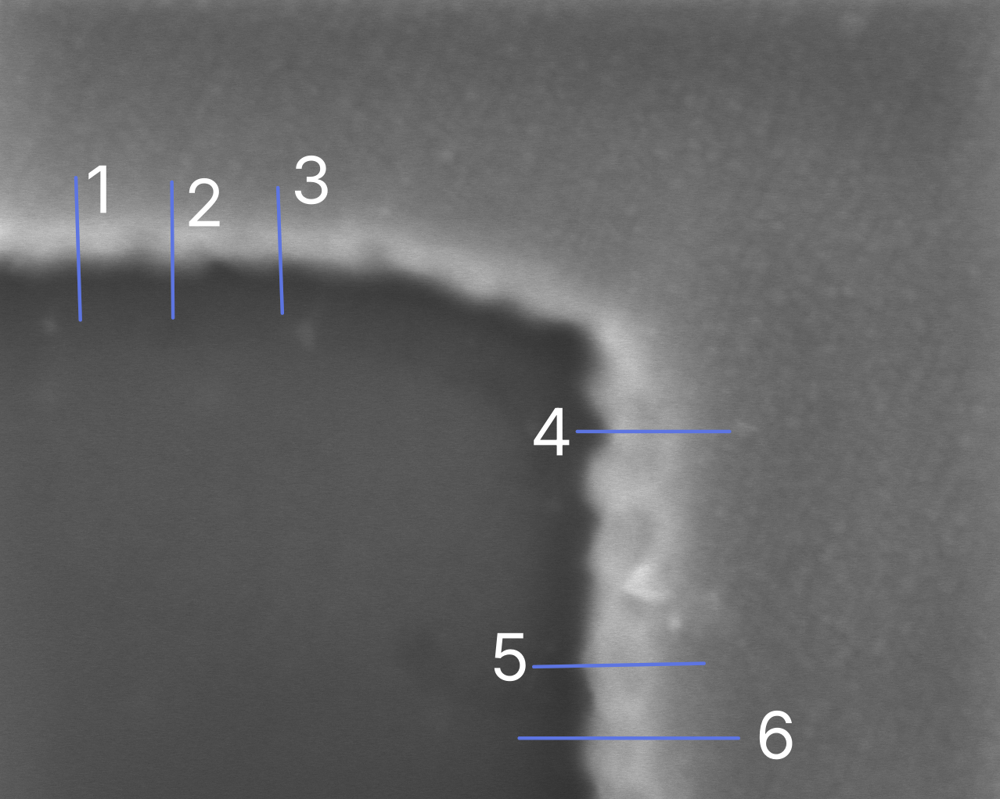
  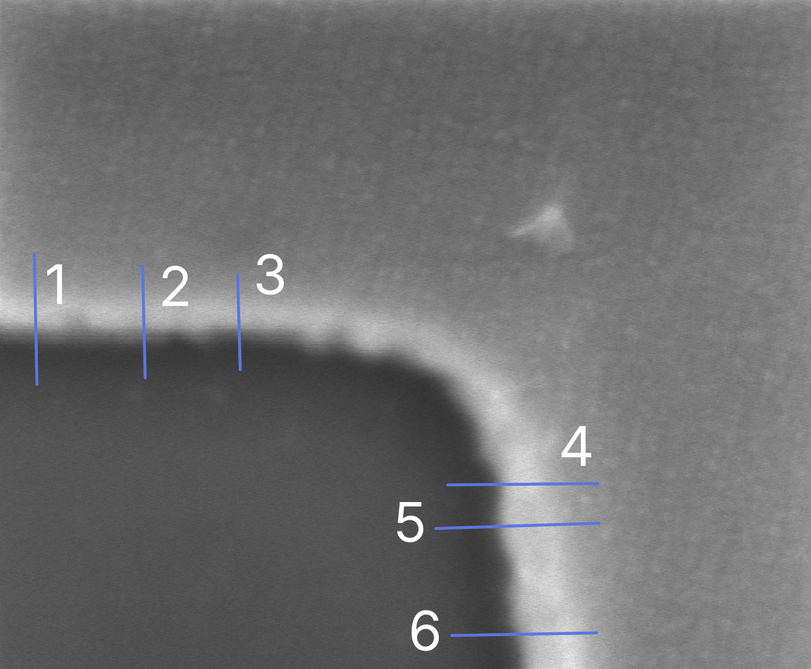
  <figcaption style="font-style: italic; color: #666; margin-top: 8px; font-size: 14px;">
    <strong>Figure 4.8:</strong> Grids 12 and 14 with labeled selected regions
  </figcaption>
</figure>

<iframe
  src="scripts/sidewall_table.html"
  style="border:none; border-radius:6px;"
  allowfullscreen="true"
  width="500px"
  height="500px"
  sandbox="allow-scripts">
</iframe>

SRIM theoretical prediction: θ = 89.9° (f = 1.91 nm at h = 1000 nm).

The fitted sidewall angles exhibit large fluctuations across both grids, with values ranging from approximately 44° to 68°, which are inconsistent with the expected geometry of a well-defined etched feature. This variability is attributed primarily to the significant difference in feature height between the current Pd samples and the resolution standard used to establish the fitting methodology.

The edge fitting approach and sidewall angle calculation were originally developed by F. Zhang et al. [1] using a nickel reference grid with a feature height of 2 µm. The current Pd samples have a total deposited thickness of only ~100 nm (100 nm Pd + 2 nm Ti), representing a reduction in height by a factor of approximately 20. This deviation arose due to machining and deposition constraints during fabrication. Given that the angle calculation is directly dependent on the ratio of feature height to FWHM, using a method calibrated for a 2 µm feature on a 100 nm structure introduces systematic error , a small FWHM that would indicate a steep sidewall at 2 µm height becomes physically ambiguous at 100 nm, where the transition width is comparable to or exceeds the feature height itself. The intense scatter in the computed angles is therefore expected and confirms that the sidewall angle metric is not a reliable figure of merit at this length scale.

A more appropriate quantity to extract from these measurements is the FWHM/2 value, which at this scale is no longer dominated by the sidewall geometry but instead reflects the SEM beam spot size and instrument resolution. The FWHM/2 values extracted from the fits show a consistent and physically meaningful pattern across both grids.

<iframe
  src="scripts/fwhm_table.html"
  style="border:none; border-radius:6px;"
  allowfullscreen="true"
  width="500px"
  height="500px"
  sandbox="allow-scripts">
</iframe>

The Y scan profiles yield an average FWHM/2 of 21.87 nm, while the X scan profiles give a substantially larger average of 45.92 nm, with a combined average of 33.89 nm across all selections. The significantly higher FWHM/2 in the X direction is consistent with the previously noted sidewall overlay effect, the projected sidewall width in the X direction broadens the measured transition zone, whereas the Y direction edge, running parallel to the wall, is less affected by this geometric contribution and therefore returns a narrower, more instrument-limited value

### 4.4 Discussion and Limitations

**Sidewall angle:**

The sidewall angles extracted from the Pd grid samples range from approximately 44° to 68°, falling well short of the 89.4° target. This is not indicative of poor sidewall geometry but rather a fundamental incompatibility between the 100 nm feature height and the method developed for the 2 µm nickel reference standard, the angle calculation becomes unreliable when the transition width f approaches the feature height h. The FWHM/2 analysis is a more appropriate metric at this scale, with Y scan values consistently narrower than X scan values, confirming the fitting pipeline is functioning correctly and capturing a real directional asymmetry in the edge profiles.

**Surface roughness:**

 Pd meets the sub-1 nm Rq target at 0.219 nm. Au exceeds it on some profiles (up to 1.271 nm), consistent with island growth during magnetron sputtering. DLC shows the largest variability (0.392 to 1.943 nm), reflecting the underlying grain structure of the seed layer rather than the DLC film itself. For applications requiring sub-1 nm smoothness, electron beam evaporated Pd is the preferred choice.

**Edge warping:**

  Edge irregularity and warping along the aperture boundaries is observed across multiple grid samples, most prominently at the corners. Two contributing mechanisms are possible: proton beam positional drift during PBW exposure, or thermal loading of the PMMA resist during Pd evaporation causing localised stress or reflow. Both effects are well documented in the literature and are not unexpected at this feature scale. 

#### Limitations of the Analysis Method

The SEM error function method provides an indirect estimate of θ inferred from the top-down intensity profile. It cannot distinguish between a genuinely sloped sidewall and broadening caused by beam effects at the measurement stage. Additionally, the shadowing artefact observed in some images may introduce systematic bias in the extracted intensity profiles even after excluding the most severely affected samples. Independent verification by tilted SEM imaging or FIB-TEM cross-section, as described in (Section 5.1)[FW.md#51-future-testing-using-sem-and-tem], would be required to confirm these results at a traceable level of accuracy.

### 4.5 Conclusion

The fabricated Pd grid resolution standard demonstrates surface roughness well within the sub-1 nm Rq target at 0.219 nm, and the fitting pipeline was validated against the nickel reference standard, recovering a sidewall angle of 89.59° in agreement with the published reference value of 89.4°. Direct sidewall angle extraction from the Pd samples was not feasible at the current feature height of ~100 nm, as the method was developed for a 2 µm standard and produces unreliable results when the transition width approaches the feature height. The FWHM/2 analysis reveals a clear directional asymmetry, Y scan average of 21.87 nm versus X scan average of 45.92 nm, consistent with sidewall overlay broadening in the X direction, and provides confidence that the measurement pipeline is functioning correctly. The primary limitations are the mismatch in feature height relative to the reference standard and the absence of cross-sectional verification. These are addressed in the future work recommendations in (Section 5: Future works)[FW.md].

[← Prev: Fabrication](Fabrication.md) | [Next: Future Works →](FW.md)

### Reference
<li> F. Zhang, J. A. van Kan, S. Y. Chiam, and F. Watt.<em>Nuclear Instruments and Methods in Physics Research Section B: Beam Interactions with Materials and Atoms</em>, vol. 260, no. 1, pp. 474–478, Jul. 2007. DOI: <a href="https://doi.org/10.1016/j.nimb.2007.02.065">10.1016/j.nimb.2007.02.065</a></li>